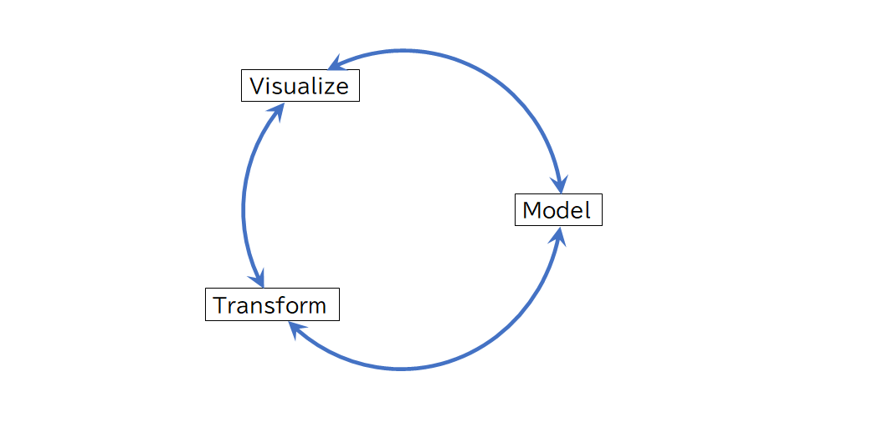
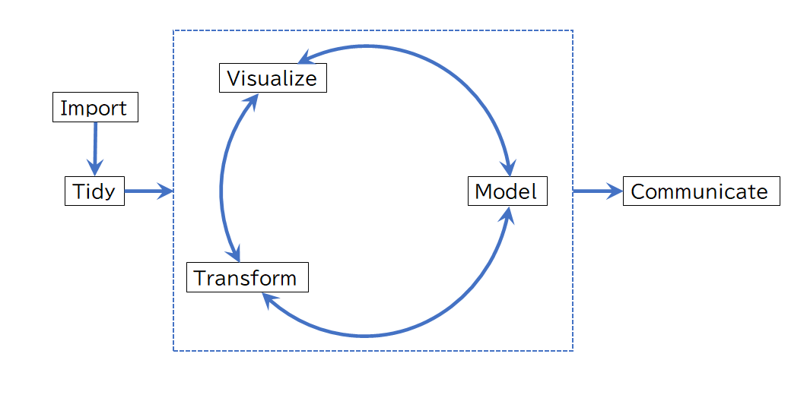
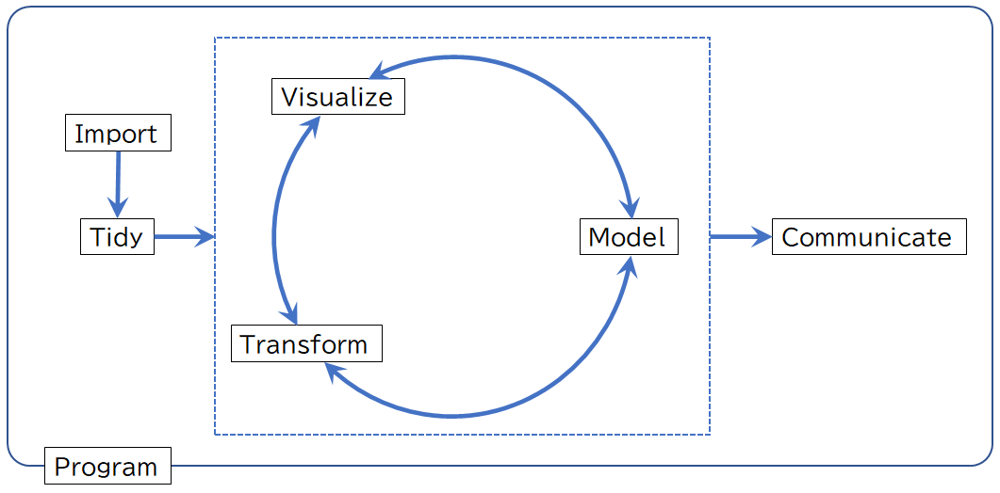
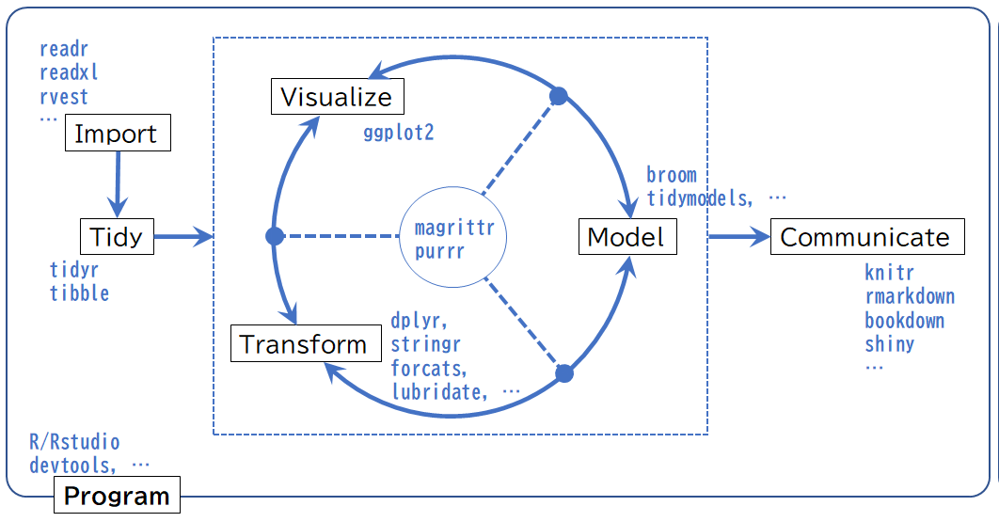

# (PART) Introduction {-}

# はじめに {.unnumbered}
　最近はデータを使いこなせる者、つまり、数学[^0]を使いこなしたものがより優位に立ち利益を手にする[数理資本主義](https://www.meti.go.jp/shingikai/economy/risukei_jinzai/20190326_report.html){target="_blank" title="数学パワーが世界を変える，経済産業省"}の時代と言われています。ソフトウェア開発においてもリリース前品質を担保するための〈データに基づく〉統計的な品質管理が有用であると言われていますが、この統計的品質管理を実践するためには統計分析と分析ツール（統計的コンピューティング）に関する知識が必要になります。  

　『データ指向のソフトウェア品質マネジメント』`r if (knitr::is_latex_output())'[@DataOrientedManagement]'`は、ソフトウェア開発における統計的品質管理の必要性と品質データの分析に必要となる統計的コンピューティングに関する基本的な知識を解説している数少ない書籍です。この書籍の著者の一人である小池氏が主催し筆者も参加している [データ分析勉強会](https://sites.google.com/view/kanto-metrics){target="_blank" title=""}では、統計的コンピューティングに興味をもつ有志が様々な知識や手法を学んでいます。  

　本書は実務でメトリクス分析を行いたいソフトウェア品質技術者をはじめとした統計的コンピューティングに興味を持っている方々に統計に特化した [R言語（以降、**R**と記述）](https://www.r-project.org/){target="_blank" title=""}の基本的な知識を紹介します。

[^0]: 純粋数学、応用数学、統計学、確率論、などの広範囲な概念としての数学を意味します


## 想定読者 {.unnumbered}
　本書はデータ分析勉強会を通じて学んだ知識を実務に適用したい方や統計的コンピューティングに興味があり基本的なコンピュータの知識と基礎的な統計の知識[^a]を有している方を想定しています。**R**を実行するための環境構築に関する詳細な解説は行いませんので、インストール手順などは市販の書籍やインターネットの情報を参考にしてください。なお、環境構築に不安があるけれどもとりあえず**R**を使ってみたいという方は [Google Colaboratory（以降、**Google Colab**）](https://colab.research.google.com/notebook#create=true&language=r){target="_blank" title="Lunch Google Colab with R engine"}\index{Google Colaboratory}の利用をおすゝめします。

[^a]: 統計検定4級程度を想定しています

\newpage

## 表記ルール {.unnumbered}
　本書では以下の表記ルールを用いています。

<!-- 
  表の表記方法（マルチラインテーブルも可）
  https://pandoc-doc-ja.readthedocs.io/ja/latest/users-guide.html
  表見出しは行頭に「:」を入れて書く
-->

: 表記ルール

対象                 | 表記方法                       | 表記例
---------------------|--------------------------------|-------------------
ハイパーリンク       | 脚注にURL表記[^1]              | CRAN^No.^
脚注                 | ハイパーリンクに同じ           | キーワード^No.^
パス・ファイル名     | モノフォント[^2]               | `sample/sample.Rmd`
パッケージ名         | 太字のモノフォント             | **`tidyverse`**
変数・オブジェクト名 | モノフォント                   | `Sepela.Width`
関数名               | モノフォントで()付き[^3]       | `print()`
コード               | モノフォント（プロンプトなし） | `library(tidyverse)`
コードの実行結果     | モノフォント（プロンプトあり） | `## output...`
キーボードのキー     | モノフォントで[]付き           | [`Ctrl`]+[`S`]
数式                 | \LaTeX 数式（math mode）       | $y = ax^2 + b$
参考文献・資料[^4]   | []または()付き                 | [Wickham, 2021]

<!-- 参考文献・資料[^3]   | [著者・作者, 作成年]                | [Wickham, 2021] -->
<!-- 参考文献・資料[^4]   | (著者・作者, 作成年)                | (Wickham, 2021) -->
<!-- 製品サービス名など   | 太字                                | **Google Colab** -->

[^1]: PDF形式のみで^No.^の部分は章ごとの通し番号になっています
[^2]: タイプライタフォントとも呼ばれる等幅フォントです
[^3]: 数式内に関数がある場合は数式と同じ表記になります
[^4]: カッコ内は参考文献一覧への文書内ハイパーリンクです

<!-- \newpage -->

## なぜRか？ {.unnumbered}
　統計的コンピューティングには適切なツールが必要不可欠です。**R**は統計分析に特化しているオープンソースのプログラミング言語です。**R**がデータ分析に向いている理由を簡潔にまとめているのが[『Six Reasons To Learn R For Business』, R Blogger](https://www.r-bloggers.com/six-reasons-to-learn-r-for-business/){target="_blank" title=""}です。

> 1.  **R** Has The Best _**Overall Qualities**_
> 2.  **R** Is Data Science _**For Non-Computer Scientists**_
> 3.  Learning **R** Is _**Easy With The Tidyverse**_
> 4.  **R** Has _**Brains, Muscle, And Heart**_
> 5.  **R** Is Built _**For Business**_
> 6.  **R** _**Community Support**_

　**R**はデータ分析に必要となるデータのハンドリングや可視化、モデリング、そして、レポートといった様々な機能をほとんど無料で利用することができ、[CRAN(The Comprehensive R Archive Network)](https://cran.r-project.org/){target="_blank" title=""}と呼ばれる**R**のリポジトリには15,000を超えるパッケージ（ライブラリ）が登録されています。それらのパッケージが網羅する分野は[CRAN Task Views](https://cran.r-project.org/web/views/){target="_blank" title=""}で整理されています。対象分野は古典的な統計や金融統計から最新の機械学習・ベイズ統計など40を超えています。その中でも特筆すべき分野は[Reproducible Research](https://cran.r-project.org/web/views/ReproducibleResearch.html){target="_blank" title=""}と呼ばれる再現可能性の分野です。  

　再現可能性とは聞き慣れない言葉だと思いますが、ここでは「ある分析結果を再分析した際に同じ結果が得られること」を意味しています。元々はResearchとあるように科学的研究の分野で使われている言葉です。他のプログラミング言語で、Reproducible Researchをサポートしているという話は聞いたことがありませんので、このあたりは**R**の大きな特徴といえます。  

　また、**R**は逐次実行するインタプリタ型の言語ですのでソフトウェアメトリクス分析のような探索的分析（Exploratory data analysis）に適しています。加えて非常にフレンドリーかつ活発なコミュニティーが日本でも形成されていますので、悩んだ時などに気軽に質問・相談ができるのも大きな強みです。  

　ちなみに本書は**R**の[**`bookdown`**](https://bookdown.org/){target="_blank" title="Write HTML, PDF, ePub, and Kindle books with R Markdown"}パッケージという文書作成をサポートしてくれるパッケージを用いています。このようなパッケージが用意されているということは**R**が単なる分析だけでなく研究やビジネスでのレポート作成にも向いていることが分かると思います。


## **R**でなにができるのか？ {.unnumbered}
　実際にどのようなことができるかを簡単な分析を通して見てみましょう。分析の対象となるデータは[フィッシャーのあやめ（Fisher's or Anderson's iris）](https://en.wikipedia.org/wiki/Iris_flower_data_set){target="_blank" title="Iris flower data set,
　Wikipedia"}\index{iris dataset}と呼ばれる下表のようなデータで、**R**にサンプルデータとして組み込まれています。

```{r iris, echo=FALSE}
iris %>% 
  df_print(n = 10L, font_size = 11, caption = "iris dataset")
```

\newpage

　まずは、データがどのような特徴を持っているデータなのかを要約統計量（記述統計量）を求めることで確認します。

```{r, echo=FALSE}
summary(iris)
```

　萼片（Sepal）の長さと幅、花弁（Petal）の長さと幅は、量的変数でその最小値（Min.）、第1四分位値（1st Qu.）、中央値（Median）、平均値（Mean）、第3四分位値（3rd Qu.）、最大値（Max.）を比較すると萼片（Sepal）より花弁（Petal）の方が小さい傾向にあると推測できます。品種（Species）は質的変数（カテゴリ変数）であり、三品種それぞれが同じ数のデータを持っていることが分かります。  

　量的変数の傾向の違いを箱ひげ図を用いて可視化してみます。

```{r irislonger, echo=FALSE, eval=FALSE, include=FALSE}
iris %>%
  tidyr::pivot_longer(cols = -Species, names_to = "part", values_to = "value") %>% 
  df_print(n = 4L, caption = "iris dataset, longer style")
```

```{r, echo=FALSE, fig.cap="花弁と萼片の分布"}
iris %>%
  tidyr::pivot_longer(cols = -Species, names_to = "part", values_to = "value") %>% 
  ggplot2::ggplot(ggplot2::aes(x = part, y = value)) + 
    ggplot2::geom_boxplot() +
    ggplot2::labs(x = "", y = "")
```

　数値で比較したように萼片（Sepal）より花弁（Petal）の方が小さいことがひと目で分かります。次に花弁（Petal）と萼片（Sepal）の幅と長さの関係を散布図で確認してみましょう。

```{r, echo=FALSE, fig.cap="幅と長さの関係", fig.subcap=c('花弁', '萼片'), fig.ncol=2, out.width="50%"}
iris %>%
  ggplot2::ggplot(ggplot2::aes(x = Petal.Width, y = Petal.Length)) +
    ggplot2::geom_point()

iris %>%
  ggplot2::ggplot(ggplot2::aes(x = Sepal.Width, y = Sepal.Length)) +
    ggplot2::geom_point()
```

　花弁（Petal）の幅と長さに関係があり、萼片（Sepal）の方には関係がないように見えますので、個々の幅と長さの相関を確認します。

```{r, echo=FALSE}
with(iris, cor.test(Petal.Width, Petal.Length))
with(iris, cor.test(Sepal.Width, Sepal.Length))
```

　花弁（Petal）の方には強い相関（相関係数$=`r with(iris, cor.test(Petal.Width, Petal.Length)$estimate)`$）があり、萼片（Sepal）の方には相関があるとは言えないことが分かります。  

　花弁（Petal）の幅と長さの関係を回帰モデル（単回帰式）として求めると下記のようになります。

```{r, echo=FALSE}
with(iris, lm(Petal.Length ~ Petal.Width)) %>% 
  summary()
```

```{r, echo=FALSE, message=FALSE, fig.cap="幅と長さの関係", fig.subcap=c('花弁の回帰モデル', '萼片の回帰モデル（参考）'), fig.ncol=2, out.width="50%"}
iris %>%
  ggplot2::ggplot(ggplot2::aes(x = Petal.Width, y = Petal.Length)) +
    ggplot2::geom_point() +
    ggplot2::geom_smooth(method = "lm", se = FALSE)

iris %>%
  ggplot2::ggplot(ggplot2::aes(x = Sepal.Width, y = Sepal.Length)) +
    ggplot2::geom_point() + 
    ggplot2::geom_smooth(method = "lm", se = FALSE)
```

　このように**R**を用いることで比較的簡単にデータを可視化したり統計量を求めることができるのが分かったのではないでしょうか？なお、ここで利用した出力（計算結果）の読み方は別途解説しますので、こういうことができるという点だけは憶えておいてください。

\newpage

　前ページまでの例のような〈探索的〉データ分析では、対象のデータの確認や変形（Transform）、可視化（Visualize）、モデルの作成（Model or Modeling）を繰り返すことで最適な（予測）モデルを探ります。この流れが分析プロセスの基本で下図のように表すことができます。

```{r, echo=FALSE, fig.cap="基本となる分析プロセス"}
# Visualize <-> Transform <-> Model

```

　実際には対象となるデータを読み込み（Import）、処理がしやすいように整形（Tidy）してから可視化などを行います。最後に分析結果を報告（Communicate）しますので、分析プロセスの全体像下図のようになります。

```{r, echo=FALSE, fig.cap="分析プロセス"}
# Import -> Tidy -> Visualize <-> Transform <-> Model -> Communicate

```

\newpage

## Data Science Workflow {.unnumbered}
　分析プロセスを円滑に回すためにはプログラム（統計的プログラミング）などの補助的な仕組みが必要です。全ページの分析プロセスにプログラム（統計的プログラミング）を加えたものが「Data Science Workflow」と呼ばれるフロー図です。

```{r, echo=FALSE, fig.cap="Data Science Workflow"}
# Import -> Tidy -> Visualize <-> Transform <-> Model -> Infer -> Communicate/Automate

```

　「Data Science Workflow」自体は**R**コミュニティに多大な貢献をしている[Hadley Wickham](http://hadley.nz/){target="_blank" title=""}が著書[『R for Data Science』](https://r4ds.had.co.nz/){target="_blank" title=""}において提唱している概念です。

```{r, echo=FALSE, fig.cap="Data Science Workflow, CC BY-NC-ND 3.0 US, Hadley Wickham"}
# knitr::include_graphics("https://raw.githubusercontent.com/hadley/r4ds/master/diagrams/data-science-explore.png")
knitr::include_graphics("fig/data-science.png")
```

　Hadlyの図には**Infer**と**Automate**というプロセスが入っていますが、本書では**Infer**は**Model**に、**Automate**は**Communicate**に含まれるものとして整理しています。

\newpage

### Program {.unnumbered}
　データ分析のすべてのプロセス（**Import**〜**Communicate**）で必要となるツール（分析環境）が**Program**です。**R**では様々なパッケージを使うことで外部アプリケーションとの連動を図り、**R**を中心に用いることで全てのプロセスを完結させることができるEcosystem（後述）と呼べる体系が出来ています。


### Import {.unnumbered}
　分析対象となるデータを分析環境に取り込むのが**Import**プロセスです。データは様々な形式（文字コード、ファイル形式など）で保存されていますので、それらに見合った方法で取り込む必要があります。


### Tidy {.unnumbered}
　インポートしたデータは必ずしもデータ分析に適した形式になっているとは限りませんので、扱いやすいような形式（Tidy Data）に整形します。[Tidy Data](https://www.jstatsoft.org/article/view/v059i10){target="_blank" title="Jounal of Statistical Software"}[@R-TidyData]\index{Tidy Data}はデータ分析において非常に有用で重要な概念で、以下の条件を満たしたデータを意味します。

* 個々の変数が一つの列をなす（Each variable forms a column.）
* 個々の観測が一つの行をなす（Each observation forms a row.）
* 個々の値が一つのセルをなす（Every cell is a single value.）
* 個々の観測の構成単位の累計が一つの表をなす（Each type of observational unit forms a table.）

　端的に表現すればデータの[「構造と意味が合致する」](https://ja.wikipedia.org/wiki/Tidy_data)と言えます。日本語では整然データと呼ばれ、対義語は雑然データ（Messy Data）です。


### Transform {.unnumbered}
　整然データ（Tidy Data）に変換したとしても、データをそのまま状態で分析に使えることは稀です。実際のデータにはデータの一部が欠損していたり、分析には必要のないデータが含まれていたりしますので、不要なデータを削除したり（クレンジング）、必要なデータだけに絞り込んだり、新しい変数を計算したりする必要があります。これらの変換を事なうのが**Transform**プロセスです。  

　**Tidy**プロセスと合わせて**Wrangle**や**Data Wrangling**、前処理などと呼ばれることもあります。本書では**Import**、**Tidy**、**Transform**をあわせて**Wrangle**と称しています。


### Visualize {.unnumbered}
　文字通りデータの可視化を行うのが**Visualize**プロセスです。**R**には伝統的な`plot()`関数系を用いた可視化に加えて、**`ggplot2`**パッケージを用いた統一された文法による可視化があります。


### Model {.unnumbered}
　データを数式を用いてモデルにするのが**Model**プロセスです。本書では**Model**プロセスと**Infer**プロセスを合わせて**Model**プロセスと称しています。


### Communicate {.unnumbered}
　モデルが作成したら最後は分析結果を伝え（報告し）なければなりません。この報告のプロセスが**Communicate**で、プロセスにおいて重要な点が再現可能性（Reproducible research）です。再現可能性の重要性については[「統計解析の再現可能性を高めるために」](http://www.igaku-shoin.co.jp/paperDetail.do?id=PA03357_03){target="_blank" title="医学界新聞, 医学書院"}をお読みください。

\newpage

## Tidyverse Ecosystem {.unnumbered}
　Data Science Workflowを**R**で実現するための手段がHadley Wickhamが中心となって開発している**`tidyverse`**パッケージ群による「Tidyverse Ecosystem」です。

```{r, echo=FALSE, fig.cap="Tidyverse Ecosystem"}

```

\begin{hint-box}
Ecosystemとは、本来、生態系を意味しますが、ITにおいてはお互いに連携することで利益や効果などを得られるシステムやプロセスなどを生態系になぞらえてEcosystemと呼ぶことがあります。
\end{hint-box}

　  

　ここでは、主要なパッケージをいくつか紹介するに留めておきます。詳細は各分析プロセスの章、または、『RStartHere』[@RStartHere:GitHub]をご覧ください。

* **Import**
  * **`readr`** [@R-readr]
      - 様々なテキスト形式テーブルを読み込むためのパッケージ
  * **`readxl`** [@R-readxl]
      - Microsoft Excelのファイルを読み込むためのパッケージ
  * **`rvest`** [@R-rvest]
      - Webスクレイピングのためのパッケージ
  * **`googlesheets4`** [@R-googlesheets4]
      - Google API v4 経由でスプレッドシートを読み込むためのパッケージ
  * **`DBI`** [@R-DBI]
      - SQL系の各種データベースと接続するためのパッケージ

\newpage

* **Tidy**
  * **`tidyr`** [@R-tidyr]
      - Tidy Dataの作成を強力にサポートしてくれるパッケージ
  * **`tibble`** [@R-tibble]
      - より厳密にTidy Dataを扱うためのパッケージ
  * **`zoo`** [@R-zoo]
      - 時系列（TS）データを効率よく扱うためのパッケージ


* **Visualize**
  * **`ggplot2`** [@R-ggplot2]
      - 統一された文法で描画が行えるパッケージ
  * **`htmlwidgets`** [@R-htmlwidgets]
      - JavaScriptのウィジェットを利用できるパッケージ
  * **`patchwork`** [@R-patchwork]
      - **`ggplot2`**オブジェクトをひとつにまとめてレイアウトするためのパッケージ


* **Transform**
  * **`dplyr`** [@R-dplyr]
      - Tidy Dataを様々な方法で操作するためのパッケージ
  * **`stringr`** [@R-stringr]
      - 文字列処理をするためのパッケージ
  * **`forcats`** [@R-forcats]
      - 因子型を操作するためのパッケージ
  * **`lubridate`** [@R-lubridate]
      - 日付データを簡単に変換するためのパッケージ


* **Model**
  * **`broom`** [@R-broom]
      - 各種モデリング結果を整然データにするためのパッケージ
  * **`tidymodels`**[@tidymodels2020; @R-tidymodels]
      - 機械学習を中心としたモデリングフレームワーク

\newpage

* **Communicate**
  * **`knitr`** [@knitr2014; @R-knitr]
      - **R**のコードと実行結果をPDFやHTMLなどに埋め込むためのパッケージ
  * **`rmarkdown`** [@R-rmarkdown]
      - マークダウン書式を用いてレポートを作成するためのパッケージ
  * **`bookdown`** [@bookdown2016; @R-bookdown]
      - 書籍や長いドキュメンを作成するためのパッケージ
  * **`shiny`** [@R-shiny]
      - インタラクティブなWebアプリケーションを作成するためのパッケージ

　プロセスのハブ・スポークを担うパッケージもEcosystemの一部です。

* **Othres**
  * **`magrittr`** [@R-magrittr]
      - パイプ演算子（`%>%`）によるスムースな処理を実現するパッケージ
  * **`purrr`** [@R-purrr]
      - 関数型プログラミングによる反復処理を提供するパッケージ

　  

　次パートでは、**R**を使うための基礎知識を紹介します。