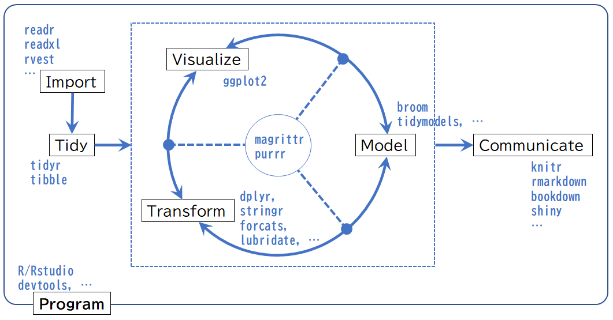

# (PART) Introduction {-}

# はじめに {.unnumbered}
　ソフトウェア開発において「データに基づく品質管理」が必要と言われるようになってから久しくなりますが、様々な理由でデータに基づく管理を実践している組織はまだまだ少数派ではないでしょうか？しかし、世の中の流れは「データドリブン」というキーワードに代表されるようにデータを使いこなせる組織が優位に立てる時代、数学が利益を生み出す[数理資本主義](https://www.meti.go.jp/shingikai/economy/risukei_jinzai/20190326_report.html){target="_blank" title="数学パワーが世界を変える，経済産業省"}の時代と言われています。

　[『データ指向のソフトウェア品質マネジメント』](https://www.juse-p.co.jp/products/view/442){target="_blank" title=""}は、日本のソフトウェア品質管理におけるデータ管理の必要性とデータ分析に必要な知識を解説している数少ない書籍です。この書籍の著者の一人である小池氏が主催している [データ分析勉強会](https://sites.google.com/site/kantometrics/home){target="_blank" title=""}では、メトリクス分析に興味をもつ有志が統計分析を実践するために統計的コンピューティングを中心に様々な知識や手法を学んでいます。

　本書は実務でメトリクス分析を行いたいソフトウェア品質技術者をはじめとした統計的コンピューティングに興味を持っている方々に [R言語（以降、**R**と記述）](https://www.r-project.org/){target="_blank" title=""}の基本的な知識を紹介しています。データ分析勉強会を通じて学んだ分析手法を実務で実践したい方の一助になれば幸いです。


## 想定読者 {.unnumbered}
　本書は統計的コンピューティングに興味があり基本的なコンピュータの知識と基礎的な統計の知識を有しており**R**を用いて分析を行いたいと考えている方々を読者として想定しています。本書では**R**を実行するための環境構築に関する詳細な解説は行いませんので、インストール手順などは市販の書籍やインターネットの情報を参考にしてください。なお、環境構築に不安があるけれどもとりあえず**R**を使ってみたいという方は [Google Colaboratory（以降、**Google Colab**）](https://colab.research.google.com/notebook#create=true&language=r){target="_blank" title="Lunch Google Colab with R engine"}\index{Google Colaboratory}の利用をおすゝめします。

<!-- \newpage -->

## 表記ルール {.unnumbered}
　本書では以下の表記ルールを用いています。

<!-- 
  表の表記方法（マルチラインテーブルも可）
  https://pandoc-doc-ja.readthedocs.io/ja/latest/users-guide.html
  表見出しは行頭に「:」を入れて書く
-->

: 表記ルール

対象                 | 表記方法                            | 表記例
---------------------|-------------------------------------|-------------------
ハイパーリンク       | 脚注にURL表記[^1]                   | CRAN^No.^
パス・ファイル名     | モノフォント[^2]                    | `sample/sample.Rmd`
パッケージ名         | 太字のモノフォント                  | **`tidyverse`**
変数・オブジェクト名 | モノフォント                        | `Sepela.Width`
関数名               | モノフォントで()付き^[3]            | `print()`
コード               | モノフォント（プロンプトなし）      | `library(tidyverse)`
コードの実行結果     | モノフォント（`##` プロンプト）     | `## output...`
キーボードのキー     | モノフォントで[]付き                | [`Ctrl`]+[`S`]
数式                 | \LaTeX 数式（math mode）            | $y = ax^2 + b$
参考文献・資料[^4]   | []または()付き                      | [Wickham, 2021]

<!-- 参考文献・資料[^3]   | [著者・作者, 作成年]                | [Wickham, 2021] -->
<!-- 参考文献・資料[^4]   | (著者・作者, 作成年)                | (Wickham, 2021) -->
<!-- 製品サービス名など   | 太字                                | **Google Colab** -->

[^1]: PDF形式のみ。^No.^の部分は章ごとの通し番号
[^2]: タイプライタフォントとも呼ばれる等幅フォント
[^3]: 数式内に関数がある場合は数式に同じ
[^4]: カッコ内は参考文献一覧への文書内ハイパーリンク

<!-- \newpage -->

## なぜRか？ {.unnumbered}
　データ分析を行うためには適切な分析ツールが必要不可欠です。**R**は統計分析に特化しているオープンソースの言語でデータ分析に最適なツールのひとつです。**R**がデータ分析に向いている理由をまとめているのが["Six Reasons To Learn R For Business", R Blogger](https://www.r-bloggers.com/six-reasons-to-learn-r-for-business/){target="_blank" title=""}です。

> 1.  R Has The Best _**Overall Qualities**_
> 2.  R Is Data Science _**For Non-Computer Scientists**_
> 3.  Learning R Is _**Easy With The Tidyverse**_
> 4.  R Has _**Brains, Muscle, And Heart**_
> 5.  R Is Built _**For Business**_
> 6.  R _**Community Support**_

　**R**はデータ分析に必要となるデータのハンドリングや可視化、モデリング、そして、レポートといった様々な機能をほとんど無料で利用することができます。[CRAN(The Comprehensive R Archive Network)](https://cran.r-project.org/){target="_blank" title=""}と呼ばれる**R**のリポジトリには15,000を超えるパッケージ（ライブラリ）が登録されています。それらのパッケージが網羅する分野は[CRAN Task Views](https://cran.r-project.org/web/views/){target="_blank" title=""}を見て分かるように古典的な統計や金融統計から最新の機械学習・ベイズ統計など40を超えています。その中でも特筆すべき分野は[Reproducible Research](https://cran.r-project.org/web/views/ReproducibleResearch.html){target="_blank" title=""}と呼ばれる再現可能性の分野です。再現可能性とは聞き慣れない言葉ですが、データ分析では「ある分析結果を再分析した際に同じ結果が得られること」を意味しています。元々は「Reproducible Research」とあるように科学的研究の分野で使われている言葉です。他の言語ではこの分野を開発範囲（スコープ）に含めることはほぼありません。

　また、**R**は逐次実行のインタプリタ型言語ですのでソフトウェアメトリクス分析のような探索的分析（Exploratory data analysis）にも適していると言えます。加えて非常にフレンドリーかつ活発なコミュニティーが日本でも形成されていますので、悩んだ時などに気軽に質問・相談ができるのも大きな強みです。

　ちなみに本書も**R**のパッケージである[**`bookdown`**](https://bookdown.org/){target="_blank" title="Write HTML, PDF, ePub, and Kindle books with R Markdown"}という文書作成に特化したパッケージを利用して**RStudio**\index{RStudio}という**R**用の統合開発環境を用いて作成してます。


## 分析の手順 {.unnumbered}
　**R**を使った分析とはどのような手順になるかを簡単に見てみましょう。**R**は分析のための単なるツールですので、データ分析の常套手段してはツールに関係なく最初に分析対象となるデータがどのような分布なのか、どのような値の範囲にあるのか、全てのデータが揃っているかなどを俯瞰することからはじめます。

　例えば[フィッシャーのあやめ（Fisher's or Anderson's iris）](https://en.wikipedia.org/wiki/Iris_flower_data_set){target="_blank" title="Iris flower data set, Wikipedia"}\index{iris dataset}を例にとってみましょう。「フィッシャーのあやめ」は**R**や機械学習の例題として様々な媒体で頻繁に使われる下記のような150行のデータセットです。**R**に標準で組み込まれています。

```{r iris, echo=FALSE}
iris %>% 
  df_print(font_size = 10, caption = "iris dataset")
```

<!-- \newpage -->

　このデータセットの要約統計量は以下で、萼片（Sepal）より花弁（Petal）の方が小さい傾向にあると推測できます。

```{r, echo=FALSE, out.width="100%"}
summary(iris)
```

　上記の要約統計章を箱ひげ図で表してみます。ただし、元の形式では都合が悪いので以下に変形しておきます。

```{r irislonger, echo=FALSE}
iris %>%
  tidyr::pivot_longer(cols = -Species, names_to = "part", values_to = "value") %>% 
  df_print(n = 4L, caption = "iris dataset, longer style")
```

　変形したデータを使って部位別の箱ひげ図を描くと確かに 花弁（Petal）の方が 萼片（Sepal）よりも小さい傾向にあることが分かります。

```{r, echo=FALSE, fig.cap="花弁と萼片の分布"}
iris %>%
  tidyr::pivot_longer(cols = -Species, names_to = "part", values_to = "value") %>% 
  ggplot2::ggplot(ggplot2::aes(x = part, y = value)) + 
    ggplot2::geom_boxplot() +
    ggplot2::labs(x = "", y = "")
```

　次に花弁（Petal）と萼片（Sepal）の幅と長さの関係を見てみます。

```{r, echo=FALSE, fig.cap="幅と長さの関係", fig.subcap=c('花弁', '萼片'), fig.ncol=2, out.width="40%"}
iris %>%
  ggplot2::ggplot(ggplot2::aes(x = Petal.Width, y = Petal.Length)) +
    ggplot2::geom_point()

iris %>%
  ggplot2::ggplot(ggplot2::aes(x = Sepal.Width, y = Sepal.Length)) +
    ggplot2::geom_point()
```

　花弁（Petal）の幅と長さに相関関係があるように、萼片（Sepal）の方には相関関係がないように見えます。そこで、花弁（Petal）の幅（`Petal.Width`）と長さ（`Petal.Length`）の回帰式を求めます。

```{r, echo=FALSE}
with(iris, lm(Petal.Length ~ Petal.Width)) %>% 
  summary()
```

　回帰モデルの当てはまり具合がかなり良いので回帰モデルを可視化します。比較として萼片（Sepal）の回帰モデルも可視化します。

```{r, echo=FALSE, message=FALSE, fig.cap="幅と長さの関係", fig.subcap=c('花弁の回帰関係', '萼片の回帰関係'), fig.ncol=2, out.width="40%"}
iris %>%
  ggplot2::ggplot(ggplot2::aes(x = Petal.Width, y = Petal.Length)) +
    ggplot2::geom_point() +
    ggplot2::geom_smooth(method = "lm", se = FALSE)

iris %>%
  ggplot2::ggplot(ggplot2::aes(x = Sepal.Width, y = Sepal.Length)) +
    ggplot2::geom_point() + 
    ggplot2::geom_smooth(method = "lm", se = FALSE)
```

　データ分析では、このような手順で対象のデータに対して可視化と変形、モデルの計算を繰り返すことで適切なモデルを探ります。これが基本となる分析プロセスです。

```{r, echo=FALSE, fig.cap="基本となる分析プロセス"}
# Visualize <-> Transform <-> Model
knitr::include_graphics("./fig/DSWF/data_science_workflow_step1.png")
```

　実際には対象のデータが都合よく**R**に組み込まれている訳ではありませんので、対象となるデータを読み込み（インポート）、処理がしやすいように整形してから可視化などを行います。最後に分析結果を報告（レポート）しますので、分析プロセスは下図になります。

```{r, echo=FALSE, fig.cap="分析プロセス"}
# Import -> Tidy -> Visualize <-> Transform <-> Model -> Communicate
knitr::include_graphics("./fig/DSWF/data_science_workflow_step2.png")
```


## Data Science Workflow {.unnumbered}
実際には前節でのプロセスを**R**などのプログラム（プログラミング）でサポートすることによりプロセス全体を円滑に回せるよう仕組みも必要です。それを加えたものが「Data Science Workflow」と呼ばれるフロー図です。

```{r, echo=FALSE, fig.cap="Data Science Workflow"}
# Import -> Tidy -> Visualize <-> Transform <-> Model -> Infer -> Communicate/Automate

```

「Data Science Workflow」自体は**R**コミュニティに多大な貢献をしている [Hadley Wickham](http://hadley.nz/){target="_blank" title=""}が著書[『R for Data Science』](https://r4ds.had.co.nz/){target="_blank" title=""}において提唱している概念です。

```{r, echo=FALSE, fig.cap="Data Science Workflow, CC BY-NC-ND 3.0 US, Hadley Wickham"}
# knitr::include_graphics("https://raw.githubusercontent.com/hadley/r4ds/master/diagrams/data-science-explore.png")
knitr::include_graphics("fig/data-science.png")
```

Hadlyの図には前節の図にはない**Infer**と**Automate**すというプロセスが入っていますが、本書では**Infer**は**Model**に、**Automate**は**Communicate**に含まれるものとして考えています。

次章に移る前に個々のプロセスについて簡単な説明をしておきます。


### Program {.unnumbered}
データ分析のすべてのプロセス（Import〜Communicate）で必要となるツールが**Program**です。**R**では様々なパッケージを使うことで外部アプリケーションとの連動を図り、**R**だけで全てのプロセスが完結するような「R Eco System」と呼べるような体型が出来上がりつつあります。この点は他のプログラミング言語と大きな違いです。


### Import {.unnumbered}
分析対象となるデータを分析環境に取り込み分析をできるようにするのが**Import**プロセスです。データは様々な形式（文字コード、ファイル形式など）で保存されていますので、それらに見合った方法でインポートする必要があります。


### Tidy {.unnumbered}
インポートしたデータは必ずしもデータ分析に適した形式になっているとは限りませんので、**R**で扱いやすいような形式（Tidy Data）にします。[Tidy Data](https://www.jstatsoft.org/article/view/v059i10){target="_blank" title="Jounal of Statistical Software"}[@R-TidyData]\index{Tidy Data}はデータ分析において非成に重要な概念で、以下の条件を満たしたデータを意味します。

* 個々の変数が一つの列をなす
* 個々の観測が一つの行をなす
* 個々の観測の構成単位の累計が一つの表をなす
* 個々の値が一つのセルをなす

端的に表現すればデータの「構造と意味が合致する」と言えます。日本語では整然データと呼ばれることもあり、対義語は雑然データ（Messy Data）となります。


### Transform {.unnumbered}
整然データ（Tidy Data）に変換したとしても、データをそのまま状態で分析に使えることは稀です。実際のデータにはデータの一部が欠損していたり、分析には必要のないデータが含まれていたりしますので、不要なデータを削除したり（クレンジング）、必要なデータだけに絞り込んだり、新しい変数を計算したりする必要があります。これらの変換を事なうのが**Transform**プロセスです。

**Tidy**プロセスと合わせて**Wrangle**や**Data Wrangling**、前処理などと呼ばれることもあります。本書では**Import**、**Tidy**、**Transform**をあわせて**Wrangle**と称しています。


### Visualize {.unnumbered}
文字通りデータの可視化を行うのが**Visualize**プロセスです。**R**には伝統的な`plot()`関数系を用いた可視化に加えて、**`ggplot2`**パッケージを用いた統一された文法による可視化があります。


### Model {.unnumbered}
データを数式を用いてモデルにするのが**Model**プロセスです。本書では**Model**プロセスと**Infer**プロセスを合わせて**Model**プロセスと称しています。


### Communicate {.unnumbered}
モデルが作成できましたら最後は分析結果を伝え（報告し）なければなりません。この報告のプロセスが**Communicate**で、プロセスにおいて重要な点が再現可能性（Reproducible research）です。再現可能性の重要性については[「統計解析の再現可能性を高めるために」](http://www.igaku-shoin.co.jp/paperDetail.do?id=PA03357_03){target="_blank" title="医学界新聞, 医学書院"}をお読みください。

<!-- \newpage￥ -->

## Tidyverse Ecosystem {.unnumbered}
Data Science Workflowを**R**で実現するための手段がHadley Wickhamが中心となって開発している**`tidyverse`**パッケージ群による「Tidyverse Ecosystem」です。

```{r, echo=FALSE, fig.cap="Tidyverse Ecosystem"}

```

ここでは、主要なパッケージをいくつか紹介するに留めておきます。詳細は各分析プロセスの章、または、『RStartHere』[@RStartHere:GitHub]をご覧ください。

* **Import**
  * **`readr`** [@R-readr]
      - 様々なテキスト形式テーブルを読み込むためのパッケージ
  * **`readxl`** [@R-readxl]
      - Microsoft Excelのファイルを読み込むためのパッケージ
  * **`rvest`** [@R-rvest]
      - Webスクレイピングのためのパッケージ
  * **`googlesheets4`** [@R-googlesheets4]
      - Google API v4 経由でスプレッドシートを読み込むためのパッケージ
  * **`DBI`** [@R-DBI]
      - SQL系の各種データベースと接続するためのパッケージ


* **Tidy**
  * **`tidyr`** [@R-tidyr]
      - Tidy Dataの作成を強力にサポートしてくれるパッケージ
  * **`tibble`** [@R-tibble]
      - より厳密にTidy Dataを扱うためのパッケージ
  * **`zoo`** [@R-zoo]
      - 時系列（TS）データを効率よく扱うためのパッケージ


* **Visualize**
  * **`ggplot2`** [@R-ggplot2]
      - 統一された文法で描画が行えるパッケージ
  * **`htmlwidgets`** [@R-htmlwidgets]
      - JavaScriptのウィジェットを利用できるパッケージ
  * **`patchwork`** [@R-patchwork]
      - **`ggplot2`**オブジェクトをひとつにまとめてレイアウトするためのパッケージ


* **Transform**
  * **`dplyr`** [@R-dplyr]
      - Tidy Dataを様々な方法で操作するためのパッケージ
  * **`stringr`** [@R-stringr]
      - 文字列処理をするためのパッケージ
  * **`forcats`** [@R-forcats]
      - 因子型を操作するためのパッケージ
  * **`lubridate`** [@R-lubridate]
      - 日付データを簡単に変換するためのパッケージ


* **Model**
  * **`broom`** [@R-broom]
      - 各種モデリング結果を整然データにするためのパッケージ
  * **`tidymodels`**[@tidymodels2020; @R-tidymodels]
      - 機械学習を中心としたモデリングフレームワーク


* **Communicate**
  * **`knitr`** [@knitr2014; @R-knitr]
      - **R**のコードと実行結果をPDFやHTMLなどに埋め込むためのパッケージ
  * **`rmarkdown`** [@R-rmarkdown]
      - マークダウン書式を用いてレポートを作成するためのパッケージ
  * **`bookdown`** [@bookdown2016; @R-bookdown]
      - 書籍や長いドキュメンを作成するためのパッケージ
  * **`shiny`** [@R-shiny]
      - インタラクティブなWebアプリケーションを作成するためのパッケージ


* **Othres**
  * **`magrittr`** [@R-magrittr]
      - パイプ演算子（`%>%`）によるスムースな処理を実現するパッケージ
  * **`purrr`** [@R-purrr]
      - 関数型プログラミングによる反復処理を提供するパッケージ

　プロセスのハブ・スポークを担うパッケージもEcosystemの一部です。

