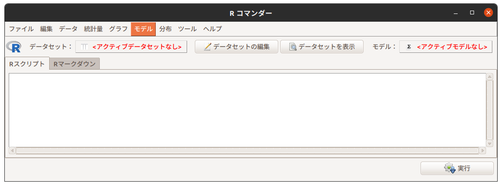
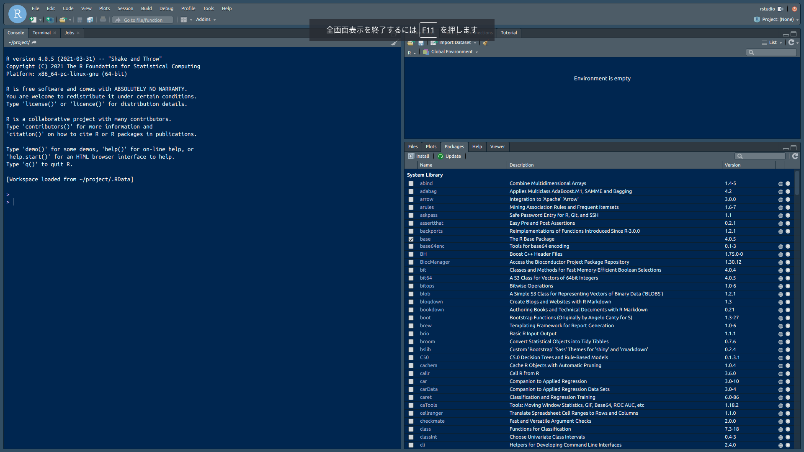

# (PART) Program {-}

# 分析環境
　**R**に限らずプログラミング（言語）を学ぶ際にはプログラミングできる環境を用意しておくべきですが、初学者にとって最も厄介なものが環境構築作業でもあります。そこで、初学者の方には環境構築の必要がない後述の**Google Colab**の利用をおすゝめします。**RStudio**の環境構築に関しては書籍や資料が多数ありますので、**R**に慣れてきたらチャレンジしてみるも良いと思います。


## 主な分析環境
　**R**を利用した分析環境には以下のようなものがあります。

: 主な想定利用者と分析環境

想定利用者 | 環境                | コード記述 | 再現可能性 | 備考 
-----------|---------------------|:----------:|:----------:|-------------------
初学者     | R Commander         | 不要       | 低         | 本書ではスコープ外
初学者     | Exploratory         | 不要[^P2-1] | 高        | 同上
初学・中級者 | Google Colab      | 要         | 高         | 
中上級者   | RStudio Desktop     | 要         | 高         | 
中上級者   | RStudio Cloud       | 要         | 高         | 
中上級者   | RStudio Server      | 要         | 高         | Dockerでの利用が前提
開発者     | R + VS Code/Emacs   | 要         | 高         | 本書ではスコープ外

[^P2-1]: 必要に応じてコードを記述することも可能です


### R Commander\index{R Commander, Rcmdr}
　[R Commander（以降、**Rcmdr**）](https://socialsciences.mcmaster.ca/jfox/Misc/Rcmdr/){target="_blank" title=""}は、本書ではスコープ外ですが、[SQiP研究会のソフトウェアメトリクス演習コース（以降、メトリクス演習コース）](https://www.juse.or.jp/sqip/workshop/outline/index.html){target="_blank" title=""}で利用されるツールですので紹介のみしておきます。  

　**Rcmdr**は**R**のパッケージとして提供されており、起動するとGUIベースの対話型分析環境になります。分析にあたって**R**のコードを記述する必要がありませんので、プログラミングの経験のない方でも手軽に利用することができます。ただし、実行できる機能（関数）が限定されている点と分析対象のデータの扱いが特有な点には注意してください。

```{r, echo=FALSE, fig.cap="Rcmdr on Ubuntu(Linux)"}

```


### Google Colab\index{Google Colaboratory}
　**Google Colab**は Googleアカウントを持っていれば誰でも利用可能な**Python**向けの**Jupyter Notebook**サービスです。[**Jupyter Notebook**は**R**をエンジンとして利用](https://colab.research.google.com/notebook#create=true&language=r)することができますので、環境を構築することなく使い始めたい方に向いています。プログラミング経験のない初学者の演習環境としては、おすゝめの環境です。

```{r, echo=FALSE, fig.cap="Google Colab"}
knitr::include_graphics("./fig/Colab/Firsttime.png")
```


### RStudio\index{RStudio}
　再現可能性を確保した探索的データ分析を行うのに最も適しているのが[**RStudio**](https://www.rstudio.com/products/rstudio/)です。無償で使えるオープンソース版には、PC上のアプリケーションとして動作する**Desktop**と Webサーバとして動作する**Server**の二種類があります。
**RStudio**は**R**のデファクトスタンダード的な統合開発環境（IDE）であり、Tidyverse Ecosystemを活かせる分析環境（開発環境）です。その特徴としては、

* **R**のコードを記述するのに適したエディタを備えている
* **R**のパッケージをインストール・管理するためのパッケージマネージャを備えている
* [**R Markdown**](https://rmarkdown.rstudio.com/){target="_blank" title=""}や [**Pandoc**](https://pandoc.org/){target="_blank" title=""} との連携による再現可能性を確保するための仕組みを備えている
* 外部リソースからのデータを取り込む仕組み（**RStudio Connect**）を備えている
* 複数の分析をプロジェクト単位で管理する仕組みを備えている
* \index{Git}[Git](https://git-scm.com/){target="_blank" title=""} などの外部プログラムと連携したソースの版管理の仕組みを備えている

などが挙げられます。

```{r, echo=FALSE, fig.cap="RStudio Desktop on Windows"}
knitr::include_graphics("./fig/RStudio/DT.png")
```

　**RStudio Server**は**RStudio**をブラウザから使う Linux 上で動作するサーバアプリケーションです。Docker\index{Docker}コンテナとして動作させることが可能ですので、個々のPCでの分析環境を固定さたい場合などには非常に便利です。

```{r, echo=FALSE, fig.cap="RStudio Server, Docker Container"}

```

::: {.hint-box data-latex=""}
Docker Desktopの商用利用は有料です。営利組織内で利用する場合は[利用条件](https://www.docker.com/products/docker-desktop)を確認の上、利用規約に抵触しなようにご注意ください。
:::


### RStudio Cloud\index{RStudio Cloud}
　[**RStudio Cloud**](https://rstudio.cloud/)は、その名の通りクラウド版の**RStudio**です。商用版の**RStudio Server Pro**をベースしていますので、任意のバージョンの**R**に切り替えて使ったり**RStduio Package Manager**とも連携していますのでパッケージ管理が楽になっています。また、英語版しかありませんがチュートリアル機能が充実しているのが特徴です。  

　無料プランが用意されていますが利用時間が25時間/月[^P2-2]に限定されていますので、繋げっぱなしでの長時間利用や機械学習などには不向きです。

```{r, echo=FALSE, fig.cap="RStudio Cloud"}
knitr::include_graphics("./fig/RStudio/RSCloud_01.png")
```

[^P2-2]: 厳密には「25 project hours」なので、CPUとRAMの割当を増やすと短くなります


### Programing Editor
　**R**の本体ははインタプリタ（対話的に逐次実行する処理系）として提供されていますので、**R**単体で動作させることが可能です。区別するために単体の**R**を**R Console**と呼ぶことがあります。  

　一部のプログラミングエディタでは機能拡張などを利用して直接**R Console**と連携してIDEのように**R**を利用することが可能です。古くはGNU Emacs用のESSや最近人気のあるMicrosoft VisualStudio Code用の機能拡張を使えば、VisualStudio Codeから直接**R**を使うことができます。
