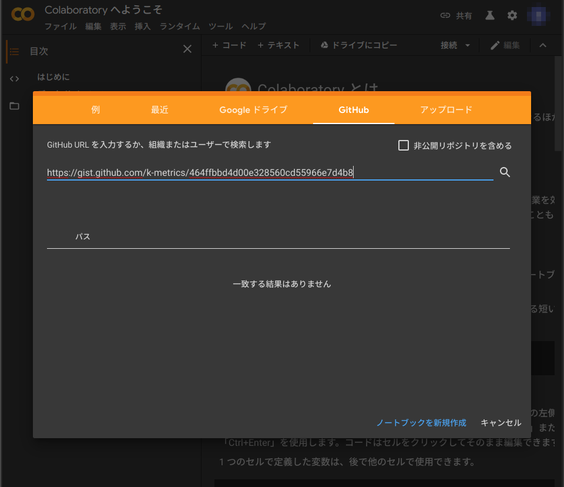
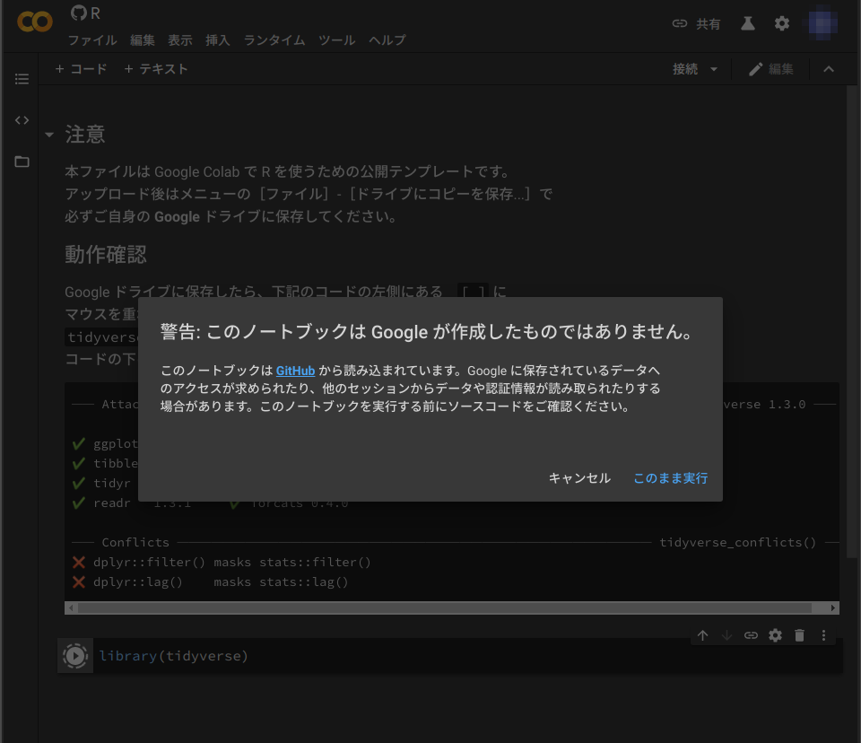
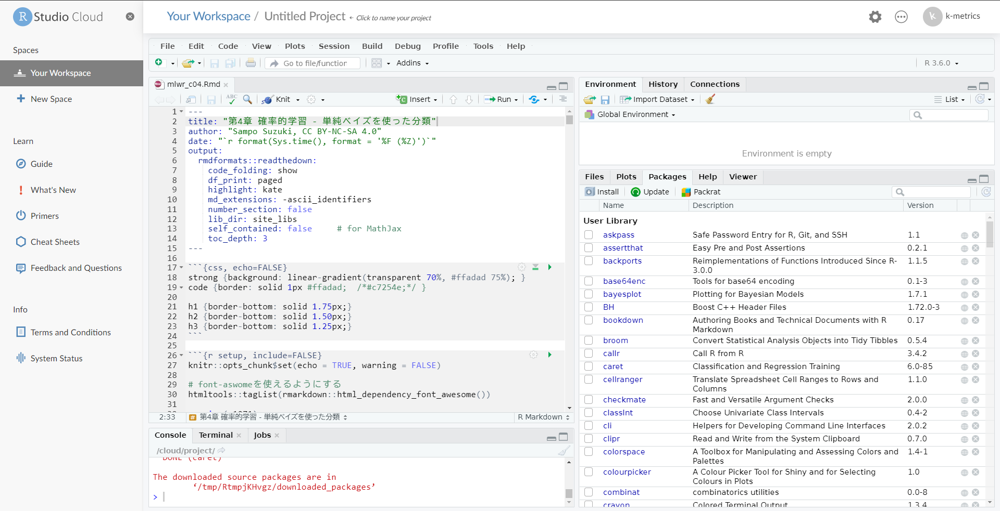

# (PART) Program {-}

# Environments
　R について学ぶ前に R が使えるように環境を構築する必要がありますが、環境構築は初学者にとって厄介な部分でもあります。そこで、本書では学習レベルに合わせて以下のように環境を使い分けることをおすゝめします。  
　  

学習フェーズ     | 環境                                    | 備考
-----------------|-----------------------------------------|--------------------
基礎学習フェーズ | [Google Colaboratory <i class="fa fa-external-link"></i>](https://colab.research.google.com/?hl=ja){target="_blank" title="Google Colab"} | 要Googleアカウント
応用学習フェーズ | [RStudio Cloud <i class="fa fa-external-link"></i>](https://rstudio.cloud/){target="_blank" title="RStudio, PBC"} | Beta edition

　  
　環境を構築するための基本的な知識がある方は最初から RStudio Dekstop（以降、RStudio）を利用しても構いません。  

　  

## Google Colaboratory
　R の言語仕様など基礎的な学習フェーズでは環境構築の手間がかからないクラウド型の Google Colaboratory（以降、Google Colab）の利用をおすゝめします。Google Colab では Jupyter Notebook というデータ分析用のツールが使えます。ただし、デフォルトの状態で R を使うのは少し不便なので、以下の手順でファイルを準備します。  
　  

1. ブラウザで Google アカウントにログインする
1. Google Colab を開く
1. R 用のテンプレートファイルをアップロードする
1. R のコードが実行できることを確認する
1. アップロードしたファイルを Google ドライブに保存する

　  

### Login Google
　Google Colab は名前通り Google が提供しているサービスですので Google のアカウントを持っていることが前提になります。また、Chrome 系（含む Chromium 系）のブラウザで利用することをおすゝめします。  
　まず、ブラウザで [Google <i class="fa fa-external-link"></i>](https://www.google.co.jp){target="_blank" title="Google"} のページを開きます。ページの右上に［ログイン］と表示されている場合は［ログイン］をクリックしてログインしておきます。  

　

### Open Google Colab
　Google で Google Colab を検索して [Colaboratory - Google Colab <i class="fa fa-external-link"></i>](https://colab.research.google.com/notebooks/welcome.ipynb?hl=ja){target="_blank" title=""} のリンクをくと以下のような画面が表示されまます。  
　  

```{r, echo=FALSE, out.width="80%", fig.cap="Google Colab, Theme: dark"}

```

　画面テーマは右上の歯車ボタンから変更できます。  

　  

### Upload Template
　Google Colab が立ち上がりましたら上部にあるメニュー ［ファイル］-［ノートブックをアップロード...］を実行します。  
　  

```{r, echo=FALSE, out.width="80%", fig.cap="Upload notebook file"}

```

　アップロード用のダイアログが開きますので［GitHub］タブをクリックし、上段のライン（画像の青線部分）に下記の URL を入力します。入力後、右端にある虫眼鏡アイコンをクリックします。  

`https://gist.github.com/k-metrics/464ffbbd4d00e328560cd55966e7d4b8`  
　  

```{r, echo=FALSE, out.width="80%", fig.cap="Upload from GitHub"}

```

　テンプレートがアップロードされ表示されます。  

　  

### Run R code
　テンプレートがアップロードできましたらテンプレートファイルの記述にしたがってコードを実行してみます。その際に下記のようなダイアログが表示されますが認証情報などを読み取ることはありませんので［このまま実行］をクリックしてください。
```{r, echo=FALSE, out.width="80%", fig.cap="Warning dialog"}

```

　サーバ（ホスト型ランタイム）との接続するため実行までに多少時間がかかります。  

　  

### Save File
　コードの実行が確認できましたらメニューの［ファイル］-［ドライブにコピーを保存...］を実行してコピーを Google Drive に保存します。以降、この保存したファイルを利用してください。  

　  

## RStudio Cloud
　Google Colab では R Markdown などのレポーティング機能は使用できませんので、このような場合には クラウド上で RStudio が利用できる RStudio Cloud が便利です。  
　  
```{r, echo=FALSE, out.width="80%", fig.cap="RStudio Cloud, beta"}

```
　  
　執筆時点では無償で利用することができ、無制限のプロジェクトとプライベートプロジェクトの作成が可能です。RStudio Cloud を利用するにはアカウントを取得するだけです。  
　  

1. ブラウザで [RStudio Cloud <i class="fa fa-external-link"></i>](https://rstudio.cloud/){target="_blank" title="Beta edition"} を開く
1. 右上の［sign up］をクリックする
1. RStudio Cloud のアカウントを作成してサインアップするか、Google または GitHub のアカウントでログインする

　  

### Create Project
　RStudio Cloud ではプロジェクトという単位で分析を管理しますので、最初にプロジェクトを作成します。作成手順については RStudio Cloud メニューにある［Guide］で確認してください。ガイドは全て英語ですが、 Chrome 系のブラウザであれば「Google翻訳」機能拡張を用いれば日本語に翻訳表示できます。  
　プロジェクトを作成すると統合開発環境の RStudio が表示されます。RStudio 自体の説明は Appendix を参照してください。  
　  

### Install Packages
　RStudio Cloud の初期状態では R のパッケージは Base R しかインストールされていません。最も利用する `tidyverse` パッケージや `rmarkdown` パッケージを最初にインストールしておきます。  

