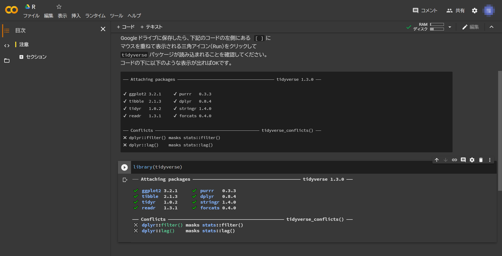

# (PART) Program {-}

# 分析環境
R について学ぶ際には R が使えるような環境を構築しておくべきです。しかし、環境構築は初学者にとって最も厄介な作業でもあります。そこで、本書では環境構築の必要がない [[Google Colaboratory]](){target="_blank" title="Turn a Git repo into a collection of interactive notebooks"} を利用します。R/RStudio 環境を構築できる方はそちらを利用しても構いません。


## R の主な分析環境

### R/R Commander(Rcmdr)
コードを記述する必要がない代わりに実行できる機能（関数）が限定され、GUI による対話形式で R を使えるのが [[R Commander（以降、Rcmdr）]](https://socialsciences.mcmaster.ca/jfox/Misc/Rcmdr/)です。Rcmdr は R のパッケージとして提供されていますが、OS により使える機能（メニュー）が若干異なるようで、基本的には Windows 環境での利用をおすゝめします。ちなみに SQiP のメトリクス演習コースでは Rcmdr を利用してます。

```{r, echo=FALSE, out.width="85%", fig.cap="Rcmdr, Ubuntu"}
knitr::include_graphics("./fig/RCmdr.png")
```

### R/RStudio Desktop
Rcmdr は簡単ですが実行できる機能（関数）が限定されていること、GUI による対話形式のため操作手順の記録が残しにくいなどの難点があります。それらを解決する統合開発環境（IDE）が RStudio です。RStudio は R の IDE におけるデファクトスタンダードであり 

* R のコードを記述するのに適したエディタを備えている
* R のパッケージをインストール・管理するためのパッケージマネージャを備えている
* [[R Markdown]](https://rmarkdown.rstudio.com/) や [[Pandoc]](https://pandoc.org/) との連携による再現可能性を確保するための仕組みを備えている
* 外部リソースからのデータを取り込む仕組み（RStudio Connect）を備えている
* 複数の分析をプロジェクト単位で管理する仕組みを備えている
* [[Git]](https://git-scm.com/) などの外部プログラムと連携したソースの版管理の仕組みを備えている

という特徴があり、R を用いた分析に最も適した分析環境と言えます。RStudio にはインストール環境に応じた複数のリリース形態がありますが、その中でも Desktop は OS 上のアプリケーションとして動作するため最も利用しやすいと言えます。

```{r, echo=FALSE, out.width="85%", fig.cap="RStudio Desktop, Windows"}
knitr::include_graphics("./fig/RStudio/DT.png")
```

### R/RStudio Server
RStudio Server はブラウザベースで動作する RStudio です。Linux 上で動作するサーバアプリケーションですが、Docker で動作させることも可能ですので複数の分析者で分析環境を統一したい場合などに適しています。

### RStudio Cloud
クラウド版の RStudio が RStudio Cloud です。RStudio Server Pro ベースのクラウドサービスですので、任意のバージョンの R に切り替えて使うことも可能です。無料プランでは利用時間が限定される点に注意してください。

```{r, echo=FALSE, out.width="85%", fig.cap="RStudio Cloud"}
knitr::include_graphics("./fig/RStudio/RSCloud_01.png")
```

### Google Colaboratory(R Engine)
Google Colaboratory（以降、Google Colab）は、Googleアカウントを持っていれば誰でも利用可能な Python 向けの開発環境である Jupyter Notebook サービスです。Jupyter Notebook は Python 以外に R をエンジンして利用することができるため、この機能を利用することで利用時間の制限なく R の分析環境として使うことができますので初学者の方には最も適した分析環境と言えます。

```{r, echo=FALSE, out.width="85%", fig.cap="Google Colab"}

```

### R(R Console)/Editor(VisualStudio Code, GNU Emacs)
R はインタプリタ（対話的に逐次実行する処理系）として提供されていますので、R 単体で動作させることが当然、可能です。単体で動作させた場合、ターミナルやコンソールと呼ばれるウィンドウベースで動作するため非常に使いにくい環境です。一方、プログラミングに慣れている方は自分の好みの使いなれたエディタで分析を行いたい場合が多いと思われます。
一部のエディタでは、このようば要望を満たすために R Conole との連携機能を提供しています。古くは Emacs 用の ESS や最近人気のある Microsoft の VisualStudio Code 用の機能拡張などが
