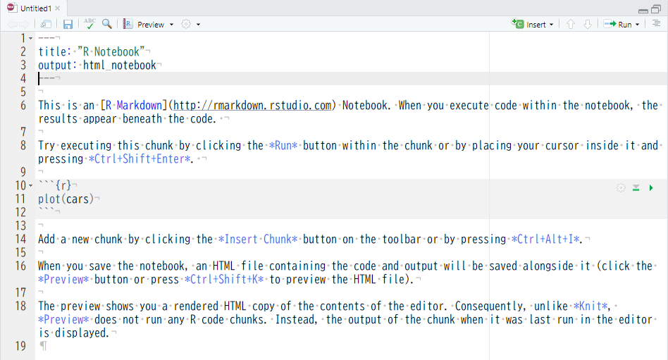
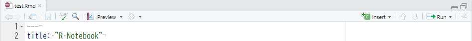
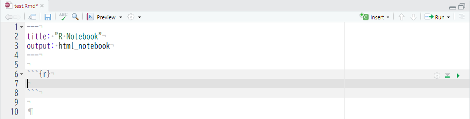
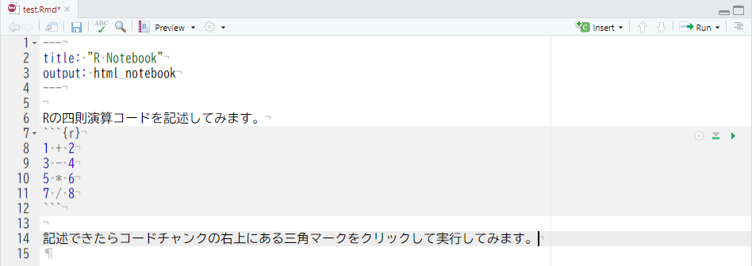
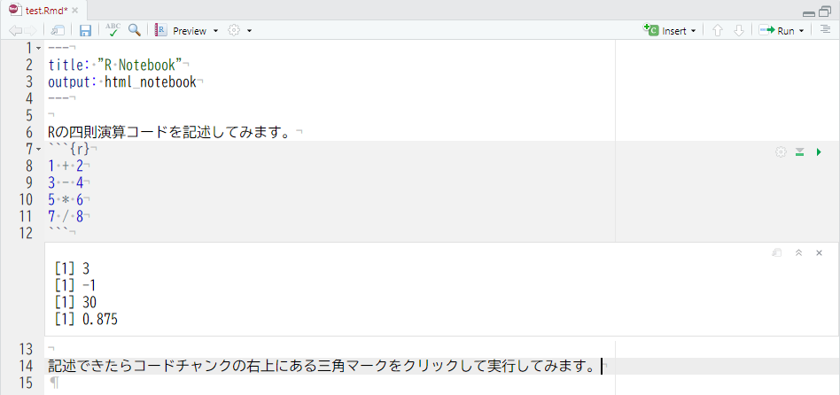
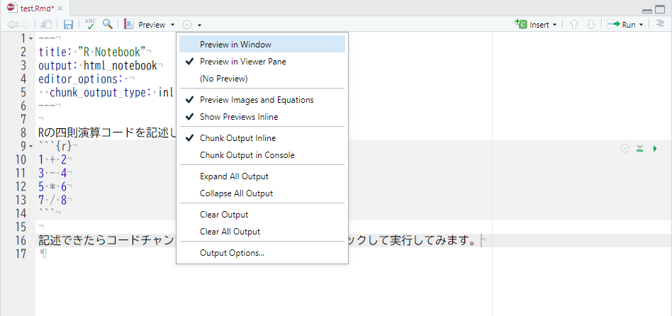

# RStudio IDE
　データ分析勉強会では長らく [R Commander（以降、Rcmdr） <i class="fa fa-external-link"></i>](https://www.rcommander.com/){target="_blank"} が利用されています。勉強会の母体となっている [SQiP研究会 <i class="fa fa-external-link"></i>](https://www.juse.or.jp/sqip/workshop/outline/index.html){target="_blank"} のソフトウェアメトリクスに関する演習コースでも同様です。これはプログラミングに縁の薄いソフトウェア品質管理技術者が短期間で R を用いた分析を行えるようにとの配慮からです。実際、 Rcmdr はコードを記述しなくてもデータの可視化や分析ができますのでデータ分析の初学者にとっては R の恩恵を簡単に受けられる非常に便利な道具です。  
　しかし、Rcmdr は R のごく一部の関数を GUI で使えるようにしたラッパープログラムですので、できることが非常に限られています。加えて GUI 操作なため操作自体が記録に残りません。つまり、探索的にデータを分析を行ってもその手順分析者の記憶に依存してしまいますので分析再現性の観点から見ると好ましい分析環境とは言えません。  
　  
　本格的な探索的データ分析を行うには、出来ることが限られる Rcmdr ではなく R のスクリプトを用いるべきです。しかし、 R 本体（R Console）は非常に機能が限られていますので、それだけで探索的データ分析を行うのは非常に困難です。そこで、初学者には様々な機能を予め備えている統合開発環境（IDE - Integrated Development Environment）を利用をおすゝめします。  
　  
　R 用統合開発環境のデファクトスタンダードと言えるのが RStudio, PBC の [RStudio IDE （以降、RStudio）<i class="fa fa-external-link"></i>](https://rstudio.com/products/rstudio/) です。無償版である Open Source Edition でも全ての基本的な機能を利用できます。  
　  
　初学者にとって RStudio には以下のような便利な機能があります。

* 補完機能が強力
    * 関数名・変数名・パッケージ名などを補完してくれますので入力負荷が大幅に減ります
* エディタ機能が強力
    * キーひとつでヘルプの参照が可能ですので即座に疑問が解決できます
    * 部分的にコードを実行できますので手順を確認しながらコーディングできます
    * Markdown 記述が使えますので分析と報告書作成を同時に進められます
        * コードの直下に実行結果を表示することができますのでコードと実行結果の関係性が一目でわかります
* パッケージ管理が分かりやすい
    * インストールされているパッケージが一目でわかります
    * パッケージの検索・読込み・インストールが GUI 操作で簡単にできます
* その他の便利な機能
    * 作成した変数を一覧で確認できると共に値も確認できます
    * プロジェクト管理機能が使えますので分析ごとにファイルなどをセパレートできます
    * バージョンコントロールシステムを用いた履歴管理ができます
    * Python などの他言語もサポートしています

　上記は機能のほんの一部を紹介したにすぎません。 RStudio は R を利用した探索的データ分析を効率的かつ強力にしかも無償でサポートしてくれる道具です。  
　  

## Overview
　RStudio を起動すると以下のような画面が表示されます。画面は大きく以下の四つのエリアに分割されており、左上の A のエリアはソースエディタが表示されるエリアなので初めて起動した際には表示されません。  
　  

```{r, echo=FALSE, out.width="80%", fig.cap="RStudio Desktop, Windows"}
knitr::include_graphics("fig/RStudio_Desktop_Area.png")
```

　各エリアのサイズ（ウィンドウ内での比率）は任意に調整できますが、横幅に関しては A と B 、 C と D が常に同サイズとなります。各エリアにはペインと呼ばれるタブ切り替え型のサブエリアが表示されます。ペインは常時表示されるペイン（下図の黒文字）と機能が呼び出されたり利用を設定している場合にのみ表示されるペイン（下図の灰文字）があります。  

```{r, echo=FALSE, out.width="80%", fig.cap="RStudio Pane Layout, Windows"}
knitr::include_graphics("fig/RStudio_Desktop_Pane.png")
```

　RStudio のバージョンにより多少ペイン構成が異なりますが以下のペインが用意されています。これらのペインはグローバルオプションで表示位置の変更や表示・非表示の切り替えができます。  
　  

No | Area | Pane name     | Descriptions
:-:|------|---------------|-----------------------------------------------------
1  | A    | (File name)   | ソースエディタ（ファイルが開かれていない場合は未表示）
2  | A    | (Data name)   | データフレーム型の変数などを表示するデータビューア
3  | B    | Console       | 文字通りRのコンソール（実行結果の表示だけでなくここから実行することも可）
4  | B 　 | Terminal      | OS のターミナル（RStudio v1.1から）
5  | B    | R Markdown    | R Markdown ファイルをレンダリングした際にレンダリング情報を表示
6  | B 　 | Jobs          | ローカルジョブの実行マネージャ（RStudio v1.2から）
7  | C    | Environment   | オブジェクト（変数、関数）の表示と参照ができる環境マネージャ
8  | C    | History       | 実行履歴マネージャ（コンソールでの実行、ソースからの実行共に記録）
9　| C    | Connections   | データソース接続マネージャ（RStudio v1.1から）
10 | C    | Build         | ビルドツール（プロジェクトオプションで有効にしている場合のみ）
11 | C    | Git or SVN    | 簡易VCSクライアント（プロジェクトオプションでVCSを有効にしている場合のみ）
12 | D    | Files         | 簡易なファイルマネージャ
13 | D    | Plots         | グラフィック専用プロットエリア（ヒストリ機能、出力機能付き）
14 | D    | Packages      | パッケージ管理を行うためのパッケージマネージャ
15 | D    | Help          | ヘルプビューア（ソースエディタやコンソールと連動したヘルプ表示が可）
16 | D    | Viewer        | HTML等の表示が可能なビューア

　  

## Keyboard Shortcuts
　キーボードショートカットは効率的なコーディングに役立ちますので、最低限、以下のショートカットを覚えましょう。  
　  

Keyboard Shortcuts       | Description
-------------------------|---------------------------------------------
［TAB］                  | 入力中のコード（オブジェクト）を補完
［Alt/Option］+［-］            | 代入演算子（` <- `）をカーソル位置に挿入する
［Ctrl/Cmd］+［Shift］+［M］ | パイプ演算子（` %>% `）をカーソル位置に挿入する
［Ctrl/Cmd］+［Shift］+［C］ | 選択行をコメント・アンコメントする（トグル動作）
［Ctrl/Cmd］+［Alt/Option］+［I］   | カーソル位置にコードチャンクを挿入する（R Markdownのみ）
［Ctrl/Cmd］+［Enter］       | 選択したコードを実行する（行選択、部分選択どちらも可）
［Ctrl/Cmd］+ [Shift] +［Enter］| コードチャンク内の全てのコードを実行する（R Markdownのみ）
［F1］                   | 選択またはカーソル位置の関数のヘルプを呼び出す
［Ctrl/Cmd］+［F］           | アクティブなペイン内の検索

　  
　上記以外のショートカットはメニュー［**Tools**］-［**Keyboard Shortcuts Help**］を選択すると表示できます。  
　  

## Writing R code
　では、実際に RStudio を利用して簡単なコードを書いてみましょう。初学者が学習のために R のコードを記述するには R Notebook 形式が便利です。 R Notebook 形式は マークダウン言語とコードを混在できる R Markdown 形式を簡易にしたものです。コード以外に説明などを記述できるのでアウトプットしながらの学習が可能です。
　R Notebook 形式を使うにはメニューから［File］-［New File］-［R Notebook］を実行します。すると下図のようなソースエディタ（以降、エディタ）が開きます。  

```{r, echo=FALSE, out.width="80%", fig.cap="R Notebook file"}

```

　この時点ではファイルとして保存されていませんので、メニューから［File］-［Save As...］を実行して適当な場所に適当な名前で保存しておきます。ここでは `test` という名前を入力して保存します。ファイルの拡張子が自動的に付与されますのでタブの表示は `test.Rmd` となります。  

```{r, echo=FALSE, out.width="80%", fig.cap="R Notebook saved file"}

```

　ファイルを保存したら 6 行目の「This is an　...」から 18 行目の「in the editor is displayed.」までを削除し、カーソルの位置（6 行目）でキーボードショートカット［Ctrl/Cmd］+［Alt/Option］+［I］を押下してコードを記述するためのブロックを挿入します。  

```{r, echo=FALSE, out.width="80%", fig.cap="R Notebook insert chunk"}

```

　すると上図のように三連のバッククォート（```` ``` ````）で囲まれたブロックが挿入されます。このブロックはコードチャンクと呼ばれる R のコードを記述する部分です。コードチャンクの前後は自由な記述が出来ますので、以下のように入力してみてください。  

```{r, echo=FALSE, out.width="80%", fig.cap="R Notebook first code"}

```

　上図のように R Notebook では説明とコードを混在することができます。では、コードチャンクの右上にある緑色の三角マークをクリックしてコードを実行してみましょう。  

```{r, echo=FALSE, out.width="80%", fig.cap="R Notebook run code"}

```

　コードチャンクの下と **Console** ペインに実行結果が表示されます。コードチャンクの下に実行結果が表示されない場合は下図のように歯車アイコンをクリックし表示したメニューから `Chunk Output Inline` にチェックをつけ、再度、緑色の三角マークをクリックしてコードを実行してください。コードチャンクの下に実行結果が表示されます。  

```{r, echo=FALSE, out.width="80%", fig.cap="R Notebook option"}

```

　最後にフロッピーディスクアイコンをクリックするかキーボードショートカットの［Ctrl/Cmd］+［S］を押下してファイルを保存しておきます。
