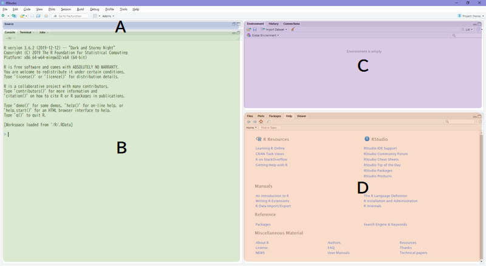
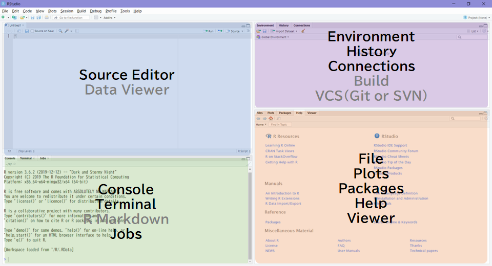

# RStudio IDE
　データ分析勉強会ではながらく [R Commander（以降、Rcmdr） <i class="fa fa-external-link"></i>](https://www.rcommander.com/){target="_blank"} が利用されています。Rcmdr はコードを記述しなくてもデータの可視化や分析ができますのでデータ分析の初学者にとっては非常に便利な道具です。しかし、Rcmdr は R のごく一部のコマンド（関数）をGUIで使えるようにしたラッパーですので、できることが非常に限られています。加えてGUI操作が記録に残りませんので分析再現性の観点からみて好ましいとは言えません。  
　  
　本格的なアドホック分析を行うには Rcmdr から卒業して R のスクリプトを書く必要があります。R 本体にはエディタ機能などが備わっていませんので統合開発環境（IDE - Integrated Development Environment）を利用すべきです。R における統合開発環境のデファクトスタンダードと言えるのが RStudio社の [RStudio IDE （以降、RStudio）<i class="fa fa-external-link"></i>](https://rstudio.com/products/rstudio/) です。 Open Source Edition であれば基本的な機能は無償で利用できます。

# RStudio Basics
　RStudio は 前述のように RStudio, Inc. が開発・公開している 統合開発環境（IDE）で R 用 IDE のデファクトスタンダードといえます。近年のバージョンアップにより R だけでなく Python や Stan などの言語もサポートも充実してきており、 R と Python の併用といったことも可能です。  
　  
初学者にとって便利な機能としては

* 強力なエディタ
    * 様々な言語に対応するコードハイライティング
    * 関数名のみならず変数名まで補完できるコード補完
    * キーひとつでヘルプの参照が可能など
* 分かりやすいパッケージ管理
    * インストール済パッケージの検索・読み込み
    * インストールしたいパッケージ名の自動補完
* プロジェクト管理
    * ディレクトリ単位でセパレートできるプロジェクト管理
    * VCSによる履歴管理

などがあります。R を利用したデータ分析を強力にサポートしてくれます。


## RStudio Overview
　RStudio を初めて起動すると以下のような画面が表示されます。画面は大きく以下の四つのエリアに分割されており、左上の A のエリアはソースエディタが表示されるエリアなので初めて起動した際には表示されません。  
　  

```{r, echo=FALSE, out.width="80%", fig.cap="RStudio Desktop, Windows"}

```

　各エリアのサイズ（ウィンドウ内での比率）は任意に調整できますが、横幅に関しは A と B 、 C と D が常に同じサイズとなります。  
　各エリアにはペインと呼ばれるタブ切り替え型のサブエリアが表示されます。ペインは常時表示されるペイン（黒文字）と機能が呼び出されたり利用を設定している場合にのみ表示されるペイン（灰文字）があります。  

```{r, echo=FALSE, out.width="80%", fig.cap="RStudio Pane Layout, Windows"}

```

　RStudio のバージョンにより多少ペイン構成が異なりますが以下のペインが用意されています。これらのペインはグローバルオプションで表示位置の変更や表示・非表示の切り替えができます。  
　  

No | Area | Pane name     | Descriptions
:-:|------|---------------|-----------------------------------------------------
1  | A    | (File name)   | ソースエディタ（ファイルが開かれていない場合は未表示）
2  | A    | (Data name)   | データフレーム型の変数などを表示するデータビューア
3  | B    | Console       | 文字通りRのコンソール（実行結果の表示だけでなくここから実行することも可）
4  | B 　 | Terminal      | OS のターミナル（RStudio v1.1から）
5  | B    | R Markdown    | R Markdown ファイルをレンダリングした際にレンダリング情報を表示
6  | B 　 | Jobs          | ローカルジョブの実行マネージャ（RStudio v1.2から）
7  | C    | Environment   | オブジェクト（変数、関数）の表示と参照ができる環境マネージャ
8  | C    | History       | 実行履歴マネージャ（コンソールでの実行、ソースからの実行共に記録）
9　| C    | Connections   | データソース接続マネージャ（RStudio v1.1から）
10 | C    | Build         | ビルドツール（プロジェクトオプションで有効にしている場合のみ表示）
11 | C    | Git or SVN    | 簡易VCSクライアント（プロジェクトオプションでVCSを有効にしている場合のみ表示）
12 | D    | Files         | 簡易なファイルマネージャ
13 | D    | Plots         | グラフィック専用プロットエリア（ヒストリ機能、出力機能付き）
14 | D    | Packages      | パッケージ管理を行うためのパッケージマネージャ
15 | D    | Help          | ヘルプビューア（ソースエディタやコンソールと連動してヘルプ表示可）
16 | D    | Viewer        | HTML等の表示が可能なビューア

　  

## Options
　RStudio のオプション設定にはグローバルオプション（**Global Options**）とプロジェクトオプション（**Project Options**）の二つがあります。グローバルオプションは文字通り RStudio 全体（全てのプロジェクト）に有効なオプション設定で、プロジェクトオプションは開いているプロジェクトのみに有効なオプション設定です。 RStudio のバージョンにより多少異なります。
　  

### Global Options
　メニュー［**Tools**］-［**Global Options...**］を選択すると表示できます。以降に推奨設定項目を記載しておきますので参考にしてください。記載されていないオプションはお好みで設定してください。  
　  

#### General
　Genelal オプションは RStudio の全般的な動作に関する設定です。 Basic と Advanced の二種類の設定がありますが、初学者の方は Basic のみ以下のように設定しておくと便利です。  
　  

大項目(Tab) | 中項目(太文字) | 設定項目                       | 推奨設定
------------|----------------|--------------------------------|-----------------
Basic       | R Sessions     | R version                      | Default（Windows only）
Basic       | R Sessions     | Default working directory      | 任意のディレクトリ
Basic       | R Sessions     | Restore most recently opened project at startup | Unchecked
Basic       | Workspace      | Restore .RData into workspace at startup | Checked
Basic       | Wrokspace      | Save workspace to .RData on exit | "Ask" or "Always"
Basic       | Ohter          | Automatically notify me of updates to RStudio | Checked

　  
　特に "Default working directory" はプロジェクトを作成・管理するディレクトリに設定しておくと便利です。  

　  

#### Code
　Code オプションはソースエディタの動作に関する設定です。ソースの記述は [スタイルガイド（The tidyverse style guide） <i class="fa fa-external-link"></i>](https://style.tidyverse.org/){target="_blank"} に準拠することをおすゝめしますので、設定例もスタイルガイドに沿ったものになっています。なお、 Python などの他言語を併用する場合は適切な設定に変更してください。  
　

大項目(Tab) | 中項目(太文字) | 設定項目                       | 推奨設定
------------|----------------|--------------------------------|-----------------
Editing     | General        | Insert spaces for tab          | Checked
Editing     | General        | Tab width                      | 2 
Editing     | General        | Auto-detect code indentation   | Checked
Editing     | General        | Insert matching parens/quotes  | Checked
Editing     | General        | Auto-indent code after paste   | Checked
Editing     | General        | Vertically align arguments in atuo-indent | Checked
Editing     | General        | Surround selection on text insertion | "Quotes & Brackets"
Editing     | Execution      | Always save R scripts before sourcing | Checked
Editing     | Execution      | Ctrl+Enter executes            | "Multi-line R statement"
Display     | General        | Highlight selected word        | Checked
Display     | General        | Highlight selected line        | Checked
Display     | General        | Show line numbers              | Checked
Display     | General        | Show margin                    | Checked
Display     | General        | Margin coloumn                 | 80
Display     | General        | Show whitespace characters     | Checked
Display     | General        | Show syntax highlighting in console input | Checked
Saving      | General        | Restore last cursor position when opening file | Checked
Saving      | Serialization  | Line ending conversion         | "Posix (LF)"
Saving      | Serialization  | Default text encoding          | "UTF-8"

　  

#### Appearance
　Appearance オプションは RStudio の見た目に関する設定です。フォント設定のみ日本語の固定ピッチフォントに変更し、その他はお好みでどうぞ。  
　  

大項目(Tab) | 中項目(太文字) | 設定項目                       | 推奨設定
------------|----------------|--------------------------------|-----------------
N/A         | N/A            | Editor font                    | 任意の日本語等幅フォント

　  
　日本語等幅フォントは好みで構いませんが、無償ダウンロード可能な以下のフォントがおすゝめです。  

* BIZ UDゴシック（macOS, Windows） - MORISAWA PASSPORT
* Source Han Code JP（Linux, macOS） - SIL Open Font License
* IPAゴシック（Linux, macOS, Windows） - IPA フォントライセンス

　なお、日本語版 Windows の RStudio では一部の日本語等幅フォントを正しく表示できないバグがあるようですので、フォントの選択には注意してください。  

　  

#### Pane Layout
　Pane Layout オプションは前述のペインの表示場所や表示・非表示を変更するためのオプションですので、初学者はデフォルト設定のまま利用することをおすゝめします。  

　  

#### Packages
　Packages オプションはパッケージマネジメントに関する設定です。 Management と Development の二種類の設定がありますが、Development はパッケージ自体を開発するためのオプションですので Management のみ設定してください。  
　  

大項目(Tab) | 中項目(太文字) | 設定項目                       | 推奨設定
------------|----------------|--------------------------------|-----------------
Management  | Package Management | Primary CRAN repository    | 任意のhttpsサイト^1^
Management  | Package Management | Enable packages pane       | Checked
Management  | Package Management | Use secure download method for HTTP | Checked
Management  | Package Management | Use Internet Explorer library/proxy for HTTP | Checked ^2^

　  

^1^ ネットワーク的に最も速い（近い）サイトを選んでください
^2^ プロキシサーバーを利用している場合に設定してください

　  

#### R Markdown
　R Markdown オプションは R Markdown に関する設定です。


大項目(Tab) | 中項目(太文字) | 設定項目                       | 推奨設定
------------|----------------|--------------------------------|-----------------
N/A         | R Markdown     | Show inline toolbar for R code chunk | Checked
N/A         | R Markdown     | Enable chunk background highlight | Checked
N/A         | R Markdown     | Show output preview in         | "Viewer Pane"
N/A         | R Markdown     | Show output inline for all R Markdown documents | Checked
N/A         | R Markdown     | Show equation and image previews | "Inline" or "In a popup"
N/A         | R Markdown     | Evaluate chunks in directory   | "Document"
N/A         | R Notebooks    | Execute setup chunk automatically in notebooks | Checked
N/A         | R Notebooks    | Hide console automatically when executing notebook chunks | Checked


#### Sweave
　Sweave オプションは R + $\LaTeX$ によるドキュメント作成に関する設定です。 Sweave を利用しない限り基本的に変更する必要はありませんが、 R Markdown で PDF ファイルを作成する場合は PDF ビューアに関する設定のみお好みのビューアを設定してください。  
　  

大項目(Tab) | 中項目(太文字) | 設定項目                       | 推奨設定
------------|----------------|--------------------------------|-----------------
N/A         | PDF Preview    | Preview PDF after compile using | お好みのビューア

　  

#### Spelling
　Spelling オプションはスペルチェックのための設定です。UK または US の English を指定するのが無難です。  

　  

#### Git/SVN
　Git/SVN オプションはバージョンコントロールシステム（VCS）に対する設定です。VCS を利用する場合のみ設定してください。  

　   

#### Publishing
　Publishing オプションは　RStudio, Inc. が提供しているサービスへドキュメントを発行する場合に利用する設定ですので、当該のサービスを利用する場合のみ設定してください。  

　  

#### Terminal
　Terminal オプションは OS のターミナルを RStudio の Terminal ペインから利用するための設定です。Terminal ペインを利用する場合のみ設定してください。  
　  

大項目(Tab) | 中項目(太文字) | 設定項目                       | 推奨設定
------------|----------------|--------------------------------|-----------------
N/A         | Shell          | New terminals open with        | 任意のシェル
N/A         | Connection     | Connect with WebSockts         | Terminalが起動しない場合はチェックを外す

　  

### Project Options
　メニュー［**Tools**］-［**Project Options...**］を選択すると表示できます。 Build Tools と Git/SVN を除いて基本的にグローバルオプションと同一の設定で構いません。  
　  
　Build Tools オプションは R Markdown Website や Bookdown を利用する場合に以下のように設定するのをおすゝめします。  
　  

大項目       | 中項目（太文字） | 設定項目                    | 推奨設定
-------------|------------------|-----------------------------|-----------------
Build Tools  | N/A | Project build tools | "Website"
Build Tools  | N/A | Preview book after building | Checked
Build Tools  | N/A | Re-knit current preview when supporting files change | Checked

　Git/SVN オプションは VCS を利用する場合に利用する VCS を選択してください。VCS がインストールされていない場合は有効にできません。  

　  

## Keyboard Shortcuts
　キーボードショートカットは効率的なコーディングに役立ちますので、最低限、以下のショートカットを覚えましょう。  
　  

Keyboard Shortcuts       | Description
-------------------------|---------------------------------------------
［TAB］                  | 入力中のコード（オブジェクト）を補完
［Alt/Option］+［-］            | 代入演算子（` <- `）をカーソル位置に挿入する
［Ctrl/Cmd］+［Shift］+［M］ | パイプ演算子（` %>% `）をカーソル位置に挿入する
［Ctrl/Cmd］+［Shift］+［C］ | 選択行をコメント・アンコメントする（トグル動作）
［Ctrl/Cmd］+［Alt/Option］+［I］   | カーソル位置にコードチャンクを挿入する（R Markdownのみ）
［Ctrl/Cmd］+［Enter］       | 選択したコードを実行する（行選択、部分選択どちらも可）
［Ctrl/Cmd］+ [Shift] +［Enter］| コードチャンク内の全てのコードを実行する（R Markdownのみ）
［F1］                   | 選択またはカーソル位置の関数のヘルプを呼び出す
［Ctrl/Cmd］+［F］           | アクティブなペイン内の検索

　  
　上記以外のショートカットはメニュー［**Tools**］-［**Keyboard Shortcuts Help**］を選択すると表示できます。


