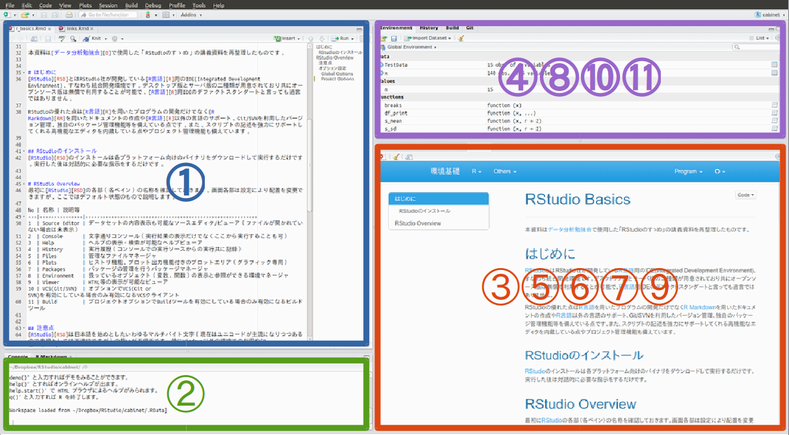

# RStudio IDE
　データ分析勉強会ではながらく [R Commander（以降、Rcmdr） <i class="fa fa-external-link"></i>](https://www.rcommander.com/){target="_blank"} が利用されています。Rcmdr はコードを記述しなくてもデータの可視化や分析ができますのでデータ分析の初学者にとっては非常に便利な道具です。しかし、Rcmdr は R のごく一部のコマンド（関数）をGUIで使えるようにしたラッパーですので、できることが非常に限られています。加えてGUI操作が記録に残りませんので分析再現性の観点からみて好ましいとは言えません。  
　  
　本格的なアドホック分析を行うには Rcmdr から卒業して R のスクリプトを書く必要があります。R 本体にはエディタ機能などが備わっていませんので統合開発環境（IDE - Integrated Development Environment）を利用すべきです。R における統合開発環境のデファクトスタンダードと言えるのが RStudio社の [RStudio IDE （以降、RStudio）<i class="fa fa-external-link"></i>](https://rstudio.com/products/rstudio/) です。 Open Source Edition であれば基本的な機能は無償で利用できます。

# RStudio Basics
　RStudio は 前述のように RStudio, Inc. が開発・公開している 統合開発環境（IDE）で R 用 IDE のデファクトスタンダードといえます。近年のバージョンアップにより R だけでなく Python や Stan などの言語もサポートも充実してきており、 R と Python の併用といったことも可能です。  
　  
初学者にとって便利な機能としては

* 強力なエディタ
    * 様々な言語に対応するコードハイライティング
    * 関数名のみならず変数名まで補完できるコード補完
    * キーひとつでヘルプの参照が可能など
* 分かりやすいパッケージ管理
    * インストール済パッケージの検索・読み込み
    * インストールしたいパッケージ名の自動補完
* プロジェクト管理
    * ディレクトリ単位でセパレートできるプロジェクト管理
    * VCSによる履歴管理

などがあります。R を利用したデータ分析を強力にサポートしてくれます。

## RStudio Overview
　RStudio の画面は大きく四つのエリア（以降、ペイン）から構成されます。

　RStudio のバージョンにより多少ペイン構成が異なりますが以下のペインが用意されています。これらのペインはオプションで表示・非表示や表示位置を変更することができます。

No | Pane name     | Descriptions
:-:|---------------|------------------------------------------------------------
1  | Source Editor | ソースエディタ/ビューア（ファイルが開かれていない場合は未表示）
2  | Console       | 文字通りRのコンソール（実行結果の表示だけでなくここから実行することも可）
　 | Terminal      | OSのターミナル（RStudio v1.1から）
　 | R Markdown    | R Markdownのレンダリング情報を表示
　 | Jobs          | ローカルジョブの実行（RStudio v1.2から）
3  | Help          | ヘルプの表示・検索が可能なヘルプビューア
4  | History       | 実行履歴（コンソールでの実行、ソースからの実行共に記録）
5  | Files         | 簡易なファイルマネージャ
6  | Plots         | ヒストリ機能、プロット出力機能付きのプロットエリア（グラフィック専用）
7  | Packages      | パッケージの管理を行うパッケージマネージャ
8  | Environment   | 扱っているオブジェクト（変数、関数）の表示と参照ができる環境マネージャ
9  | Viewer        | HTML等の表示が可能なビューア
10 | VCS(Git/SVN)  | 簡易VCSクライアント（オプションでVCS(Git or SVN)を有効にしている場合のみ）
11 | Build         | ビルドツール（プロジェクトオプションでBuildツールを有効にしている場合のみ）
　 | Connections   | データソース接続マネージャ（RStudio v1.1から）

## Options
　RStudio のオプション設定には **Global Options** と **Project Options** の二つの設定があります。 **Global Options** は文字通り RStudio 全体に対するオプション設定で、 **Project Options** は開いているプロジェクトのみに有効になるオプション設定です。オプション設定はデフォルトでも構いませんが、以下のように変更しておくことをおすゝめします。  
　  

### Global Options
　メニュー［**Tools**］-［**Global Options...**］を選択すると表示できます。  
　  

大項目   | 中項目                       | 小項目                 | 設定内容等
---------|------------------------------|------------------------|--------------
General  | R version                    | NA                     | Windows版のみでOSのビット数に合わせる
　       | Default working directory    | NA                     | Windows版のみ
Code     | Editing                      | Insert spaces for tab  | チェックする
　       |　                            | Tab width              | 2
　       | Display                      | Show line numbers      | チェックする
　       | 　                           | Show margin            | チェックする
　       | 　                           | Margin coloumn         | 80
　       | Saving                       | Line ending conversion | Posix (LF)
　       | 　                           | Default text encording | UTF-8を選択
Packages | CRAN mirror                  | NA                     | Golbal(CND) or Japan(Tokyo)
Sweave   | Weave Rnw files using        | NA                     | knitr
　       | Typeset LaTeX into PDF using | NA                     | XeLaTeX
Terminal | Connection                   | Connect with WebSockts | Terminalが起動しない場合はチェックを外す

　  

### Project Options
　メニュー［**Tools**］-［**Project Options...**］を選択すると表示できます。  
　  

大項目       | 中項目                          | 設定内容等
-------------|---------------------------------|--------------------------------
General      | 　                              | 必要に応じて変更します
Code Editing | Insert spaces for tab           | Global Optionと同設定を推奨
　           | Tab width                       | 同上
　           | Line ending conversion          | 同上
　           | Text encordint                  | 同上
Sweave       | Weace Rnw files using           | 同上
　           | Typeset LaTeX into PDF using    | 同上
Build Tools  | Project build tools             | 必要に応じて選択します
Git/SVN      | Version control system          | 同上
Packrat      | Using packrat with this project | Packratを利用する場合に使います

## Keyboard Shortcuts
　キーボードショートカットは効率的なコーディングに役立ちますので、最低限、以下のショートカットを覚えましょう。  
　  

Keyboard Shortcuts       | Description
-------------------------|---------------------------------------------
［TAB］                  | 入力中のコード（オブジェクト）を補完
［Alt/Option］+［-］            | 代入演算子（` <- `）をカーソル位置に挿入する
［Ctrl/Cmd］+［Shift］+［M］ | パイプ演算子（` %>% `）をカーソル位置に挿入する
［Ctrl/Cmd］+［Shift］+［C］ | 選択行をコメント・アンコメントする（トグル動作）
［Ctrl/Cmd］+［Alt/Option］+［I］   | カーソル位置にコードチャンクを挿入する（R Markdownのみ）
［Ctrl/Cmd］+［Enter］       | 選択したコードを実行する（行選択、部分選択どちらも可）
［Ctrl/Cmd］+ [Sift] +［Enter］| コードチャンク内の全てのコードを実行する（R Markdownのみ）
［F1］                   | 選択またはカーソル位置の関数のヘルプを呼び出す
［Ctrl/Cmd］+［F］           | アクティブなペイン内の検索

　  
　上記以外のショートカットはメニュー［**Tools**］-［**Keyboard Shortcuts Help**］を選択すると表示できます。

