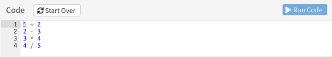

# R Basics

> Rの一番良いところは統計学者が作っているところだ。 Rの一番悪いところは統計学者が作っているところだ。 

<p align=right>[出典](https://www.slideshare.net/shuyo/r-4022379)</p>

　と言われる R ですが、最たる特徴は統計処理に特化している点です。また、前出の Data Science Workflow 全体をカバーできるようになっており、データ構造の変換や特定の分析に対する数々のパッケージ、コマンド一つでグラフが描ける高度なグラフィクス、更には分析結果をレポーティングするための仕組みも用意されています。  
　データ分析をひとつの言語で一気通貫できるので覚えることは非常に多岐に渡りますが、初学者が R を学ぶ際には、まず、「ベクトル演算」を理解するのが一つのポイントだと考えます。  
　  
　本書を読みながら実際にコードを実行する場合は以下のリンクをクリックして binder による RStudio を起動しておきます。binder はあくまでも一時的な試用環境ですので起動後に放置するとインスタンスが自動消滅します。その場合は、再度、リンクをクリックして再起動してください。  
　  

[ Lunch RStudio on binder](https://mybinder.org/v2/gh/k-metrics/learnr/master?urlpath=rstudio)

　  
　RStudio が起動しましたら以下の手順でチュートリアルを起動してください。  

1. 右下のエリアに表示されている `.Rmd` ファイルをクリックします
1. 左上のエリアに `.Rmd` ファイルが開きます
1. ファイルが表示されているエリアの上部にある **`Run Document`** をクリックします
1. ダイアログが表示された場合は **`Try again`** ボタンをクリックします
1. チュートリアルウィンドウが開きます

　  
　チュートリアルでは下図のようなコードが表示されます。表示されたコードを実行するには **`Run Code`** をクリックしてください。**`Start Over`** をクリックすると実行結果をリセットすることができます。また、コードの修正や追記も可能です。  
　  

```{r, echo=FALSE, out.width="90%", fig.cap="Google Colab での実行例"}

```

　  
　なお、チュートリアルを起動後、何も操作をしないで放置しておくと自動的にチュートリアルウィンドウがクローズします。クローズした場合は、再度、**`Run Document`** をクリックして再起動してください。  
　  

　以降、見出しの括弧内の英語はチュートリアルの見出しと対応しています。  
　  

## 基本的な演算（Basic Operations）
　まずは最も基本となる演算を行ってみましょう。  
```{r, include=FALSE, echo=FALSE}
knitr::read_chunk("./learnr/tutorial.R")
```

　  

### 算術演算の基本
　算術演算の基本である加減乗除算の四則演算は他のプログラミング言語や OS に付属の電卓アプリなどと同じです。  
```{r arithmetic-operations, exercise=FALSE}
```

　  

### 代入演算の基本
　変数に演算結果を代入するには代入演算子（`<-`）を用います。変数を使うための変数宣言は不要です。また、代入結果を確認（表示）するためには変数名だけを記述して実行します。  
```{r assignment-operations, exercise=FALSE}
```

　  

### 変数演算の基本
　定数だけでなく変数同士、変数と定数の演算も可能です。ここでは変数同士および変数と定数の四則演算を行ってみます。  
```{r variable-operation, exercise=FALSE}
```

　さらに変数同士の演習結果を変数に代入してみます。代入前後で変数の値を確認して変数がどのように変化するかのかを合わせて確認します。  
```{r variable-operation-overwrite, exercise=FALSE}
```

　このように R での変数の扱いは非常にシンプルですが、簡単に変数を上書きできてしまう点に留意してください。  

　  

## 予約語（Reserved word）
　プログラミング言語には予約語（Reserved word）といわれるものがあり予約語は変数名として使えません。 R では以下が予約語になっています。

`if`, `else`, `for`, `while`, `repeat`, `in`, `next`, `break`, `function`,  
`TRUE`, `FALSE`, `NULL`, `NA`, `NaN`, `Inf`  

　  

## 変数（Variables）
　R での変数の扱い方について触れておきます。まず、変数名の命名規則ですが [スタイルガイド <i class="fa fa-external-link"></i>](https://style.tidyverse.org/syntax.html#object-names){target="_blank"} に準拠して「英小文字、数字、アンダースコア」のみを使うことを推奨します。また、変数名は分かりやすい名称にするように心掛けてください。例えば  
```{r}
number_int <- 10L
number_int
```

　なお、数字から始まる変数名は R の仕様により使用することができません。
```{r, error=TRUE}
1num <- 100
2_string <- "foo"
```

　また、予約語以外でも変数型や関数に使われているような名前を変数名にすることはおすゝめできません。  

　  

### データ型
　他の言語でも同じですが変数には値を入れることができます。データ型はどのような値（データ）が入っているかを識別するためのものです。R の代表的なデータ型には以下のようなものがあります。

型       | クラス      | タイプ      | モード      | 格納モード  | 備考
---------|-------------|-------------|-------------|-------------|---------------
実数型   | `numeric`   | `double`    | `numeric`   | `double`    | 倍精度浮動小数点
整数型   | `integer`   | `integer`   | `numeric`   | `integer`   | 
複素数型 | `complex`   | `complex`   | `complex`   | `complex`   | 
論理型   | `logical`   | `logical`   | `logical`   | `logical`   | Boolean型
文字型   | `character` | `character` | `character` | `character` | 
日付型   | `Date`      | `double`    | `numeric`   | `double`    | Date型（POSIX型もあり）

　R は開発の経緯から様々な型の見かたがありますが、基本的に同じようなものだとと考えてください。書籍などでよく出てくる `str`（structure）関数が返す型は上表におけるクラスです。  

　  

### 変数型
　前述のようなデータ型を持った値を入れる箱が変数です。変数には華表のような様々な形があります。中でも表形式のデータを扱えるデータフレーム型は R ならではの変数型といえます。また、R には他の言語ではよく見かけるスカラー型（一種類のデータ型の値を一つだけ格納できる変数型）はありません基本となる変数型はベクトル型になります。  
　変数型にもクラスがありますが、ベクトル型変数のクラスはデータ型のクラスと同じです。  
　  

変数の型               | クラス         | 説明
-----------------------|----------------|---------------------------------------
ベクトル型             | データ型に同じ | 一種類のデータ型の値を任意の個数だけ格納できる変数型
因子型                 | `factor`, `ordered` | 水準インデックスを持ったベクトル型変数
マトリクス型（行列型） | `matrix`       |  二次元型の変数型（ベクトル型とは異なる型）
アレイ型（配列型）     | `array`        | 多次元型の変数（ベクトル型とは異なる型）
データフレーム型       | `data.frame`   | データ型の異なる複数の**等長**ベクトル型を格納できる変数型
リスト型               | `list`         | データ型の異なる複数のベクトル型変数を格納できる変数型

　  

### ベクトル型
　ベクトル型は前述のように最も基本となる変数型です。ベクトル型変数を作成するには `c` 関数使います。代入して `str` 関数でクラス、長さ（値の個数）と値を確認してみます。  
　長さが $1$ の場合は `c` 関数を省略できます。
```{r vector-1, exercise=FALSE}
```
　
```{r vector-2, exercise=FALSE}
```

　文字（型）を代入する場合はクォート（ダブルまはたシングル）で囲みます。
```{r vector-3, exercise=FALSE}
```

　では文字（型）と数字（型）を混在させたらどうなるでしょう？
```{r vector-4, exercise=FALSE}
```
　エラーにはならずベクトル型変数は文字型クラスとして作成されます。これは強制型変換という処理が行われるためです。強制型変換は複数のデータ型が混在した場合により柔軟度の高いデータ型に変換する処理です。論理型、整数型、実数型、複素数型、文字型の順に変換されます。  
　便利ではありますが意図しない結果を招く可能性がありますので、このような変換があることは覚えておいてください。  

　  

### 因子型
　因子型は名義尺度や順序尺度の変数を扱うのに便利な変数型です。因子型を作成するには `factor` 関数を使う順序なしの因子型と `ordered` 関数を使う順序ありの因子型があります。どちらも `levels`（水準） という属性がついているベクトル型です。  
　後述のデータフレーム型の中で使うと「層別」という処理が楽になります。
```{r factor, exercise=FALSE}
```

　`ordered` 型は `levels` に順序がついている点が `factor` 型と異なる点です。
```{r ordered, exercise=FALSE}
```

　  

### マトリクス型
　マトリクス型は文字通り二次元配列を扱うための変数型です。作成するには `matrix` 関数を利用します。引数のベクトル型を列方向から二次元に展開します。
```{r matrix-1, exercise=FALSE}
```
　展開方向を変えるには `byrow` オプションを指定します。
```{r matrix-2, exercise=FALSE}
```
　数値だけでなく文字列も扱えます。
```{r matrix-3, exercise=FALSE}
```

　  

### アレイ型
　アレイ型は多次元配列を扱うのに便利な変数型です。作成するには `array` 関数を利用します。第一引数で指定したベクトル型のデータを第二引数で指定した構造（行, 列, 次元）にしたがって展開します。  
　展開は列方向のみで `matrix` 型にある `byrow` オプションはありません。また、第一引数のデータ数が足りない場合は先頭からリサイクルして展開します。
```{r array, exercise=FALSE}
```

　  

### データフレーム型
　データフレーム型は表形式のデータを扱うのに非常に便利な変数型です。列ごとに異なるデータ型の変数を格納することが可能ですので、データベースのテーブルのようなものです。ただし、全ての列において行数が同一でなければなりません。データフレーム型を作成するには `data.frame` 関数を用います。
```{r dataframe, exercise=FALSE}
```
　データフレーム型は列名を指定することが可能です。また、文字型のデータはデフォルトで因子型変数として扱われます。

　  

### リスト型
　リスト型はデータフレーム型とは異なり不等長のベクトル型変数を格納できる変数型です。ベクトル型の他にもマトリクス型やデータフレーム型、リスト型地震を格納できる非常に柔軟な構造であるため様々な関数あが返り値と使っています。
```{r list, exercise=FALSE}
```

　  

## 定数（Constant）
　変数はその名の通り値を変更できますが、R には特別な意味を持った値を保持するための定数があります。なお、定数にもクラスがあります。  
　  

定数    | クラス    | 意味・説明
--------|-----------------------------------------------------------------------
`TRUE`  | `logical` | Boolean の真を意味する（$1$ と等価）
`FALSE` | `logical` | Boolean の偽を意味する（$0$ と等価）
`NULL`  | `NULL`    | 空（何も存在しない）を意味する（$0$ や下記の `NA` とは異なる）
`NA`    | `logical` | 欠損値（Not Available で、データの欠損意味する）
`NaN`   | `numeric` | 非数（Not a Number で、$\frac{0}{0}$ のような数値では表現できないものを意味する）
`Inf`   | `numeric` | 無限大（$0$ 除算時等は `NaN`ではなく`Inf/-Inf`）

　  
　`NULL` を除く定数はデータ型のクラスですので強制型変換の対象となります。以下のような変換が行われますので注意してください。
```{r constant, exercise=FALSE}
```

　

### `NA` の型
　欠損値を示す`NA`には明示的にデータ型を示すためのバリエーションがあります。関数によっては明示的に `NA` を指定する必要がありますので覚えておいてください。  
　  

NA            | データ型
--------------|--------
NA_integer_   | 整数型
NA_real_      | 実数型
NA_complex_   | 複素数型
NA_character_ | 文字型

　  

## 参照・アクセス（Access Operators）
　変数の中の値を参照する方法は変数型により多少異なりますが、基本的には参照演算子またはアクセス演算子と呼ばれる `[` や `$` を用います。

　  

### `[` 演算子
　`[` 演算子はベクトル型系の要素を参照するための演算子です。例えば $5$ 番目の値を参照するには以下のようにします。
```{r vector-access-1, exercise=FALSE}
```

　マトリクス型では、行・列・セルの三通りの参照が可能です。
```{r vector-access-2, exercise=FALSE}
```
　  
　アレイ型でも同様の参照が可能です。ただし、マトリクス型とは異なり次元が絡んできますので、表示は少しややこしくなります。以下の $2 \times 2$ の $4$ 次元アレイで説明します。
```{r array-access-1, exercise=FALSE}
```
　第 $1$ 次元を参照します。
```{r array-access-2, exercise=FALSE}
```
　第 $1$ 次元の $1$ 行目を参照します。
```{r array-access-3, exercise=FALSE}
```
　第 $1$ 次元の $1$ 列目を参照します。
```{r array-access-4, exercise=FALSE}
```
　全次元の $1$ 行目を参照します。参照結果は列が各次元になる点に注意してください。
```{r array-access-5, exercise=FALSE}
```
　全次元の $1$ 列目を参照します。行の参照と同様に参照結果は列が各次元になります。
```{r array-access-6, exercise=FALSE}
```
　全次元の $1$ 行 $1$ 列目を参照します。
```{r array-access-7, exercise=FALSE}
```

　  

### `$` 演算子
　`$` 演算子はデータフレーム型やリスト型の要素を参照するための演算子です。
```{r df-access-1, exercise=FALSE}
```
```{r df-access-2, exercise=FALSE}
```
　さらに要素内を参照するには前述の `[` 演算子と組み合わせます。
```{r df-access-3, exercise=FALSE}
```

　リスト型を `$` 演算子で参照するの場合は 要素が `names` 属性を持っていることが前提です。以下のリスト型変数では `$` 表示の後ろに要素名が表示されいている `blood`, `data` が `$` 演算子で参照可能です。
```{r}
x <- list(blood = c("A", "B", "AB", "O"), c("M", "F"),
          data = data.frame(blood = c("A", "B", "A", "O", "A"),
                            age = c(18, 25, 22, 35, 19)))
str(x)
```
　要素名が表示されていない二番目の要素を参照するには `[[` 演算子を用います。
```{r}
x[[2]]
```
　さらに要素内の値を参照する場合は前述のデータフレーム型同様に `[` 演算子を用います。
```{r}
x$blood[2]
x[[2]][1]
```

　  

## 検査・変換
　R では変数内に複数のデータ型が混在している場合は前述のように強制型変換が行われますので、タイポなどがあると知らぬ間に意図しないデータ型になっていることがあります。作成した変数のデータ型を検査するために `is.` 関数群が用意されています。  
　  

データ型 | 関数           | 備考
---------|----------------|-----------------------------------------------------
論理型   | `is.logical`   | 
整数型   | `is.integer`   | 
実数型   | `is.double`    | 
数値型   | `is.numeric`   | 整数型または実数型の場合 `TRUE`
複素数型 | `is.complex`   | 
文字型   | `is.character` | 

　  
　同様に変数型を検査するための `is.` 関数軍も用意されています。  
　  

変数型           | 関数            | 備考
-----------------|-----------------|--------------------------------------------
ベクトル型       | `is.vector`     | 
因子型           | `is.factor` or `is.ordered` | 
マトリクス型     | `is.matrix`     | 
アレイ型         | `is.array`      | 
データフレーム型 | `is.data.frame` | 
リスト型         | `is.list`       |

　  
　定数用の `is.` 関数群もあります。  
　  

定数   | 関数         | 備考
-------|--------------|---------------------------------------------------------
`NULL` | `id.null`    | NULL値か否か
`NA`   | `is.na`      | 欠損値か否か
`NaN`  | `is.nan`     | 非数か否か
`inf`  | `is.infinit` | 無現値か否か（有限値か否かを確認する `is.finit` 関数もあり）

　  

## 演算子（Operators）
　R はベクトル演算が可能ですので演算子は基本的にベクトル演算に対応しています。  
　演算子は単項演算子と二項演算子に大別できます。二項演算子には算術演算子、比較演算子、論理演算子、特殊演算子があります。等長のベクトル型変数どうし、もしくは、ベクトル型変数とスカラ型変数の間の演算が可能です。不等長のベクトル変数に対して二項演算子を利用した場合、足りない値は先頭からリサイクルされて演算されます。条件によってはワーニングも表示されませんので不等長のベクトル演算は注意してください。  
```{r operators, exercise=FALSE}
```

　  
、
### 単項演算子
　単項演算子は文字通り単項に作用する演算子です。単項演算子には算術演算子の `-`（マイナス）と論理型演算子の `!`（否定, NOT）があります。
```{r}
x <- c(1:5)
x
-x
```

```{r}
x <- c(TRUE, TRUE, TRUE, FALSE, TRUE)
x
!x
```

　  

### 算術演算子
　算術演算子は基本中の基本とも言える四則演算子である加算、減算、乗算、除算、ならびに、べき算（べき乗算）、整数除算（商、剰余）の六つの演算子があります。
```{r}
a <- c(1:10)
b <- c(10:1)
a
b
```
```{r}
a + b         # 加算
a - b         # 減算
a * b         # 乗算
a / b         # 除算
a ^ b         # べき乗算
a %/% b       # 整数除算（商）
a %% b        # 整数除算（剰余）
```

　  

### 比較演算子 Logical Operations
　比較演算子は関係演算子とも呼ばれ、二変数の関係を調べる演算子です。同値関係を調べる等号記号や大小関係を調べる不等号などがこれにあたります。返り値は論理型となります。

小なり  | 大なり  | 小なりイコール | 大なりイコール | イコール | ノットイコール | 
--------|---------|----------|----------|----------|----------|
`<`     | `>`     | `<=`     | `>=`     | `==`     | `!=`     |

　例えば以下の二つのベクトル型変数に対する比較を行ってみます。
```{r}
a
b
```

```{r}
a < b
a > b
a <= b
a >= b
a == b
a != b
```

　  

### 論理演算子 Boolean Operations
　論理演算子はブール関数を評価するものです。論理積（AND）・論理和（OR）は演算対象により二種類の演算子があります。
　

演算         | 演算子 | 説明
-------------|--------|----------------------------------------------------------
論理積       | `&`    | AND（ベクトル演算用）
論理和       | `|`    | OR,（ベクトル演算用）
排他的論理和 | `xor`  | eXclusive OR（ベクトル演算用）
否定         | `!`    | NOT（単項演算子, ベクトル演算可）
論理積       | `&&`   | 条件式における論理積
論理和       | `||`   | 条件式における論理和

　  

### 特殊演算子
　特殊演算子は`%`文字と`%`文字で挟まれた演算子です。算術演算子の整数除算（商、剰余）厳密にいえば特殊演算子になりますが本資料では算術演算子として記載しています。  
　R では特殊演算子を用いて任意の演算を定義することができます。パッケージによっては特殊演算子を用意している場合もあります。  
　  

特殊演算子 | 演算内容
-----------|-------------------
`%*%`      | 内積（スカラー積）
`%in%`     | マッチング
`%o%`      | 外積（ベクトル積）
`%x%`      | クロネッカー積

　  

### 演算子の優先順位
　演算子の優先順位は下表の通りとなります。優先順位を変えたい場合は数学と同様に `()` を利用して明示的に優先順位を指定をしてください。下記以外はヘルプで `Syntax` を検索すると確認できます。  

演算子               | 説明                                                            | 順位
---------------------|-----------------------------------------------------------------|-----
`::`                 | 名前空間へのアクセス                                            | 高
`$`                  | 要素へのアクセス（データフレーム型、リスト型）                  | 
`[]`, `[[]]`         | 要素へのアクセス（ベクトル型、マトリクス型、アレイ型、リスト型）| 
`^`                  | べき乗                                                          | 
`-`                  | マイナス（単項演算子、`+`も使用可）                             | 
`:`                  | 等差数列（c(1:10）のような数列）                                | 
`%%`                 | 特殊演算子（二項演算子）                                        | 
`*`, `/`             | 乗算、除算（二項演算子）                                        | 
`+`, `-`             | 加算、減算（二項演算子）                                        | 
`<`, `>`, `<=`, `>=` | 比較演算子（大小関係）                                          | 
`==`, `!=`           | 比較演算子（同値関係、大小関係と優先順位は同列）                | 
`!`                  | 否定（単項演算子）                                              | 
`&`, `&&`, `|`, `||` | 論理積、論理和（論理演算子）                                    | 
`~`                  | フォーミュラ                                                    | 
`<-`                 | 代入                                                            | 低

　  

## 制御文
　制御文はプログラムの流れをコントロールするためのもので大抵の言語で予約語になっています。制御文には条件分岐と繰り返し（ループ）の二種類があります。  

　  

### 条件分岐
　条件分岐には以下のようなものがあります。その他、パッケージなどで条件分岐のための関数が提供されています。

文・関数  | 説明
----------|---------------------------------------------------------------------
`if else` | 基本的な条件分岐（予約語）
`switch`  | 条件が多数に分岐する場合に便利（予約語）
`ifelse`  | ExcelのIF関数に似た条件分岐（関数）

　  

### if, else
　`if` 文と `else` 文は最も基本的な条件分岐です。評価式には論理演算子または論理型変数を用います。コーディングスタイルとして以下のどちらも可能です。
```{r}
x <- FALSE

if (x != TRUE) print("TRUE") else print("FALSE")

if (x == TRUE) {
  print("TRUE")
} else {
  print("FALSE")
}
```

　`if` 文は入れ子にしたり `else if` 文として組み合わせて使うことも可能です。
```{r}
x <- 10L
y <- 5

if ((x > 5) && (y < x)) {
   print("match, (x > 5) && (y < x)")
} else if ((x > 5) && (y >= x)) {
   print("match, (x > 5) && (y >= x)")
} else {
   print("else")
}
```
　  

### switch
　分岐する条件の数が多い場合は`if`文でなく`switch`*文を利用するのが便利です。`if`文と同じで評価式は`TRUE`か`FALSE`が単一で返るようにしなければなりません。注意しなければならないのは、引数により構文が異なる点です。  
　  

#### 引数が整数の場合
　引数に整数 $n$ を指定した場合、$n$ 番目の処理文の結果が返ります。
```{r}
x <- 2
switch(x,                 # 分岐のための引数
       "x is 1",          # 1番目の処理文
       "x is 2",          # 2番目の処理文
       "Error")           # 3番目の処理文
```

　注意しなければならないのは条件分岐数と一致しない場合は `NULL` が返される点です。  
```{r}
x <- 5L
is.null(switch(x,         # 分岐のための引数
               "x is 1",  # 1番目の処理文
               "x is 2",  # 2番目の処理文
               "Error"))  # 3番目の処理文
```

　  

#### 引数が文字の場合
　一方、引数が文字の場合、`if/else` 文と同様の処理が行われます。`if/else` 文と異なるのは `else` 文に相当する分岐が途中になっていても正しく処理してくれる点です。
```{r}
x <- "2"
switch(x,
       "1" = "x is 1",    # 引数が"1"と一致する場合（`if (x == "1")` に等価）
       "x is others",     # 一致するものがない場合（`else` に等価）
       "2" = "x is 2")    # 引数が"2"と一致する場合（`if (x == "2")` に等価）
```

　  
　引数に整数を指定しても動作しますが、引数が整数の場合と同様の動きをします。
```{r}
x <- 3
switch(x,                 # 分岐のための引数が整数になると
       "1" = "x is 1",    # 1番目の処理文
       "x is others",     # 2番目の処理文
       "2" = "x is 2")    # 3番目の処理文
```

　  

### ifelse
　`base::ifelse` は予約語でなく関数です。`if/else` 文と異なるのはベクトル型の評価が一度に行える点です。第一引数に `TRUE` か `FALSE` が返る評価式であればベクトル型でも構いません。
```{r, eval=FALSE}
ifelse(TRUE, 1, 0)
```

　  

### 繰り返し
　繰り返しは文字通り処理を任意の回数繰り返す場合に用いるもので予約語になっています。繰り返し文の処理は時間がかかるため R においては好ましくなく繰り返しは使わずベクトル演算で処理すべきと言われていますが、R-3.4.0 から JIT コンパイラと呼ばれる繰り返し処理の高速化がデフォルトで有効化されており今後は処理記述の流れが変わる可能性があります。処理の高速化についてはこちらの [参考資料 <i class="fa fa-external-link"></i>](http://masato-613.hatenablog.com/entry/2017/04/25/064632){target="_blank" title="R 3.4.0 のJITバイトコンパイラってどんくらい早くなるの？"} で確認してください。なお、繰り返し処理で注意すべき点は繰り返し文中では明示的に出力を指定しないと出力がなされない点です。  

　  

文       | 説明
---------|----------------------------------------------------------------------
`for`    | 条件式に与えたベクトルやリストが空になるまで任意の回数繰り返す
`while`  | 条件式に与えた条件が成立している限り繰り返す
`repeat` | 無限に繰り返すが繰り返し処理中の`break`文で繰り返しを終了できる

　  
また、繰り返しを条件式以外で変更する処理用の文として以下が用意されています。これらも予約語です。  
　  

文       | 説明
---------|----------------------------------------------------------------------
`next`   | この文が実行された時点で強制的に次の繰り返し処理に入ります
`break`  | この文が実行された時点で繰り返し処理を終了します

　  

### for
　`for`文は最も基本となる繰り返し処理で、条件式としてベクトルやリストを指定できる点が他の言語と異なる点です。
```{r}
for (i in c(1:5, 7, 9:15)) {
  if (i == 4) {
    next
  } else if (i >= 10) {
    break
  } else {
    print(as.character(i))
  }
}
```

　  

### while, repeat
　`while`文と`repeat`文については、あまり使うこともないと思いますので省略します。  

　  
