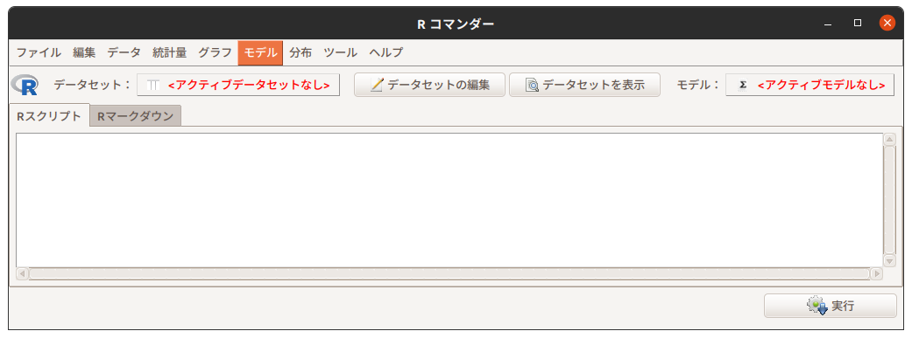
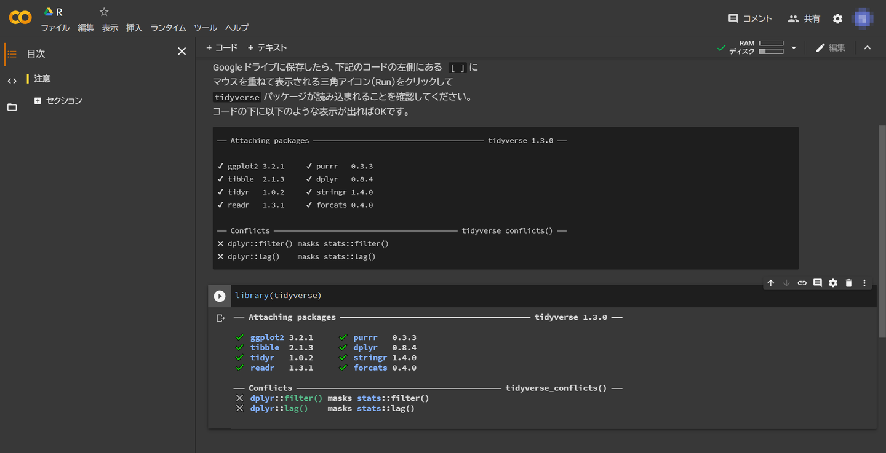
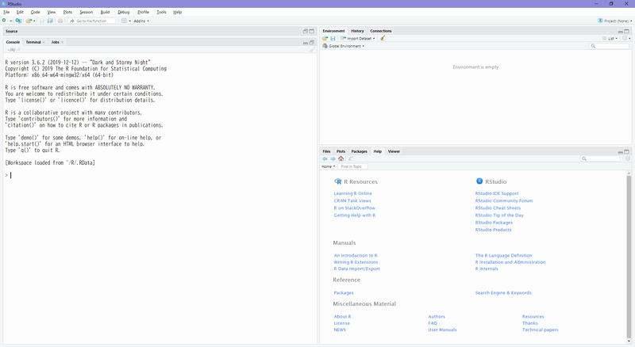
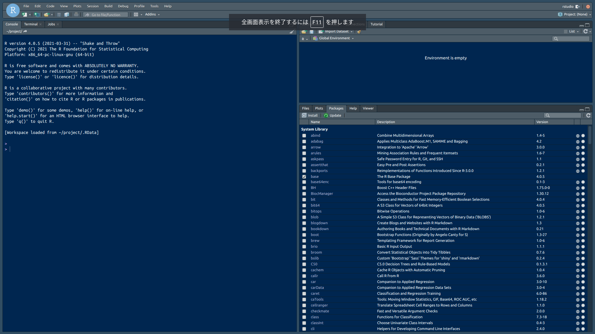
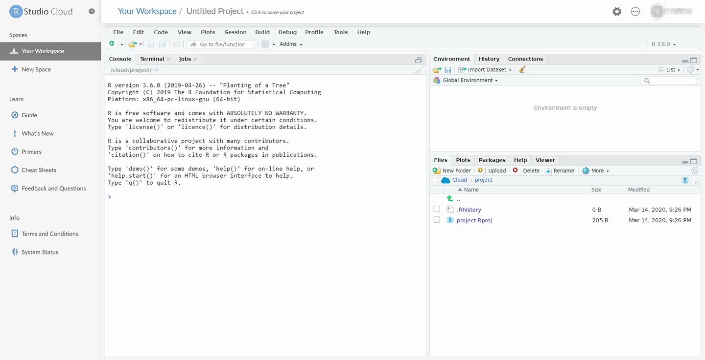

# (PART) Program {-}

# 分析環境
**R**について学ぶ際には**R**が使えるような環境を用意しておくべきですが環境構築は初学者にとって最も厄介な作業です。そこで、初学者の方には環境構築の必要がない**Google Colab**の利用をおすゝめします。**RStudio**環境を構築できる方は、構築するのがベストです。


## 主な分析環境
**R**を利用した分析環境には以下のようなものがあります。

想定利用者 | 環境                | コード記述 | 再現可能性 | 備考 
-----------|---------------------|:----------:|:----------:|-------------------
初学者     | R Commander         | 不要       | 低         | 本書ではスコープ外
初学者     | Exploratory         | 不要       | 高         | 同上
初学・中級者 | Google Colab      | 要         | 高         | 
中上級者   | RStudio Desktop     | 要         | 高         | 
中上級者   | RStudio Cloud       | 要         | 高         | 
中上級者   | RStudio Server      | 要         | 高         | 
開発者     | R + VS Code/Emacs   | 要         | 高         | 


### R Commander
[R Commander（以降、**Rcmdr**）](https://socialsciences.mcmaster.ca/jfox/Misc/Rcmdr/){target="_blank" title=""}は、本書ではスコープ外ですが、[SQiP研究会の演習コース ソフトウエアメトリクス（以降、メトリクス演習コース）](https://www.juse.or.jp/sqip/workshop/outline/index.html){target="_blank" title=""}におけるデフォルトツールですので簡単に紹介しておきます。
**Rcmdr**は**R**のパッケージとして提供されている GUIベースの対話型分析環境です。分析にあたって**R**のコードを記述する必要がありませんので、プログラミングの経験のない方でも利用することができます。ただし、実行できる機能（関数）が限定されている点と分析対象のデータの扱いに特有の考え方を用いてる点には注意が必要です。

```{r, echo=FALSE, fig.cap="Rcmdr, Ubuntu"}

```


### Google Colab
**Google Colab**は Googleアカウントを持っていれば誰でも利用可能な**Python**向けの環境である**Jupyter Notebook**サービスです。**Jupyter Notebook**は**R**をエンジンとして利用することができますので、環境を構築することなく使い始めることができますので、初学者の演習環境としておすゝめです。

```{r, echo=FALSE, fig.cap="Google Colab"}

```


### RStudio 
再現可能性を確保した探索的データ分析を行うのに最も適しているのが**RStudio**です。無償で使えるオープンソース版には、PC上のアプリケーションとして動作する**Desktop**と Webサーバとして動作する**Server**の二種類があります。
**RStudio**は**R**のデファクトスタンダード的な統合開発環境（IDE）であり、Tidyverse Eco Systemの中核とも言えます。その特徴として

* **R**のコードを記述するのに適したエディタを備えている
* **R**のパッケージをインストール・管理するためのパッケージマネージャを備えている
* [**R Markdown**](https://rmarkdown.rstudio.com/){target="_blank" title=""}や [**Pandoc**](https://pandoc.org/){target="_blank" title=""} との連携による再現可能性を確保するための仕組みを備えている
* 外部リソースからのデータを取り込む仕組み（**RStudio Connect**）を備えている
* 複数の分析をプロジェクト単位で管理する仕組みを備えている
* [Git](https://git-scm.com/){target="_blank" title=""} などの外部プログラムと連携したソースの版管理の仕組みを備えている

などがあります。

```{r, echo=FALSE, fig.cap="RStudio Desktop, Windows"}

```

**RStudio Server**は**RStudio**をブラウザ経由で使う Linux 上で動作するサーバアプリケーションです。Dockerコンテナとして動作させることも可能ですので、個々の PC での分析環境を固定さたい場合には非常に便利です。

```{r, echo=FALSE, fig.cap="RStudio Server, Docker"}

```


### RStudio Cloud
**RStudio Cloud**は、その名の通りクラウド版の**RStudio**です。商用版の**RStudio Server Pro**をベースしていますので、任意のバージョンの**R**に切り替えて使うことや**RStduio Package Manager**とも連携しています。また、英語版ですがチュートリアル機能が充実しているのも特徴です。
無料プランが用意されていますが利用時間が15時間/月に限定されていますので、繋げっぱなしでの長時間利用には不向きです。

```{r, echo=FALSE, fig.cap="RStudio Cloud"}

```


### Programing Editor
**R**の本体ははインタプリタ（対話的に逐次実行する処理系）として提供されていますので、**R**単体で動作させることが可能です。区別するために単体の**R**を**R Console**と呼ぶことがあります。
一部のプログラミングエディタでは機能拡張などを利用して直接**R Console**と連携してIDEのように**R**を利用することが可能です。古くはGNU Emacs用のESSや最近人気のあるMicrosoft VisualStudio Code用の機能拡張を使えば、お好みのエディタから直接**R**を使えるようになります。
