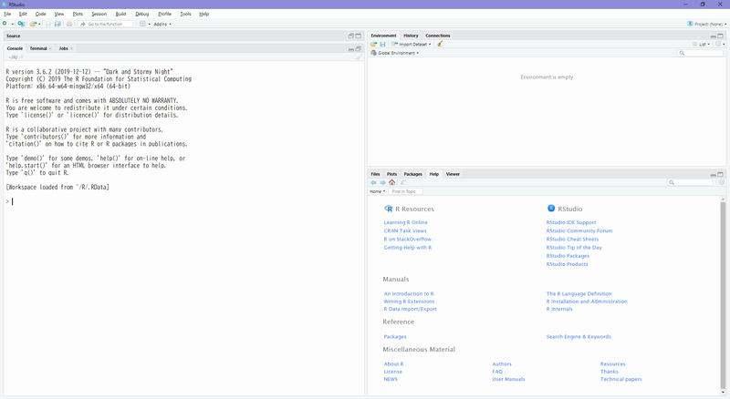

# Install
　R について学ぶ前に R が使えるように環境を整えます。本書は R, RStudio, [tidyverse/ <i class="fa fa-external-link"></i>](https://www.tidyverse.org/){target="_blank"} パッケージならびにその他必要なパッケージの利用を前提としています。  
　R ならびに RStudio はマルチプラットフォーム対応（マルチOS対応）ですので Windows, macOS, Linux のどのプラットフォームを選択しても構いません。ただし、64bit プラットフォームであることが条件です。なお、日本語版 Windows では Windows が利用してる文字コード（CP932, Shift JIS）に起因する不具合が散見されています。日本語版 Windows 環境を利用する場合はその点を認識の上で利用してください。  
　  
　環境を整えるための手順は以下のようになります。  

手順 | 実施内容                 | 備考
:---:|--------------------------|------ 
1    | Rのインストール          | 64bit プラットフォーム
2    | Rtoolsのインストール     | Winodws のみ
3    | RStudioのインストール    | Desktop 版
4    | パッケージのインストール | tidyverse, rmarkdown
5    | Gitのインストール        | 任意

　  
　[Git <i class="fa fa-external-link"></i>](https://git-scm.com/){target="_blank"} は VCS(Version Control System) と呼ばれるソースの版管理を行うシステムです。必要な場合のみインストールしてください。

　  

## Install R
　R は [CRAN (The Comprehensive R Archive Network)<i class="fa fa-external-link"></i>](https://cran.r-project.org/){target="_blank"} と呼ばれる公式リポジトリから入手してインストールします。 CRAN には [ミラーサイト <i class="fa fa-external-link"></i>](https://cran.r-project.org/mirrors.html){target="_blank"} も多数ありますので、利用しているインターネット環境に応じて近いサイトからダウンロードしてください。  
　よくある質問は [FAQ(Frequently Asked Questions) <i class="fa fa-external-link"></i>](https://cran.r-project.org/doc/FAQ/R-FAQ.html){target="_blank"} にまとめられています。  
　  

### Windows
　Winodws では特段の理由がない限り [CRAN <i class="fa fa-external-link"></i>](https://cran.r-project.org/bin/windows/){target="_blank"} から最新バージョンをインストールしてください。  
　旧バージョンをインストールしたい場合は　[Previous Releases of R for Windows <i class="fa fa-external-link"></i>](https://cran.r-project.org/bin/windows/base/old/){target="_blank"} 
から当該バージョンをダウンロードしインストールしてください。  
　  
　日本語によるインストール方法が必要な場合は非公式ページですが [R初心者の館（RとRStudioのインストール、初期設定、基本的な記法など） <i class="fa fa-external-link"></i>](https://das-kino.hatenablog.com/entry/2019/11/07/125044){target="_blank"} などのサイトを参考にしてください。  
　  

#### Rtools
　Windows ではコンパイラなどの開発ツール類が標準装備されていませんので、 R のパッケージをインストールする際に必要となる Rtools と呼ばれるツールキットをインストールしておきます。 [Building R for Windows <i class="fa fa-external-link"></i>](https://cran.r-project.org/bin/windows/Rtools/){target="_blank"} のページからインストールした R のバージョン用の Rtools をダウンロードしてインストールしてください。なお、インストールの際はデフォルトオプションでインストールしてください。インストールディレクトリなどを変更すると正しく動かない場合があります。  
　  

### macOS (OS X)
　macOS ではインストールできるバージョンが限られていますので [CRAN <i class="fa fa-external-link"></i>](https://cran.r-project.org/bin/macosx/){target="_blank"} で確認の上でインストールしてください。  
　  

### Linux
　R がサポートしているディストリビューションは Debian, RedHat, Suse, Ubuntu のみです。Fedora を利用したい場合には [README <i class="fa fa-external-link"></i>](https://cran.r-project.org/bin/linux/redhat/README){target="_blank" title=""} を参照の上で RedHat Software のリポジトリからインストールしてください。  
　  
　Linux の場合、ディストリビューションごと・バージョンごとにインストール方法が異なりますので各ディストリビューション用のディレクトリ内の README ファイルを参考にインストールしてください。  
　  

## Install RStudio Desktop
　R のインストールが完了しましたら統合開発環境（IDE）である RStudio Desktop をインストールします。 [Downloadページ <i class="fa fa-external-link"></i>](https://rstudio.com/products/rstudio/download/#download){target="_blank"} から使用している環境（OS）用の RStudio をダウンロードしてインストールしてください。 
　  

### 動作確認
　RStudio のインストールが完了したら RStudio を起動します。下図のようなウィンドウが立ち上がり左側の **Console** ペインに R のバージョンなどが表示されます。  
　  


　**Console** ペインのプロンプト（`>`表示）の部分に`2 * 3`と打ち込んで［Enter］キーを押し`[1] 6`と表示されることを確認してください。

```{r, comment=""}
2 * 3
```

　  

## Install R packages
　次に必要となるいくつかのパッケージをインストールします。パッケージをインストールする場合はインターネットに接続されている必要があります。 **Console** ペインのプロンプトに以下のコードを入力し [Enter]キーを押して実行します。

```{r, eval=FALSE}
install.packages("tidyverse")
```

　インストールが終わりましたらパッケージが正しくインストールされていることを確認するために **Console** ペインに以下のコードを入力して実行します。
```{r, eval=FALSE}
library(tidyverse)
```

　以下のようなメッセージが表示されることを確認します。インストール時期によってはバージョン表記などが下記と異なる場合があります。なお、日本語版 Windows 環境では一部の文字が化けします。
```{r, eval=FALSE}
Loading required package: tidyverse
─ Attaching packages ─────────────────────────────── tidyverse 1.3.0 ─
✔ ggplot2 3.2.1     ✔ purrr   0.3.3
✔ tibble  2.1.3     ✔ dplyr   0.8.3
✔ tidyr   1.0.0     ✔ stringr 1.4.0
✔ readr   1.3.1     ✔ forcats 0.4.0
─ Conflicts ───────────────────────────────── tidyverse_conflicts() ─
✖ dplyr::filter() masks stats::filter()
✖ dplyr::lag()    masks stats::lag()
```

　  

　続いて [rmarkdown <i class="fa fa-external-link"></i>](https://rmarkdown.rstudio.com/){target="_blank"} パッケージをインストールします。`tidyverse` パッケージのときと同様に以下のコードを **Console** ペインに入力して実行します。

```{r, eval=FALSE}
install.packages("rmarkdown")
```


### Linux環境の場合
　Linux環境ではプラットフォーム側のライブラリなどが足りずにパッケージのインストールが完了できない場合があります。その場合は [RStudio Package Manager, demo site <i class="fa fa-external-link"></i>](https://demo.rstudiopm.com/client/#/){target="_blank"} にてインストールしたいパッケージが必要とするライブラリなどを確認、インストールしてから再度パッケージをインストールしてください。  
　例えば Ubuntu 18.04LTS で R に `tidyverse` パッケージをインストールする場合には以下のようなライブラリなどがOS側にインストールされている必要があります。  
　  

```{bash, eval=FALSE}
apt-get install -y libicu-dev
apt-get install -y make
apt-get install -y libcurl4-openssl-dev
apt-get install -y libssl-dev
apt-get install -y pandoc
apt-get install -y libxml2-dev
```

　  

## Install Git
　RStudio にはソースコードの版管理を行うインタフェースが標準で用意されていますが、版管理システム（以降、VCS）を別途インストールする必要があります。RStudio で利用できる VCS は以下の二つです。  
　  

* [Git <i class="fa fa-external-link"></i>](https://git-scm.com/){target="_blank"} 
* [Subversion(SVN) <i class="fa fa-external-link"></i>](https://subversion.apache.org/){target="_blank"}

　どちらを利用しても構いませんが [GitHub <i class="fa fa-external-link"></i>](https://github.com/){target="_blank"} などのクラウドサービスが充実している Git の利用をおすゝめします。  
　  

### Git
　Windows および macOS は Gitの [ダウンロードページ <i class="fa fa-external-link"></i>](https://git-scm.com/downloads){target="_blank"} から最新バージョンをダウンロードしてインストールします。Linux はリポジトリからインストールするか [ダウンロードページ <i class="fa fa-external-link"></i>](https://git-scm.com/downloads){target="_blank"} から最新バージョンをダウンロードしてインストールしてください。  
　  

### Git Client
　RStudio には簡易的な Git のクライアント機能が標準で用意されていますが、きめ細かな操作を行いたい場合には Git の GUI クライアントをインストールしてください。代表的な Git Client を以下に列挙しておきます。  
　  

Git GUI Client           | Ubuntu | Mac | Windows | Memo
-------------------------|:---:|:---:|:---:|---------
[GitKraken <i class="fa fa-external-link"></i>](https://www.gitkraken.com/){target="_blank"}   | Yes | Yes | Yes | Free版は機能制限あり
[SmartGit <i class="fa fa-external-link"></i>](https://www.syntevo.com/smartgit/){target="_blank"}     | Yes | Yes | Yes | Free版でも機能制限なし^1^
[GitEye <i class="fa fa-external-link"></i>](https://www.collab.net/downloads/giteye){target="_blank"}         | Yes | Yes | Yes | 
[Sourcetree <i class="fa fa-external-link"></i>](https://www.sourcetreeapp.com/){target="_blank"} | No  | Yes | Yes | 日本語版あり
[GitHub Desktop <i class="fa fa-external-link"></i>](https://desktop.github.com/){target="_blank"} | No  | Yes | Yes | 

^1^ : 非商用利用の場合  

　  

## RStudio Server
　R/Rstudio Desktop は前述のようにマルチプラットフォーム対応ですがプラットフォームごとに以下のような制約があります。  
　  

* 日本語版 Windows 環境では文字コード（CP932, Shift JIS）が原因で日本語を正しく処理できない事例が散見される
* 18.04LTSより前の Ubuntu 環境では RStudio Desktop で日本語入力ができない
      * 有志による日本語入力パッチ（非公式パッチ）はあり
* macOS 環境ではグラフの日本語が文字化けする
      * いわゆる豆腐文字問題

　  
　特に日本語版 Windows 環境での問題は Windows が利用している文字コード（CP932, Shift JIS） に起因しているため問題は根本的な解決を期待できません。詳細については伝説とも言われている「Why are you using SJIS?」というキーワードで検索してみてください。  
　  
　日本語版 Windows 環境における文字コード問題を回避するためには、 [RStudio Server <i class="fa fa-external-link"></i>](https://rstudio.com/products/rstudio/download-server/){target="_blank"} を利用する方法が考えられます。
　RStudio Server は Linux 環境で動作する Web サーバベースの IDE ですが、 [Docker <i class="fa fa-external-link"></i>](https://www.docker.com/){target="_blank"} のコンテナ技術を利用することで Windows や macOS 環境で動作させることが可能です。
　  

OS      | Docker app                 | System Requirements
--------|----------------------------|--------------------
macOS   | Docker Desktop for Mac     | [refer docker docs <i class="fa fa-external-link"></i>](https://docs.docker.com/docker-for-mac/install/){target="_blank"} 
Windows | Docker Desktop for Windows | Hyper-V(Windows10 64bit Pro or Higher) or WSL2^1^

　  
^1^ WSL2 は Windows10 version 2004 から利用可能になる予定です

　  

### Setup RStudio Sever with Docker
　Windows または macOS 環境で Docker を利用し RStudio Server を起動するためには以下の手順が必要です。  
　  

手順 | 実施内容                      | 備考
:---:|-------------------------------|------ 
1    | Hyper-V の有効化              | Windows のみ
2    | Docker Desktop のインストール | 
3    | Docker Image のダウンロード   | 
4    | Docker Container の起動           | 

　  
　なお、Linux 環境での手順は割愛します。
　

#### Enable Hyper-V (Windows Only)
　Windows 環境ではインストールする前に [Hyper-V を有効にする <i class="fa fa-external-link"></i>](https://docs.microsoft.com/ja-jp/virtualization/hyper-v-on-windows/quick-start/enable-hyper-v){target="_blank"} 必要があります。  


#### Download and Install Docker Desktop
　利用している環境に応じた [Docker Desktop <i class="fa fa-external-link"></i>](https://www.docker.com/products/docker-desktop){target="_blank"} をダウンロードしてインストールします。なお、ダウンロードには [docker hub <i class="fa fa-external-link"></i>](https://hub.docker.com/){target="_blank"} でアカウント登録が必要です。  
　  
　詳細な手順や設定方法は [Docker docs <i class="fa fa-external-link"></i>](https://docs.docker.com/get-docker/){target="_blank"} を参照してください。  
　  

#### Download Docker Image
　Docker Desktop をインストール・起動しましたら RStudio Server の Docker Image をダウンロードします。様々な方が RStudio Server の Docker Image を公開されていますが代表的な Docker Image には次のようなものがあります。  
　  

Image             | Description 
------------------|------------------------------------------------------------
[rocker/tidyverse <i class="fa fa-external-link"></i>](https://hub.docker.com/r/rocker/tidyverse){target="_blank"} | Version-stable base R and RStudio, tidyverse, devtools
[rocker/verse <i class="fa fa-external-link"></i>](https://hub.docker.com/r/rocker/verse){target="_blank"} | Adds TeX and related packages to rocker/tidyverse
[ykunisato/paper-r-jp <i class="fa fa-external-link"></i>](https://hub.docker.com/r/ykunisato/paper-r-jp){target="_blank"} | Dockerfile of writing paper by R Markdown 
[kmetrics/jverse <i class="fa fa-external-link"></i>](https://hub.docker.com/r/kmetrics/jverse){target="_blank"} | Japanized rocker/verse 

　  
　[rocker <i class="fa fa-external-link"></i>](https://github.com/rocker-org/rocker){target="_blank"} は準公式とも言えるような R に関連する Docker Image を継続的に提供しているプロジェクトです。様々なイメージを提供していますが残念ながら日本語フォントの追加などの日本語対応がなされていません。グラフで日本語を利用しない限りは rocker のイメージを利用しても何ら問題はありません（ソースなどの表示はブラウザに依存しているのでコードに日本語を記述することが可能です）。  
　グラフで日本語を利用したい場合は著者が rocker/verse に日本語フォントなどを追加して日本語対応させた [kmetrics/jverse <i class="fa fa-external-link"></i>](https://hub.docker.com/r/kmetrics/jverse){target="_blank"} を利用するか rocker が公開している Dockerfile を改修して日本語対応させたイメージを利用してください。  
　  
　利用する Docker Image を決めたらコンソール（コマンドプロンプト）で以下のコマンドを実行してイメージをダウンロードしてください。  
　  

```{bash, eval=FALSE}
docker pull rocker/tidyverse
```


　  

#### Run Container

