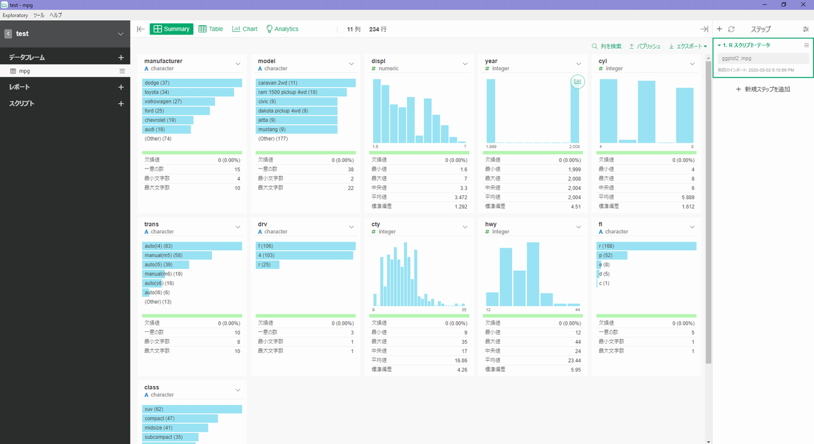

# RStudio Cloud
　[RStudio Colud <i class="fa fa-external-link"></i>](https://rstudio.cloud/){target="_blank" title="RStudio"} は RStudio, PBC が提供している RStudio Server によるクラウドサービスです。2020年2月末時点では無料プランでも無制限のプロジェクトならびにプライベートなプロジェクトの作成が可能です。また、 `learnr` パッケージを用いた初学者用のチュートリアルなど学習資料が多数用意されているのも特徴です。 

　  
```{r, echo=FALSE, out.width="80%", fig.cap="RStudio Cloud, beta"}
knitr::include_graphics("fig/RStudio/Cloud.png")
```
　  

　ただし、無料プランで使えるリソースはメモリ 1GB ・ 1CPU と限られていますので、ナイーブ・ベイズのようなメモリを必要とする機械学習プログラミングなどには向いていません。なお、 Google Colab のように24時間でインスタンスが消滅するというようなことは無いようです。  

　  

# Exploratory
　[Exploratory <i class="fa fa-external-link"></i>](https://exploratory.io/){target="_blank" title="Exploratory"} は BI（Business Intelligence）BI（Business Intelligence）ツールのような操作で R を持ちた探索的データ分析（EDA）が行える利用できる専用クライアントアプリケーションを用いるクラウドサービスです。無料で利用できますがオンライン限定・パブリックシェアオンリーとなりますので注意してください。  

　[何ができるのか見てみる <i class="fa fa-external-link"></i>](https://exploratory.io/insight?type=note&q=tag%3Avisualization%20tag%3Ahow-to%20tag%3A%22team%20exploratory%22&sort=top-viewed&language=ja){target="_blank" title="Exploratory"} ページで多数の分析サンプルが公開されています。  
　また、 [使い方ガイド <i class="fa fa-external-link"></i>](https://exploratory.io/howto?language=ja){target="_blank" title="Exploratory"} ページにも様々な説明資料が用意されています。  

　  
```{r, echo=FALSE, out.width="80%", fig.cap="Exploratory Public"}

```
　  

　[価格 <i class="fa fa-external-link"></i>](https://exploratory.io/pricing){target="_blank" title=""} ページからお好みのプランを選んでアカウントを取得します。クライアントアプリケーションは、mac まはた Windwos でしか動作しません。  

　  
