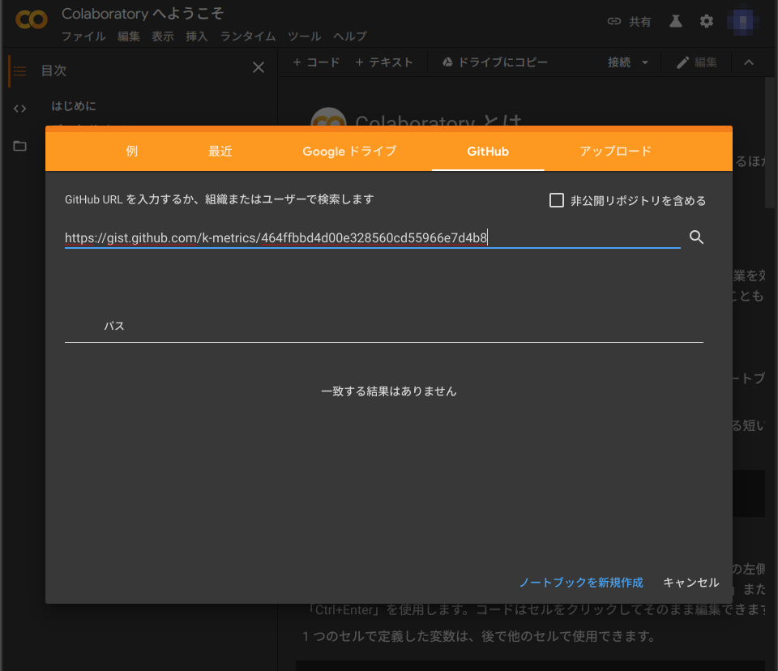
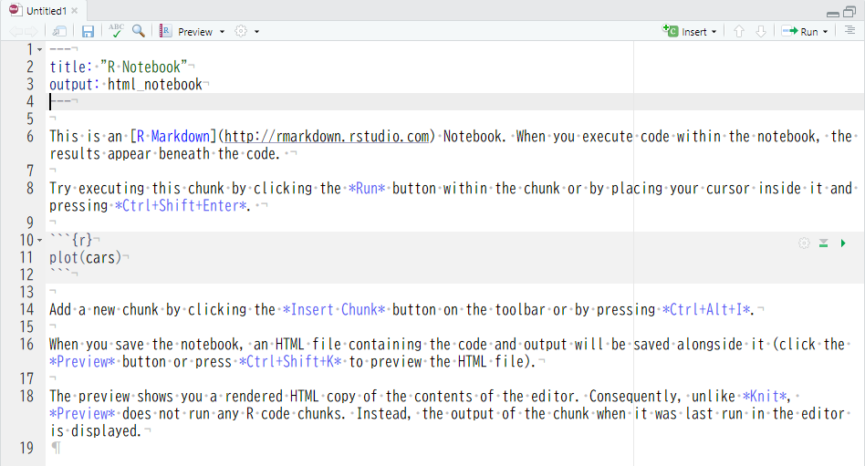
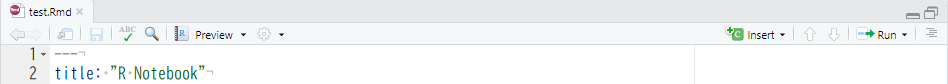
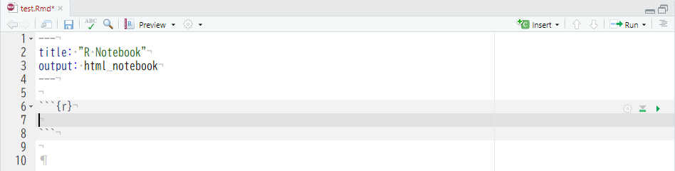
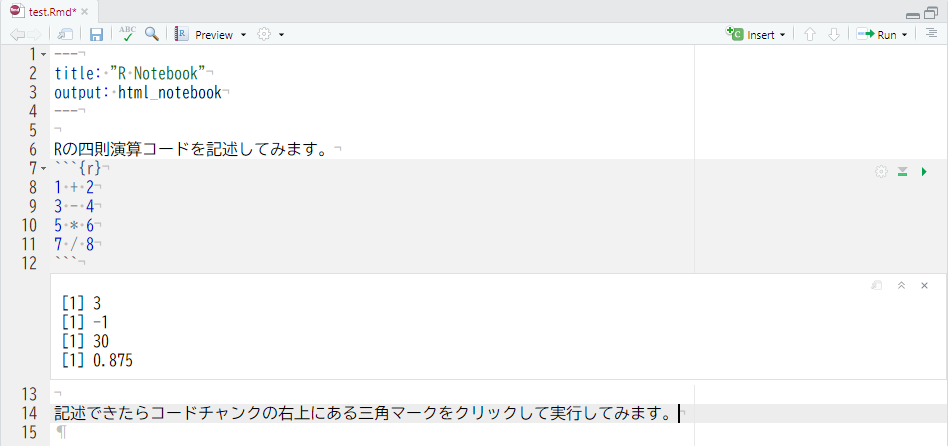
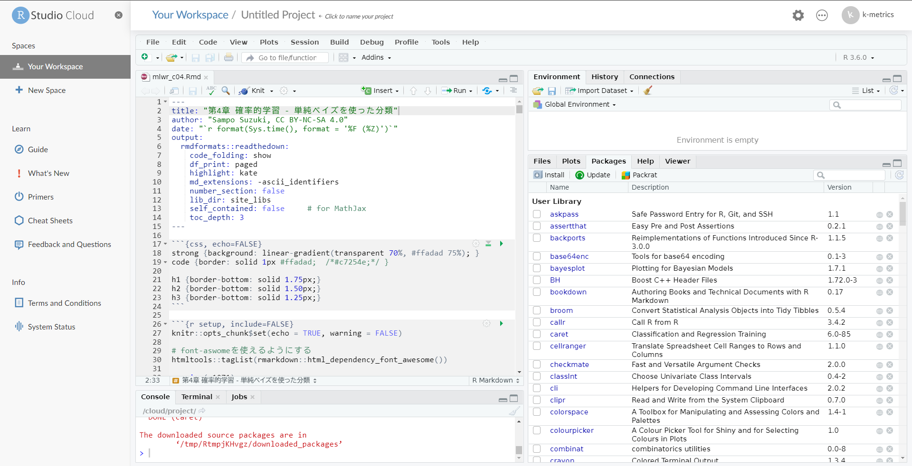

```{css, include=FALSE}
# local CSS
```

```{r setup, include=FALSE}
knitr::opts_chunk$set(echo = TRUE, fig_caption = TRUE, fig.align = 'center')
htmltools::tagList(rmarkdown::html_dependency_font_awesome())

require(tidyverse)
```

# Preface {.unnumbered}

　ソフトウェア開発において「データに基づく品質管理」が必要と言われるようになってから久しくなりますが、様々な理由でデータに基づく管理を実践している組織はまだまだ少数派ではないでしょうか？しかし、世の中の流れは「データドリブン」というキーワードに代表されるようにデータを使いこなせる組織が優位に立てる時代、数学が利益を生み出す数理資本主義の時代と言われています。\
　\
　[『データ指向のソフトウェア品質マネジメント』 <i class="fa １fa-external-link"></i>](https://www.juse-p.co.jp/products/view/442) は、日本のソフトウェア品質管理におけるデータ管理の必要性とデータ分析に必要な知識を解説している数少ない書籍です。著者の一人である小池氏が主催している [データ分析勉強会 <i class="fa １fa-external-link"></i>](https://sites.google.com/site/kantometrics/home){target="_blank"} では、メトリクス分析に興味をもつ有志がこれらの知識を元に統計的コンピューティングによる品質管理を実践するための様々な知識や手法を学んでいます。\
　\
　本書は実務でメトリクス分析を行うソフトウェア品質技術者をはじめとし R を用いてデータ分析を行いたい方々を想定読者として R の基本的な知識を紹介しています。データ分析勉強会を通じて学んだ分析手法を実務で実践したい方の一助になれば幸いです。\
　

------------------------------------------------------------------------

　本書は [クリエイティブ・コモンズ 表示 - 非営利 - 継承 4.0 国際 ライセンス](https://creativecommons.org/licenses/by-nc-sa/4.0/deed.ja) の下に提供されています。\
　\
　あなたの従うべき条件は以下の通りです。

-   表示（BY）

    -   あなたは 適切なクレジットを表示し、ライセンスへのリンクを提供し、変更があったらその旨を示さなければなりません。これらは合理的であればどのような方法で行っても構いませんが、許諾者があなたやあなたの利用行為を支持していると示唆するような方法は除きます。

-   非営利（NC）

    -   あなたは営利目的でこの資料を利用してはなりません。

-   継承（SA）

    -   もしあなたがこの資料をリミックスしたり、改変したり、加工した場合には、あなたはあなたの貢献部分を元の作品と同じライセンスの下に頒布しなければなりません。\
        　


\newpage

## How to read
　本書は基本的なコンピュータの知識と基本的な統計の知識を有している読者におすゝめします。本書は R の実行環境構築に関する詳細な解説を行いませんので、実行環境の構築に不安がある方は次章で紹介している無料のクラウドサービスをご利用ください。


<!--chapter:end:index.Rmd-->

# Introduction

　データ分析を行うためには適切な分析ツールが必要不可欠です。 [R <i class="fa fa-external-link"></i>](https://www.r-project.org/){target="_blank"} は統計計算に特化しているオープンソースの言語でデータ分析に最適なツールのひとつです。R がデータ分析に向いている理由をまとめているのが ["Six Reasons To Learn R For Business", R Blogger <i class="fa fa-external-link"></i>](https://www.r-bloggers.com/six-reasons-to-learn-r-for-business/){target="_blank"} です。\
　

> 1.  R Has The Best **Overall Qualities**
> 2.  R Is Data Science **For Non-Computer Scientists**
> 3.  Learning R Is **Easy With The Tidyverse**
> 4.  R Has **Brains, Muscle, And Heart**
> 5.  R Is Built **For Business**
> 6.  R **Community** Support

　\
　R はデータ分析に必要となるデータのハンドリングや可視化、モデリング、そして、レポーティングといった様々な機能を無料で利用することができます。また、R は逐次実行のインタプリタ型言語ですのでソフトウェアメトリクス分析のような探索的分析（Exploratory data analysis）に適していると言えます。さらに、非常にフレンドリーかつ活発なコミュニティーが日本でも形成されていますので、悩んだ時などに気軽に質問・相談ができるのも大きな強みです。\
　

## How to analize

　分析対象のデータがどのようなものかを知ることは、データ分析を行うにあたって重要なことです。どのような分布なのか、どのような値の範囲なのか、全てのデータが揃っているのかなど俯瞰して把握します。　\
　

### Visualize/Transform {.unnumbered}

　データを俯瞰するためには可視化（Visualize）が分かりやすい手法の一つです。例えば、計量値や計数値であれば棒グラフを用いて分布を確認したり、

```{r, echo=FALSE}
with(iris, barplot(Sepal.Width, main = "Sepal.Width"))
```

　だた、棒グラフでは今ひとつ分布の状況が分かりませんので、度数を求めてヒストグラムを描いたり、五数要約を求めて箱ひげ図を描くことでよりデータの分布（状況）を把握することができるようになります。

```{r}
with(iris, tapply(Sepal.Width, Species, fivenum))
```

```{r}
with(iris, tapply(Sepal.Length, Species, fivenum))
```

```{r}
with(iris, hist(Sepal.Width, plot = FALSE))$count
```

　つまり、データの把握（分布の把握）とは可視化（Visualize）と変換（Transform）の繰り返し作業と言えます。

### Model　 {.unnumbered}

### Communicate　 {.unnumbered}

### Import/Tidy

### Program

## Data Science Workflow

　データ分析の方法は様々ですが、そのプロセスは下図のように抽象化することができます。

```{r, echo=FALSE, out.width="95%", fig.cap="Data Science Workflow, CC BY-NC-ND 3.0 US, Hadley Wickham"}
knitr::include_graphics("https://github.com/hadley/r4ds/blob/master/diagrams/data-science-explore.png?raw=true")
# knitr::include_graphics("fig/data-science.png")
```

<!-- <p align=right>図出典：[RStartHere, RStudio, inc. <i class="fa fa-external-link"></i>](https://github.com/rstudio/RStartHere){target="_blank"}</p> -->

　この図は「Data Science Workflow」と呼ばれ、R コミュニティに多大な貢献をしている Hadley Wickham がその著書 [『R for Data Science』 <i class="fa fa-external-link"></i>](https://r4ds.had.co.nz/){target="_blank"} で提唱している概念図です。本書は、この Data Science Workflow に基づくページ構成になっており各プロセスのスコープ概略は下記の通りです。\
　

**Program**\
　データ分析のすべてのプロセス（Tidy 〜 Communicate/Automate）で必要となるツールがプログラミングです。プログラミングを覚えることで効率的に分析処理を行えるようになります。

**Import**\
　分析対象となるデータを分析環境に取り込み分析をできるようにするのがインポートプロセスです。データは様々な形式（文字コード、ファイル形式など）で保存されていますので、それらに見合った方法でインポートする必要があります。\
　\
**Tidy**\
　インポートしたデータは必ずしもデータ分析に適した形式になっているとは限りませんので、一貫した形式（Tidy data）に整理します。 [Tidy data <i class="fa fa-external-link"></i>](){target="_blank"} はデータ分析において重要な概念です。\
　\
**Transform**\
　整理したデータ（Tidy data）がそのまま状態でデータ分析に使えることは稀です。不要なデータを削除したり（クレンジング）、必要なデータだけに絞り込んだり、新しい変数を計算したりする必要があります。\
　**Tidy** プロセスと合わせて **Wrangle** や **Data wrangling**、前処理と呼ばれることもあります。\
　\
**Visualize**\
　データを可視化することは様々な示唆を得ることと同義といえます。分析方針を考えるためにもデータがどういう傾向をもっているのかを把握するためのプロセスともいえます。\
　\
**Model**\
　可視化で得られた情報を元に数式可（モデル化）するのプロセスです。モデルは様々な\
　\
**Communicate**\
　分析結果を他人に伝えるためのプロセスです。結果を他人に伝えるだけでは不十分で [再現可能性（Reproducible research） <i class="fa fa-external-link"></i>](){target="_blank"} が伴っていることも求められます。 　 　[3つの再現可能性 <i class="fa fa-external-link"></i>](http://www.igaku-shoin.co.jp/paperDetail.do?id=PA03357_03){target="_blank"}

## Tidyverse Eco System

　このような Data Science Workflow を R で実現するための手段が Hadley Wickham により開発された tidyverse パッケージ群による Tidyverse Eco System です。tidyverse

<!--chapter:end:0-01-intro.Rmd-->

# (PART) Program {-}

# Environments
　R について学ぶ前に R が使えるように環境を構築する必要がありますが、環境構築は初学者にとって厄介な部分でもあります。そこで、本書では環境構築の必要がない [binder <i class="fa fa-external-link"></i>](https://mybinder.org/){target="_blank" title="Turn a Git repo into a collection of interactive notebooks"} を利用します。RStudio 環境を構築できる方はそちらを利用しても構いません。  
　  
　binder による環境を利用するには以下のリンクをクリックしてください。Docker イメージのキャッシュが存在しない場合には Docker イメージの構築から行われますので起動するまでに多少の時間がかかります。  
　  

[ Run Tutorial on binder](https://mybinder.org/v2/gh/k-metrics/binder/master?urlpath=rstudio)

<!--chapter:end:1-01-env.Rmd-->

# R Basics

> Rの一番良いところは統計学者が作っているところだ。 Rの一番悪いところは統計学者が作っているところだ。 

<p align=right>[出典](https://www.slideshare.net/shuyo/r-4022379)</p>

　と言われる R ですが、最たる特徴は統計処理に特化している点です。また、前出の Data Science Workflow 全体をカバーできるようになっており、データ構造の変換や特定の分析に対する数々のパッケージ、コマンド一つでグラフが描ける高度なグラフィクス、更には分析結果をレポーティングするための仕組みも用意されています。  
　データ分析をひとつの言語で一気通貫できるので覚えることは非常に多岐に渡りますが、初学者が R を学ぶ際には、まず、「ベクトル演算」を理解するのが一つのポイントだと考えます。  
　  
　本書を読みながら実際にコードを実行する場合は以下のリンクをクリックして binder による RStudio を起動しておきます。binder はあくまでも一時的な試用環境ですので起動後に放置するとインスタンスが自動消滅します。その場合は、再度、リンクをクリックして再起動してください。  
　  

[ Lunch RStudio on binder](https://mybinder.org/v2/gh/k-metrics/learnr/master?urlpath=rstudio)

　  
　RStudio が起動しましたら以下の手順でチュートリアルを起動してください。  

1. 右下のエリアに表示されている `.Rmd` ファイルをクリックします
1. 左上のエリアに `.Rmd` ファイルが開きます
1. ファイルが表示されているエリアの上部にある **`Run Document`** をクリックします
1. ダイアログが表示された場合は **`Try again`** ボタンをクリックします
1. チュートリアルウィンドウが開きます

　  
　チュートリアルでは下図のようなコードが表示されます。表示されたコードを実行するには **`Run Code`** をクリックしてください。**`Start Over`** をクリックすると実行結果をリセットすることができます。また、コードの修正や追記も可能です。  
　  

```{r, echo=FALSE, out.width="90%", fig.cap="Google Colab での実行例"}
knitr::include_graphics("fig/tutorial_code.png")
```

　  
　なお、チュートリアルを起動後、何も操作をしないで放置しておくと自動的にチュートリアルウィンドウがクローズします。クローズした場合は、再度、**`Run Document`** をクリックして再起動してください。  
　  

　以降、見出しの括弧内の英語はチュートリアルの見出しと対応しています。  
　  

## 基本的な演算（Basic Operations）
　まずは最も基本となる演算を行ってみましょう。  
```{r, include=FALSE, echo=FALSE}
knitr::read_chunk("./learnr/tutorial.R")
```

　  

### 算術演算の基本
　算術演算の基本である加減乗除算の四則演算は他のプログラミング言語や OS に付属の電卓アプリなどと同じです。  
```{r arithmetic-operations, exercise=TRUE}
```

　  

### 代入演算の基本
　変数に演算結果を代入するには代入演算子（`<-`）を用います。変数を使うための変数宣言は不要です。また、代入結果を確認（表示）するためには変数名だけを記述して実行します。  
```{r assignment-operations, exercise=TRUE}
```

　  

### 変数演算の基本
　定数だけでなく変数同士、変数と定数の演算も可能です。ここでは変数同士および変数と定数の四則演算を行ってみます。  
```{r variable-operation, exercise=TRUE}
```

　さらに変数同士の演習結果を変数に代入してみます。代入前後で変数の値を確認して変数がどのように変化するかのかを合わせて確認します。  
```{r variable-operation-overwrite, exercise=TRUE}
```

　このように R での変数の扱いは非常にシンプルですが、簡単に変数を上書きできてしまう点に留意してください。  

　  

## 予約語（Reserved word）
　プログラミング言語には予約語（Reserved word）といわれるものがあり予約語は変数名として使えません。 R では以下が予約語になっています。

`if`, `else`, `for`, `while`, `repeat`, `in`, `next`, `break`, `function`,  
`TRUE`, `FALSE`, `NULL`, `NA`, `NaN`, `Inf`  

　  

## 変数（Variables）
　R での変数の扱い方について触れておきます。まず、変数名の命名規則ですが [スタイルガイド <i class="fa fa-external-link"></i>](https://style.tidyverse.org/syntax.html#object-names){target="_blank"} に準拠して「英小文字、数字、アンダースコア」のみを使うことを推奨します。また、変数名は分かりやすい名称にするように心掛けてください。例えば  
```{r}
number_int <- 10L
number_int
```

　なお、数字から始まる変数名は R の仕様により使用することができません。
```{r, error=TRUE}
1num <- 100
2_string <- "foo"
```

　また、予約語以外でも変数型や関数に使われているような名前を変数名にすることはおすゝめできません。  

　  

### データ型
　他の言語でも同じですが変数には値を入れることができます。データ型はどのような値（データ）が入っているかを識別するためのものです。R の代表的なデータ型には以下のようなものがあります。

型       | クラス      | タイプ      | モード      | 格納モード  | 備考
---------|-------------|-------------|-------------|-------------|---------------
実数型   | `numeric`   | `double`    | `numeric`   | `double`    | 倍精度浮動小数点
整数型   | `integer`   | `integer`   | `numeric`   | `integer`   | 
複素数型 | `complex`   | `complex`   | `complex`   | `complex`   | 
論理型   | `logical`   | `logical`   | `logical`   | `logical`   | Boolean型
文字型   | `character` | `character` | `character` | `character` | 
日付型   | `Date`      | `double`    | `numeric`   | `double`    | Date型（POSIX型もあり）

　R は開発の経緯から様々な型の見かたがありますが、基本的に同じようなものだとと考えてください。書籍などでよく出てくる `str`（structure）関数が返す型は上表におけるクラスです。  

　  

### 変数型
　前述のようなデータ型を持った値を入れる箱が変数です。変数には華表のような様々な形があります。中でも表形式のデータを扱えるデータフレーム型は R ならではの変数型といえます。また、R には他の言語ではよく見かけるスカラー型（一種類のデータ型の値を一つだけ格納できる変数型）はありません基本となる変数型はベクトル型になります。  
　変数型にもクラスがありますが、ベクトル型変数のクラスはデータ型のクラスと同じです。  
　  

変数の型               | クラス         | 説明
-----------------------|----------------|---------------------------------------
ベクトル型             | データ型に同じ | 一種類のデータ型の値を任意の個数だけ格納できる変数型
因子型                 | `factor`, `ordered` | 水準インデックスを持ったベクトル型変数
マトリクス型（行列型） | `matrix`       |  二次元型の変数型（ベクトル型とは異なる型）
アレイ型（配列型）     | `array`        | 多次元型の変数（ベクトル型とは異なる型）
データフレーム型       | `data.frame`   | データ型の異なる複数の**等長**ベクトル型を格納できる変数型
リスト型               | `list`         | データ型の異なる複数のベクトル型変数を格納できる変数型

　  

### ベクトル型
　ベクトル型は前述のように最も基本となる変数型です。ベクトル型変数を作成するには `c` 関数使います。代入して `str` 関数でクラス、長さ（値の個数）と値を確認してみます。  
　長さが $1$ の場合は `c` 関数を省略できます。
```{r vector-1, exercise=TRUE}
```
　
```{r vector-2, exercise=TRUE}
```

　文字（型）を代入する場合はクォート（ダブルまはたシングル）で囲みます。
```{r vector-3, exercise=TRUE}
```

　では文字（型）と数字（型）を混在させたらどうなるでしょう？
```{r vector-4, exercise=TRUE}
```
　エラーにはならずベクトル型変数は文字型クラスとして作成されます。これは強制型変換という処理が行われるためです。強制型変換は複数のデータ型が混在した場合により柔軟度の高いデータ型に変換する処理です。論理型、整数型、実数型、複素数型、文字型の順に変換されます。  
　便利ではありますが意図しない結果を招く可能性がありますので、このような変換があることは覚えておいてください。  

　  

### 因子型
　因子型は名義尺度や順序尺度の変数を扱うのに便利な変数型です。因子型を作成するには `factor` 関数を使う順序なしの因子型と `ordered` 関数を使う順序ありの因子型があります。どちらも `levels`（水準） という属性がついているベクトル型です。  
　後述のデータフレーム型の中で使うと「層別」という処理が楽になります。
```{r factor, exercise=TRUE}
```

　`ordered` 型は `levels` に順序がついている点が `factor` 型と異なる点です。
```{r ordered, exercise=TRUE}
```

　  

### マトリクス型
　マトリクス型は文字通り二次元配列を扱うための変数型です。作成するには `matrix` 関数を利用します。引数のベクトル型を列方向から二次元に展開します。
```{r matrix-1, exercise=TRUE}
```
　展開方向を変えるには `byrow` オプションを指定します。
```{r matrix-2, exercise=TRUE}
```
　数値だけでなく文字列も扱えます。
```{r matrix-3, exercise=TRUE}
```

　  

### アレイ型
　アレイ型は多次元配列を扱うのに便利な変数型です。作成するには `array` 関数を利用します。第一引数で指定したベクトル型のデータを第二引数で指定した構造（行, 列, 次元）にしたがって展開します。  
　展開は列方向のみで `matrix` 型にある `byrow` オプションはありません。また、第一引数のデータ数が足りない場合は先頭からリサイクルして展開します。
```{r array, exercise=TRUE}
```

　  

### データフレーム型
　データフレーム型は表形式のデータを扱うのに非常に便利な変数型です。列ごとに異なるデータ型の変数を格納することが可能ですので、データベースのテーブルのようなものです。ただし、全ての列において行数が同一でなければなりません。データフレーム型を作成するには `data.frame` 関数を用います。
```{r dataframe, exercise=TRUE}
```
　データフレーム型は列名を指定することが可能です。また、文字型のデータはデフォルトで因子型変数として扱われます。

　  

### リスト型
　リスト型はデータフレーム型とは異なり不等長のベクトル型変数を格納できる変数型です。ベクトル型の他にもマトリクス型やデータフレーム型、リスト型地震を格納できる非常に柔軟な構造であるため様々な関数あが返り値と使っています。
```{r list, exercise=TRUE}
```

　  

## 定数（Constant）
　変数はその名の通り値を変更できますが、R には特別な意味を持った値を保持するための定数があります。なお、定数にもクラスがあります。  
　  

定数    | クラス    | 意味・説明
--------|-----------------------------------------------------------------------
`TRUE`  | `logical` | Boolean の真を意味する（$1$ と等価）
`FALSE` | `logical` | Boolean の偽を意味する（$0$ と等価）
`NULL`  | `NULL`    | 空（何も存在しない）を意味する（$0$ や下記の `NA` とは異なる）
`NA`    | `logical` | 欠損値（Not Available で、データの欠損意味する）
`NaN`   | `numeric` | 非数（Not a Number で、$\frac{0}{0}$ のような数値では表現できないものを意味する）
`Inf`   | `numeric` | 無限大（$0$ 除算時等は `NaN`ではなく`Inf/-Inf`）

　  
　`NULL` を除く定数はデータ型のクラスですので強制型変換の対象となります。以下のような変換が行われますので注意してください。
```{r constant, exercise=TRUE}
```

　

### `NA` の型
　欠損値を示す`NA`には明示的にデータ型を示すためのバリエーションがあります。関数によっては明示的に `NA` を指定する必要がありますので覚えておいてください。  
　  

NA            | データ型
--------------|--------
NA_integer_   | 整数型
NA_real_      | 実数型
NA_complex_   | 複素数型
NA_character_ | 文字型

　  

## 参照・アクセス（Access Operators）
　変数の中の値を参照する方法は変数型により多少異なりますが、基本的には参照演算子またはアクセス演算子と呼ばれる `[` や `$` を用います。

　  

### `[` 演算子
　`[` 演算子はベクトル型系の要素を参照するための演算子です。例えば $5$ 番目の値を参照するには以下のようにします。
```{r vector-access-1, exercise=TRUE}
```

　マトリクス型では、行・列・セルの三通りの参照が可能です。
```{r vector-access-2, exercise=TRUE}
```
　  
　アレイ型でも同様の参照が可能です。ただし、マトリクス型とは異なり次元が絡んできますので、表示は少しややこしくなります。以下の $2 \times 2$ の $4$ 次元アレイで説明します。
```{r array-access-1, exercise=TRUE}
```
　第 $1$ 次元を参照します。
```{r array-access-2, exercise=TRUE}
```
　第 $1$ 次元の $1$ 行目を参照します。
```{r array-access-3, exercise=TRUE}
```
　第 $1$ 次元の $1$ 列目を参照します。
```{r array-access-4, exercise=TRUE}
```
　全次元の $1$ 行目を参照します。参照結果は列が各次元になる点に注意してください。
```{r array-access-5, exercise=TRUE}
```
　全次元の $1$ 列目を参照します。行の参照と同様に参照結果は列が各次元になります。
```{r array-access-6, exercise=TRUE}
```
　全次元の $1$ 行 $1$ 列目を参照します。
```{r array-access-7, exercise=TRUE}
```

　  

### `$` 演算子
　`$` 演算子はデータフレーム型やリスト型の要素を参照するための演算子です。
```{r df-access-1, exercise=TRUE}
```
```{r df-access-2, exercise=TRUE}
```
　さらに要素内を参照するには前述の `[` 演算子と組み合わせます。
```{r df-access-3, exercise=TRUE}
```

　リスト型を `$` 演算子で参照するの場合は 要素が `names` 属性を持っていることが前提です。以下のリスト型変数では `$` 表示の後ろに要素名が表示されいている `blood`, `data` が `$` 演算子で参照可能です。
```{r}
x <- list(blood = c("A", "B", "AB", "O"), c("M", "F"),
          data = data.frame(blood = c("A", "B", "A", "O", "A"),
                            age = c(18, 25, 22, 35, 19)))
str(x)
```
　要素名が表示されていない二番目の要素を参照するには `[[` 演算子を用います。
```{r}
x[[2]]
```
　さらに要素内の値を参照する場合は前述のデータフレーム型同様に `[` 演算子を用います。
```{r}
x$blood[2]
x[[2]][1]
```

　  

## 検査・変換
　R では変数内に複数のデータ型が混在している場合は前述のように強制型変換が行われますので、タイポなどがあると知らぬ間に意図しないデータ型になっていることがあります。作成した変数のデータ型を検査するために `is.` 関数群が用意されています。  
　  

データ型 | 関数           | 備考
---------|----------------|-----------------------------------------------------
論理型   | `is.logical`   | 
整数型   | `is.integer`   | 
実数型   | `is.double`    | 
数値型   | `is.numeric`   | 整数型または実数型の場合 `TRUE`
複素数型 | `is.complex`   | 
文字型   | `is.character` | 

　  
　同様に変数型を検査するための `is.` 関数軍も用意されています。  
　  

変数型           | 関数            | 備考
-----------------|-----------------|--------------------------------------------
ベクトル型       | `is.vector`     | 
因子型           | `is.factor` or `is.ordered` | 
マトリクス型     | `is.matrix`     | 
アレイ型         | `is.array`      | 
データフレーム型 | `is.data.frame` | 
リスト型         | `is.list`       |

　  
　定数用の `is.` 関数群もあります。  
　  

定数   | 関数         | 備考
-------|--------------|---------------------------------------------------------
`NULL` | `id.null`    | NULL値か否か
`NA`   | `is.na`      | 欠損値か否か
`NaN`  | `is.nan`     | 非数か否か
`inf`  | `is.infinit` | 無現値か否か（有限値か否かを確認する `is.finit` 関数もあり）

　  

## 演算子（Operators）
　R はベクトル演算が可能ですので演算子は基本的にベクトル演算に対応しています。  
　演算子は単項演算子と二項演算子に大別できます。二項演算子には算術演算子、比較演算子、論理演算子、特殊演算子があります。等長のベクトル型変数どうし、もしくは、ベクトル型変数とスカラ型変数の間の演算が可能です。不等長のベクトル変数に対して二項演算子を利用した場合、足りない値は先頭からリサイクルされて演算されます。条件によってはワーニングも表示されませんので不等長のベクトル演算は注意してください。  
```{r operators, exercise=TRUE}
```

　  
、
### 単項演算子
　単項演算子は文字通り単項に作用する演算子です。単項演算子には算術演算子の `-`（マイナス）と論理型演算子の `!`（否定, NOT）があります。
```{r}
x <- c(1:5)
x
-x
```

```{r}
x <- c(TRUE, TRUE, TRUE, FALSE, TRUE)
x
!x
```

　  

### 算術演算子
　算術演算子は基本中の基本とも言える四則演算子である加算、減算、乗算、除算、ならびに、べき算（べき乗算）、整数除算（商、剰余）の六つの演算子があります。
```{r}
a <- c(1:10)
b <- c(10:1)
a
b
```
```{r}
a + b         # 加算
a - b         # 減算
a * b         # 乗算
a / b         # 除算
a ^ b         # べき乗算
a %/% b       # 整数除算（商）
a %% b        # 整数除算（剰余）
```

　  

### 比較演算子 Logical Operations
　比較演算子は関係演算子とも呼ばれ、二変数の関係を調べる演算子です。同値関係を調べる等号記号や大小関係を調べる不等号などがこれにあたります。返り値は論理型となります。

小なり  | 大なり  | 小なりイコール | 大なりイコール | イコール | ノットイコール | 
--------|---------|----------|----------|----------|----------|
`<`     | `>`     | `<=`     | `>=`     | `==`     | `!=`     |

　例えば以下の二つのベクトル型変数に対する比較を行ってみます。
```{r}
a
b
```

```{r}
a < b
a > b
a <= b
a >= b
a == b
a != b
```

　  

### 論理演算子 Boolean Operations
　論理演算子はブール関数を評価するものです。論理積（AND）・論理和（OR）は演算対象により二種類の演算子があります。
　

演算         | 演算子 | 説明
-------------|--------|----------------------------------------------------------
論理積       | `&`    | AND（ベクトル演算用）
論理和       | `|`    | OR,（ベクトル演算用）
排他的論理和 | `xor`  | eXclusive OR（ベクトル演算用）
否定         | `!`    | NOT（単項演算子, ベクトル演算可）
論理積       | `&&`   | 条件式における論理積
論理和       | `||`   | 条件式における論理和

　  

### 特殊演算子
　特殊演算子は`%`文字と`%`文字で挟まれた演算子です。算術演算子の整数除算（商、剰余）厳密にいえば特殊演算子になりますが本資料では算術演算子として記載しています。  
　R では特殊演算子を用いて任意の演算を定義することができます。パッケージによっては特殊演算子を用意している場合もあります。  
　  

特殊演算子 | 演算内容
-----------|-------------------
`%*%`      | 内積（スカラー積）
`%in%`     | マッチング
`%o%`      | 外積（ベクトル積）
`%x%`      | クロネッカー積

　  

### 演算子の優先順位
　演算子の優先順位は下表の通りとなります。優先順位を変えたい場合は数学と同様に `()` を利用して明示的に優先順位を指定をしてください。下記以外はヘルプで `Syntax` を検索すると確認できます。  

演算子               | 説明                                                            | 順位
---------------------|-----------------------------------------------------------------|-----
`::`                 | 名前空間へのアクセス                                            | 高
`$`                  | 要素へのアクセス（データフレーム型、リスト型）                  | 
`[]`, `[[]]`         | 要素へのアクセス（ベクトル型、マトリクス型、アレイ型、リスト型）| 
`^`                  | べき乗                                                          | 
`-`                  | マイナス（単項演算子、`+`も使用可）                             | 
`:`                  | 等差数列（c(1:10）のような数列）                                | 
`%%`                 | 特殊演算子（二項演算子）                                        | 
`*`, `/`             | 乗算、除算（二項演算子）                                        | 
`+`, `-`             | 加算、減算（二項演算子）                                        | 
`<`, `>`, `<=`, `>=` | 比較演算子（大小関係）                                          | 
`==`, `!=`           | 比較演算子（同値関係、大小関係と優先順位は同列）                | 
`!`                  | 否定（単項演算子）                                              | 
`&`, `&&`, `|`, `||` | 論理積、論理和（論理演算子）                                    | 
`~`                  | フォーミュラ                                                    | 
`<-`                 | 代入                                                            | 低

　  

## 制御文
　制御文はプログラムの流れをコントロールするためのもので大抵の言語で予約語になっています。制御文には条件分岐と繰り返し（ループ）の二種類があります。  

　  

### 条件分岐
　条件分岐には以下のようなものがあります。その他、パッケージなどで条件分岐のための関数が提供されています。

文・関数  | 説明
----------|---------------------------------------------------------------------
`if else` | 基本的な条件分岐（予約語）
`switch`  | 条件が多数に分岐する場合に便利（予約語）
`ifelse`  | ExcelのIF関数に似た条件分岐（関数）

　  

### if, else
　`if` 文と `else` 文は最も基本的な条件分岐です。評価式には論理演算子または論理型変数を用います。コーディングスタイルとして以下のどちらも可能です。
```{r}
x <- FALSE

if (x != TRUE) print("TRUE") else print("FALSE")

if (x == TRUE) {
  print("TRUE")
} else {
  print("FALSE")
}
```

　`if` 文は入れ子にしたり `else if` 文として組み合わせて使うことも可能です。
```{r}
x <- 10L
y <- 5

if ((x > 5) && (y < x)) {
   print("match, (x > 5) && (y < x)")
} else if ((x > 5) && (y >= x)) {
   print("match, (x > 5) && (y >= x)")
} else {
   print("else")
}
```
　  

### switch
　分岐する条件の数が多い場合は`if`文でなく`switch`*文を利用するのが便利です。`if`文と同じで評価式は`TRUE`か`FALSE`が単一で返るようにしなければなりません。注意しなければならないのは、引数により構文が異なる点です。  
　  

#### 引数が整数の場合
　引数に整数 $n$ を指定した場合、$n$ 番目の処理文の結果が返ります。
```{r}
x <- 2
switch(x,                 # 分岐のための引数
       "x is 1",          # 1番目の処理文
       "x is 2",          # 2番目の処理文
       "Error")           # 3番目の処理文
```

　注意しなければならないのは条件分岐数と一致しない場合は `NULL` が返される点です。  
```{r}
x <- 5L
is.null(switch(x,         # 分岐のための引数
               "x is 1",  # 1番目の処理文
               "x is 2",  # 2番目の処理文
               "Error"))  # 3番目の処理文
```

　  

#### 引数が文字の場合
　一方、引数が文字の場合、`if/else` 文と同様の処理が行われます。`if/else` 文と異なるのは `else` 文に相当する分岐が途中になっていても正しく処理してくれる点です。
```{r}
x <- "2"
switch(x,
       "1" = "x is 1",    # 引数が"1"と一致する場合（`if (x == "1")` に等価）
       "x is others",     # 一致するものがない場合（`else` に等価）
       "2" = "x is 2")    # 引数が"2"と一致する場合（`if (x == "2")` に等価）
```

　  
　引数に整数を指定しても動作しますが、引数が整数の場合と同様の動きをします。
```{r}
x <- 3
switch(x,                 # 分岐のための引数が整数になると
       "1" = "x is 1",    # 1番目の処理文
       "x is others",     # 2番目の処理文
       "2" = "x is 2")    # 3番目の処理文
```

　  

### ifelse
　`base::ifelse` は予約語でなく関数です。`if/else` 文と異なるのはベクトル型の評価が一度に行える点です。第一引数に `TRUE` か `FALSE` が返る評価式であればベクトル型でも構いません。
```{r, eval=FALSE}
ifelse(TRUE, 1, 0)
```

　  

### 繰り返し
　繰り返しは文字通り処理を任意の回数繰り返す場合に用いるもので予約語になっています。繰り返し文の処理は時間がかかるため R においては好ましくなく繰り返しは使わずベクトル演算で処理すべきと言われていますが、R-3.4.0 から JIT コンパイラと呼ばれる繰り返し処理の高速化がデフォルトで有効化されており今後は処理記述の流れが変わる可能性があります。処理の高速化についてはこちらの [参考資料 <i class="fa fa-external-link"></i>](http://masato-613.hatenablog.com/entry/2017/04/25/064632){target="_blank" title="R 3.4.0 のJITバイトコンパイラってどんくらい早くなるの？"} で確認してください。なお、繰り返し処理で注意すべき点は繰り返し文中では明示的に出力を指定しないと出力がなされない点です。  

　  

文       | 説明
---------|----------------------------------------------------------------------
`for`    | 条件式に与えたベクトルやリストが空になるまで任意の回数繰り返す
`while`  | 条件式に与えた条件が成立している限り繰り返す
`repeat` | 無限に繰り返すが繰り返し処理中の`break`文で繰り返しを終了できる

　  
また、繰り返しを条件式以外で変更する処理用の文として以下が用意されています。これらも予約語です。  
　  

文       | 説明
---------|----------------------------------------------------------------------
`next`   | この文が実行された時点で強制的に次の繰り返し処理に入ります
`break`  | この文が実行された時点で繰り返し処理を終了します

　  

### for
　`for`文は最も基本となる繰り返し処理で、条件式としてベクトルやリストを指定できる点が他の言語と異なる点です。
```{r}
for (i in c(1:5, 7, 9:15)) {
  if (i == 4) {
    next
  } else if (i >= 10) {
    break
  } else {
    print(as.character(i))
  }
}
```

　  

### while, repeat
　`while`文と`repeat`文については、あまり使うこともないと思いますので省略します。  

　  

<!--chapter:end:1-02-rbasics.Rmd-->

# (PART) Wrangle {-}

# Import
　Import は

>　Google Colab を利用する場合は［＋コード］（［Ctrl］+［M］+［Ctrl］+［B］）ボタンでコードを追加してコードブロックを挿入してからコードを記載します。コードブロックの移動や削除はブロック右側に表示されているサブメニューで行います。［＋テキスト］ボタンでテキストブロックを挿入すればコメントなどを書き込むことができます。  

　  

>　RStudio を利用する場合はメニューから［File］-［New File］-［R Notebook］を実行してR Notebook を作成します。キーボードショートカット［Ctrl/Cmd］+［Alt/Option］+［I］でコードチャンクを挿入しチャンクにコードを記述します。チャング以外にコメントなどを書き込むことができます。  

　  

## readr

## readxl

## pdftools


<!--chapter:end:2-01-import.Rmd-->

# Tidy

## Tidy Data

## longer

## wider


<!--chapter:end:2-02-tidy.Rmd-->

# Transform

## filter

## rename

## select

### select helpers

## mutate

## summarize


<!--chapter:end:2-03-transform.Rmd-->

# (PART) Visualize {-}

# Base R

## plot

## boxplot

## hist

<!--chapter:end:3-01-baser.Rmd-->

# ggplot2


<!--chapter:end:3-02-ggplot2.Rmd-->

# (PART) Model/Infer {-}

# Test

# Linear model

# Machine Learning

<!--chapter:end:4-00-Model.Rmd-->

# (PART) Communicate {-}

# R Markdown

<!--chapter:end:5-01-rmarkdown.Rmd-->

# (PART) Automate {-}

# shiny

<!--chapter:end:6-00-Automate.Rmd-->

# (PART) Program {-}

# Environments 2
　R について学ぶ前に R が使えるように環境を構築する必要がありますが、環境構築は初学者にとって厄介な部分でもあります。そこで、本書では学習レベルに合わせて以下のように環境を使い分けることをおすゝめします。  
　  

学習フェーズ     | 環境                                    | 備考
-----------------|-----------------------------------------|--------------------
基礎学習フェーズ | [Google Colaboratory <i class="fa fa-external-link"></i>](https://colab.research.google.com/?hl=ja){target="_blank" title="Google Colab"} | 要Googleアカウント
応用学習フェーズ | [RStudio Cloud <i class="fa fa-external-link"></i>](https://rstudio.cloud/){target="_blank" title="RStudio, PBC"} | beta edition

　  
　環境を構築するための基本的な知識がある方は最初から RStudio Dekstop（以降、RStudio）を利用しても構いません。  

　  

## Google Colaboratory
　R の言語仕様など基礎的な学習フェーズでは環境構築の手間がかからないクラウド型の Google Colaboratory（以降、Google Colab）の利用をおすゝめします。Google Colab では Jupyter Notebook というデータ分析用のツールが使えます。ただし、デフォルトの状態で R を使うのは少し不便なので、以下の手順でファイルを準備します。  
　  

1. ブラウザで Google アカウントにログインする
1. Google Colab を開く
1. R 用のテンプレートファイルをアップロードする
1. R のコードが実行できることを確認する
1. アップロードしたファイルを Google ドライブに保存する

　  

### Login Google
　Google Colab は名前通り Google が提供しているサービスですので Google のアカウントを持っていることが前提になります。また、Chrome 系（含む Chromium 系）のブラウザで利用することをおすゝめします。  
　まず、ブラウザで [Google <i class="fa fa-external-link"></i>](https://www.google.co.jp){target="_blank" title="Google"} のページを開きます。ページの右上に［ログイン］と表示されている場合は［ログイン］をクリックしてログインしておきます。  

　

### Open Google Colab
　Google で Google Colab を検索して [Colaboratory - Google Colab <i class="fa fa-external-link"></i>](https://colab.research.google.com/notebooks/welcome.ipynb?hl=ja){target="_blank" title=""} のリンクをくと以下のような画面が表示されまます。  
　  

```{r, echo=FALSE, out.width="80%", fig.cap="Google Colab, Theme: dark"}
knitr::include_graphics("fig/Colab/welcome.png")
```

　画面テーマは右上の歯車ボタンから変更できます。  

　  

### Upload Template
　Google Colab が立ち上がりましたら上部にあるメニュー ［ファイル］-［ノートブックをアップロード...］を実行します。  
　  

```{r, echo=FALSE, out.width="80%", fig.cap="Upload notebook file"}

```

　アップロード用のダイアログが開きますので［GitHub］タブをクリックし、上段のライン（画像の青線部分）に下記の URL を入力します。入力後、右端にある虫眼鏡アイコンをクリックします。  

`https://gist.github.com/k-metrics/464ffbbd4d00e328560cd55966e7d4b8`  
　  

```{r, echo=FALSE, out.width="80%", fig.cap="Upload from GitHub"}

```

　テンプレートがアップロードされ表示されます。  

　  

### Run R code
　テンプレートがアップロードできましたらテンプレートファイルの記述にしたがってコードを実行してみます。その際に下記のようなダイアログが表示されますが認証情報などを読み取ることはありませんので［このまま実行］をクリックしてください。
```{r, echo=FALSE, out.width="80%", fig.cap="Warning dialog"}
knitr::include_graphics("fig/Colab/run_dialog.png")
```

　サーバ（ホスト型ランタイム）との接続するため実行までに多少時間がかかります。  

　  

### Save File
　コードの実行が確認できましたらメニューの［ファイル］-［ドライブにコピーを保存...］を実行してコピーを Google Drive に保存します。以降、この保存したファイルを利用してください。  

　  

## RStudio Cloud
　Google Colab では R Markdown などのレポーティング機能は使用できませんので、このような場合には クラウド上で RStudio が利用できる RStudio Cloud が便利です。RStudio Cloud は統合開発環境の RStudio だけでなく種々のチュートリアルコンテンツを備えています。  
　  
```{r, echo=FALSE, out.width="80%", fig.cap="RStudio Cloud, beta"}

```
　  
　執筆時点では無償で利用することができ、無制限のプロジェクトとプライベートプロジェクトの作成が可能です。RStudio Cloud を利用するにはアカウントを取得するだけです。  
　  

1. ブラウザで [RStudio Cloud <i class="fa fa-external-link"></i>](https://rstudio.cloud/){target="_blank" title="Beta edition"} を開く
1. 右上の［sign up］をクリックする
1. RStudio Cloud のアカウントを作成してサインアップするか、Google または GitHub のアカウントでログインする

　  

### Create Project
　RStudio Cloud ではプロジェクトという単位で分析を管理しますので、最初にプロジェクトを作成します。作成手順については RStudio Cloud メニューにある［Guide］で確認してください。ガイドは全て英語ですが、 Chrome 系のブラウザであれば「Google翻訳」機能拡張を用いれば日本語に翻訳表示できます。  
　プロジェクトを作成すると下図のような統合開発環境の RStudio が表示されます。RStudio 自体の説明は Appendix を参照してください。  
　  
```{r, echo=FALSE, out.width="80%", fig.cap="Initial View"}
knitr::include_graphics("fig/RStudio/RSCloud_01.png")
```

　  

### Install Packages
　RStudio Cloud の初期状態では R のパッケージは Base R しかインストールされていません。最も利用する `tidyverse` パッケージと `rmarkdown` パッケージをインストールするために右下のエリアにある `Packages` タブをクリックしてパッケージマネージャを表示させます。  
　  
```{r, echo=FALSE, out.width="80%", fig.cap="Packages Manager"}

```

　  
　次にパッケージマネージャの上部に表示されている `install` ボタンをクリックし表示されたダイアログに `tidyverse, rmarkdown` と入力し［install］ボタンをクリックしてインストールします。  
　  
```{r, echo=FALSE, out.width="80%", fig.cap="Install Dialog"}

```

　  
　以上で、RStudio Cloud の準備は完了です。

<!--chapter:end:9-01-01-env.Rmd-->

# (APPENDIX) Appendix {-}

# Install R/RStudio
　R について学ぶ前に R が使えるように環境を整えます。本書は R, RStudio, [tidyverse/ <i class="fa fa-external-link"></i>](https://www.tidyverse.org/){target="_blank"} パッケージならびにその他必要なパッケージの利用を前提としています。  
　R ならびに RStudio はマルチプラットフォーム対応（マルチOS対応）ですので Windows, macOS, Linux のどのプラットフォームを選択しても構いません。ただし、64bit プラットフォームであることが条件です。なお、日本語版 Windows では Windows が利用してる文字コード（CP932, Shift JIS）に起因する不具合が散見されています。日本語版 Windows 環境を利用する場合はその点を認識の上で利用してください。  
　  
　環境を整えるための手順は以下のようになります。  

手順 | 実施内容                 | 備考
:---:|--------------------------|------ 
1    | Rのインストール          | 64bit プラットフォーム
2    | Rtoolsのインストール     | Winodws のみ
3    | RStudioのインストール    | Desktop 版
4    | パッケージのインストール | tidyverse, rmarkdown
5    | Gitのインストール        | 任意

　  
　[Git <i class="fa fa-external-link"></i>](https://git-scm.com/){target="_blank"} は VCS(Version Control System) と呼ばれるソースの版管理を行うシステムです。必要な場合のみインストールしてください。

　  

## Install R
　R は [CRAN (The Comprehensive R Archive Network)<i class="fa fa-external-link"></i>](https://cran.r-project.org/){target="_blank"} と呼ばれる公式リポジトリから入手してインストールします。 CRAN には [ミラーサイト <i class="fa fa-external-link"></i>](https://cran.r-project.org/mirrors.html){target="_blank"} も多数ありますので、利用しているインターネット環境に応じて近いサイトからダウンロードしてください。  
　よくある質問は [FAQ(Frequently Asked Questions) <i class="fa fa-external-link"></i>](https://cran.r-project.org/doc/FAQ/R-FAQ.html){target="_blank"} にまとめられています。  
　  

### Windows
　Winodws では特段の理由がない限り [CRAN <i class="fa fa-external-link"></i>](https://cran.r-project.org/bin/windows/){target="_blank"} から最新バージョンをインストールしてください。  
　旧バージョンをインストールしたい場合は　[Previous Releases of R for Windows <i class="fa fa-external-link"></i>](https://cran.r-project.org/bin/windows/base/old/){target="_blank"} 
から当該バージョンをダウンロードしインストールしてください。  
　  
　日本語によるインストール方法が必要な場合は非公式ページですが [R初心者の館（RとRStudioのインストール、初期設定、基本的な記法など） <i class="fa fa-external-link"></i>](https://das-kino.hatenablog.com/entry/2019/11/07/125044){target="_blank"} などのサイトを参考にしてください。  
　  

#### Rtools
　Windows ではコンパイラなどの開発ツール類が標準装備されていませんので、 R のパッケージをインストールする際に必要となる Rtools と呼ばれるツールキットをインストールしておきます。 [Building R for Windows <i class="fa fa-external-link"></i>](https://cran.r-project.org/bin/windows/Rtools/){target="_blank"} のページからインストールした R のバージョン用の Rtools をダウンロードしてインストールしてください。なお、インストールの際はデフォルトオプションでインストールしてください。インストールディレクトリなどを変更すると正しく動かない場合があります。  
　  

### macOS (OS X)
　macOS ではインストールできるバージョンが限られていますので [CRAN <i class="fa fa-external-link"></i>](https://cran.r-project.org/bin/macosx/){target="_blank"} で確認の上でインストールしてください。  
　  

### Linux
　R がサポートしているディストリビューションは Debian, RedHat, Suse, Ubuntu のみです。Fedora を利用したい場合には [README <i class="fa fa-external-link"></i>](https://cran.r-project.org/bin/linux/redhat/README){target="_blank" title=""} を参照の上で RedHat Software のリポジトリからインストールしてください。  
　  
　Linux の場合、ディストリビューションごと・バージョンごとにインストール方法が異なりますので各ディストリビューション用のディレクトリ内の README ファイルを参考にインストールしてください。  
　  

## Install RStudio Desktop
　R のインストールが完了しましたら統合開発環境（IDE）である RStudio Desktop をインストールします。 [Downloadページ <i class="fa fa-external-link"></i>](https://rstudio.com/products/rstudio/download/#download){target="_blank"} から使用している環境（OS）用の RStudio をダウンロードしてインストールしてください。 
　  

### 動作確認
　RStudio のインストールが完了したら RStudio を起動します。下図のようなウィンドウが立ち上がり左側の **Console** ペインに R のバージョンなどが表示されます。  
　  


　**Console** ペインのプロンプト（`>`表示）の部分に`2 * 3`と打ち込んで［Enter］キーを押し`[1] 6`と表示されることを確認してください。

```{r, comment=""}
2 * 3
```

　  

## Install R packages
　次に必要となるいくつかのパッケージをインストールします。パッケージをインストールする場合はインターネットに接続されている必要があります。 **Console** ペインのプロンプトに以下のコードを入力し [Enter]キーを押して実行します。

```{r, eval=FALSE}
install.packages("tidyverse")
```

　インストールが終わりましたらパッケージが正しくインストールされていることを確認するために **Console** ペインに以下のコードを入力して実行します。
```{r, eval=FALSE}
library(tidyverse)
```

　以下のようなメッセージが表示されることを確認します。インストール時期によってはバージョン表記などが下記と異なる場合があります。なお、日本語版 Windows 環境では一部の文字が化けします。
```{r, eval=FALSE}
Loading required package: tidyverse
─ Attaching packages ─────────────────────────────── tidyverse 1.3.0 ─
✔ ggplot2 3.2.1     ✔ purrr   0.3.3
✔ tibble  2.1.3     ✔ dplyr   0.8.3
✔ tidyr   1.0.0     ✔ stringr 1.4.0
✔ readr   1.3.1     ✔ forcats 0.4.0
─ Conflicts ───────────────────────────────── tidyverse_conflicts() ─
✖ dplyr::filter() masks stats::filter()
✖ dplyr::lag()    masks stats::lag()
```

　  

　続いて [rmarkdown <i class="fa fa-external-link"></i>](https://rmarkdown.rstudio.com/){target="_blank"} パッケージをインストールします。`tidyverse` パッケージのときと同様に以下のコードを **Console** ペインに入力して実行します。

```{r, eval=FALSE}
install.packages("rmarkdown")
```


### Linux環境の場合
　Linux環境ではプラットフォーム側のライブラリなどが足りずにパッケージのインストールが完了できない場合があります。その場合は [RStudio Package Manager, demo site <i class="fa fa-external-link"></i>](https://demo.rstudiopm.com/client/#/){target="_blank"} にてインストールしたいパッケージが必要とするライブラリなどを確認、インストールしてから再度パッケージをインストールしてください。  
　例えば Ubuntu 18.04LTS で R に `tidyverse` パッケージをインストールする場合には以下のようなライブラリなどがOS側にインストールされている必要があります。  
　  

```{bash, eval=FALSE}
apt-get install -y libicu-dev
apt-get install -y make
apt-get install -y libcurl4-openssl-dev
apt-get install -y libssl-dev
apt-get install -y pandoc
apt-get install -y libxml2-dev
```

　  

## Install Git
　RStudio にはソースコードの版管理を行うインタフェースが標準で用意されていますが、版管理システム（以降、VCS）を別途インストールする必要があります。RStudio で利用できる VCS は以下の二つです。  
　  

* [Git <i class="fa fa-external-link"></i>](https://git-scm.com/){target="_blank"} 
* [Subversion(SVN) <i class="fa fa-external-link"></i>](https://subversion.apache.org/){target="_blank"}

　どちらを利用しても構いませんが [GitHub <i class="fa fa-external-link"></i>](https://github.com/){target="_blank"} などのクラウドサービスが充実している Git の利用をおすゝめします。  
　  

### Git
　Windows および macOS は Gitの [ダウンロードページ <i class="fa fa-external-link"></i>](https://git-scm.com/downloads){target="_blank"} から最新バージョンをダウンロードしてインストールします。Linux はリポジトリからインストールするか [ダウンロードページ <i class="fa fa-external-link"></i>](https://git-scm.com/downloads){target="_blank"} から最新バージョンをダウンロードしてインストールしてください。  
　  

### Git Client
　RStudio には簡易的な Git のクライアント機能が標準で用意されていますが、きめ細かな操作を行いたい場合には Git の GUI クライアントをインストールしてください。代表的な Git Client を以下に列挙しておきます。  
　  

Git GUI Client           | Ubuntu | Mac | Windows | Memo
-------------------------|:---:|:---:|:---:|---------
[GitKraken <i class="fa fa-external-link"></i>](https://www.gitkraken.com/){target="_blank"}   | Yes | Yes | Yes | Free版は機能制限あり
[SmartGit <i class="fa fa-external-link"></i>](https://www.syntevo.com/smartgit/){target="_blank"}     | Yes | Yes | Yes | Free版でも機能制限なし^1^
[GitEye <i class="fa fa-external-link"></i>](https://www.collab.net/downloads/giteye){target="_blank"}         | Yes | Yes | Yes | 
[Sourcetree <i class="fa fa-external-link"></i>](https://www.sourcetreeapp.com/){target="_blank"} | No  | Yes | Yes | 日本語版あり
[GitHub Desktop <i class="fa fa-external-link"></i>](https://desktop.github.com/){target="_blank"} | No  | Yes | Yes | 

^1^ : 非商用利用の場合  

　  

# RStudio Server
　R/Rstudio Desktop は前述のようにマルチプラットフォーム対応ですがプラットフォームごとに以下のような制約があります。  
　  

* 日本語版 Windows 環境では文字コード（CP932, Shift JIS）が原因で日本語を正しく処理できない事例が散見される
* 18.04LTSより前の Ubuntu 環境では RStudio Desktop で日本語入力ができない
      * 有志による日本語入力パッチ（非公式パッチ）はあり
* macOS 環境ではグラフの日本語が文字化けする
      * いわゆる豆腐文字問題

　  
　特に日本語版 Windows 環境での問題は Windows が利用している文字コード（CP932, Shift JIS） に起因しているため問題は根本的な解決を期待できません。詳細については伝説とも言われている「Why are you using SJIS?」というキーワードで検索してみてください。  
　  
　日本語版 Windows 環境における文字コード問題を回避するためには、 [RStudio Server <i class="fa fa-external-link"></i>](https://rstudio.com/products/rstudio/download-server/){target="_blank"} を利用する方法が考えられます。
　RStudio Server は Linux 環境で動作する Web サーバベースの IDE ですが、 [Docker <i class="fa fa-external-link"></i>](https://www.docker.com/){target="_blank"} のコンテナ技術を利用することで Windows や macOS 環境で動作させることが可能です。
　  

OS      | Docker app                 | System Requirements
--------|----------------------------|--------------------
macOS   | Docker Desktop for Mac     | [refer docker docs <i class="fa fa-external-link"></i>](https://docs.docker.com/docker-for-mac/install/){target="_blank"} 
Windows | Docker Desktop for Windows | Hyper-V(Windows10 64bit Pro or Higher) or WSL2^1^

　  
^1^ WSL2 は Windows10 version 2004 から利用可能になる予定です

　  

## Setup RStudio Sever with Docker
　Windows または macOS 環境で Docker を利用し RStudio Server を起動するためには以下の手順が必要です。  
　  

手順 | 実施内容                      | 備考
:---:|-------------------------------|------ 
1    | Hyper-V の有効化              | Windows のみ
2    | Docker Desktop のインストール | 
3    | Docker Image のダウンロード   | 
4    | Docker Container の起動           | 

　  
　なお、Linux 環境での手順は割愛します。
　

### Enable Hyper-V (Windows Only)
　Windows 環境ではインストールする前に [Hyper-V を有効にする <i class="fa fa-external-link"></i>](https://docs.microsoft.com/ja-jp/virtualization/hyper-v-on-windows/quick-start/enable-hyper-v){target="_blank"} 必要があります。  


### Download and Install Docker Desktop
　利用している環境に応じた [Docker Desktop <i class="fa fa-external-link"></i>](https://www.docker.com/products/docker-desktop){target="_blank"} をダウンロードしてインストールします。なお、ダウンロードには [docker hub <i class="fa fa-external-link"></i>](https://hub.docker.com/){target="_blank"} でアカウント登録が必要です。  
　  
　詳細な手順や設定方法は [Docker docs <i class="fa fa-external-link"></i>](https://docs.docker.com/get-docker/){target="_blank"} を参照してください。  
　  

### Download Docker Image
　Docker Desktop をインストール・起動しましたら RStudio Server の Docker Image をダウンロードします。様々な方が RStudio Server の Docker Image を公開されていますが代表的な Docker Image には次のようなものがあります。  
　  

Image             | Description 
------------------|------------------------------------------------------------
[rocker/tidyverse <i class="fa fa-external-link"></i>](https://hub.docker.com/r/rocker/tidyverse){target="_blank"} | Version-stable base R and RStudio, tidyverse, devtools
[rocker/verse <i class="fa fa-external-link"></i>](https://hub.docker.com/r/rocker/verse){target="_blank"} | Adds TeX and related packages to rocker/tidyverse
[ykunisato/paper-r-jp <i class="fa fa-external-link"></i>](https://hub.docker.com/r/ykunisato/paper-r-jp){target="_blank"} | Dockerfile of writing paper by R Markdown 
[kmetrics/jverse <i class="fa fa-external-link"></i>](https://hub.docker.com/r/kmetrics/jverse){target="_blank"} | Japanized rocker/verse 

　  
　[rocker <i class="fa fa-external-link"></i>](https://github.com/rocker-org/rocker){target="_blank"} は準公式とも言えるような R に関連する Docker Image を継続的に提供しているプロジェクトです。様々なイメージを提供していますが残念ながら日本語フォントの追加などの日本語対応がなされていません。グラフで日本語を利用しない限りは rocker のイメージを利用しても何ら問題はありません（ソースなどの表示はブラウザに依存しているのでコードに日本語を記述することが可能です）。  
　グラフで日本語を利用したい場合は著者が rocker/verse に日本語フォントなどを追加して日本語対応させた [kmetrics/jverse <i class="fa fa-external-link"></i>](https://hub.docker.com/r/kmetrics/jverse){target="_blank"} を利用するか rocker が公開している Dockerfile を改修して日本語対応させたイメージを利用してください。  
　  
　利用する Docker Image を決めたらコンソール（コマンドプロンプト）で以下のコマンドを実行してイメージをダウンロードしてください。  
　  

```{bash, eval=FALSE}
docker pull rocker/tidyverse
```


　  

### Run Container


<!--chapter:end:9-01-install.Rmd-->

# RStudio IDE
　データ分析勉強会では長らく [R Commander（以降、Rcmdr） <i class="fa fa-external-link"></i>](https://www.rcommander.com/){target="_blank"} が利用されています。勉強会の母体となっている [SQiP研究会 <i class="fa fa-external-link"></i>](https://www.juse.or.jp/sqip/workshop/outline/index.html){target="_blank"} のソフトウェアメトリクスに関する演習コースでも同様です。これはプログラミングに縁の薄いソフトウェア品質管理技術者が短期間で R を用いた分析を行えるようにとの配慮からです。実際、 Rcmdr はコードを記述しなくてもデータの可視化や分析ができますのでデータ分析の初学者にとっては R の恩恵を簡単に受けられる非常に便利な道具です。  
　しかし、Rcmdr は R のごく一部の関数を GUI で使えるようにしたラッパープログラムですので、できることが非常に限られています。加えて GUI 操作なため操作自体が記録に残りません。つまり、探索的にデータを分析を行ってもその手順分析者の記憶に依存してしまいますので分析再現性の観点から見ると好ましい分析環境とは言えません。  
　  
　本格的な探索的データ分析を行うには、出来ることが限られる Rcmdr ではなく R のスクリプトを用いるべきです。しかし、 R 本体（R Console）は非常に機能が限られていますので、それだけで探索的データ分析を行うのは非常に困難です。そこで、初学者には様々な機能を予め備えている統合開発環境（IDE - Integrated Development Environment）を利用をおすゝめします。  
　  
　R 用統合開発環境のデファクトスタンダードと言えるのが RStudio, PBC の [RStudio IDE （以降、RStudio）<i class="fa fa-external-link"></i>](https://rstudio.com/products/rstudio/) です。無償版である Open Source Edition でも全ての基本的な機能を利用できます。  
　  
　初学者にとって RStudio には以下のような便利な機能があります。

* 補完機能が強力
    * 関数名・変数名・パッケージ名などを補完してくれますので入力負荷が大幅に減ります
* エディタ機能が強力
    * キーひとつでヘルプの参照が可能ですので即座に疑問が解決できます
    * 部分的にコードを実行できますので手順を確認しながらコーディングできます
    * Markdown 記述が使えますので分析と報告書作成を同時に進められます
        * コードの直下に実行結果を表示することができますのでコードと実行結果の関係性が一目でわかります
* パッケージ管理が分かりやすい
    * インストールされているパッケージが一目でわかります
    * パッケージの検索・読込み・インストールが GUI 操作で簡単にできます
* その他の便利な機能
    * 作成した変数を一覧で確認できると共に値も確認できます
    * プロジェクト管理機能が使えますので分析ごとにファイルなどをセパレートできます
    * バージョンコントロールシステムを用いた履歴管理ができます
    * Python などの他言語もサポートしています

　上記は機能のほんの一部を紹介したにすぎません。 RStudio は R を利用した探索的データ分析を効率的かつ強力にしかも無償でサポートしてくれる道具です。  
　  

## Overview
　RStudio を起動すると以下のような画面が表示されます。画面は大きく以下の四つのエリアに分割されており、左上の A のエリアはソースエディタが表示されるエリアなので初めて起動した際には表示されません。  
　  

```{r, echo=FALSE, out.width="80%", fig.cap="RStudio Desktop, Windows"}
knitr::include_graphics("fig/RStudio/DT_Area.png")
```

　各エリアのサイズ（ウィンドウ内での比率）は任意に調整できますが、横幅に関しては A と B 、 C と D が常に同サイズとなります。各エリアにはペインと呼ばれるタブ切り替え型のサブエリアが表示されます。ペインは常時表示されるペイン（下図の黒文字）と機能が呼び出されたり利用を設定している場合にのみ表示されるペイン（下図の灰文字）があります。  

```{r, echo=FALSE, out.width="80%", fig.cap="RStudio Pane Layout, Windows"}

```

　RStudio のバージョンにより多少ペイン構成が異なりますが以下のペインが用意されています。これらのペインはグローバルオプションで表示位置の変更や表示・非表示の切り替えができます。  
　  

No | Area | Pane name     | Descriptions
:-:|------|---------------|-----------------------------------------------------
1  | A    | (File name)   | ソースエディタ（ファイルが開かれていない場合は未表示）
2  | A    | (Data name)   | データフレーム型の変数などを表示するデータビューア
3  | B    | Console       | 文字通りRのコンソール（実行結果の表示だけでなくここから実行することも可）
4  | B 　 | Terminal      | OS のターミナル（RStudio v1.1から）
5  | B    | R Markdown    | R Markdown ファイルをレンダリングした際にレンダリング情報を表示
6  | B 　 | Jobs          | ローカルジョブの実行マネージャ（RStudio v1.2から）
7  | C    | Environment   | オブジェクト（変数、関数）の表示と参照ができる環境マネージャ
8  | C    | History       | 実行履歴マネージャ（コンソールでの実行、ソースからの実行共に記録）
9　| C    | Connections   | データソース接続マネージャ（RStudio v1.1から）
10 | C    | Build         | ビルドツール（プロジェクトオプションで有効にしている場合のみ）
11 | C    | Git or SVN    | 簡易VCSクライアント（プロジェクトオプションでVCSを有効にしている場合のみ）
12 | D    | Files         | 簡易なファイルマネージャ
13 | D    | Plots         | グラフィック専用プロットエリア（ヒストリ機能、出力機能付き）
14 | D    | Packages      | パッケージ管理を行うためのパッケージマネージャ
15 | D    | Help          | ヘルプビューア（ソースエディタやコンソールと連動したヘルプ表示が可）
16 | D    | Viewer        | HTML等の表示が可能なビューア

　  

## Keyboard Shortcuts
　キーボードショートカットは効率的なコーディングに役立ちますので、最低限、以下のショートカットを覚えましょう。  
　  

Keyboard Shortcuts       | Description
-------------------------|---------------------------------------------
［TAB］                  | 入力中のコード（オブジェクト）を補完
［Alt/Option］+［-］            | 代入演算子（` <- `）をカーソル位置に挿入する
［Ctrl/Cmd］+［Shift］+［M］ | パイプ演算子（` %>% `）をカーソル位置に挿入する
［Ctrl/Cmd］+［Shift］+［C］ | 選択行をコメント・アンコメントする（トグル動作）
［Ctrl/Cmd］+［Alt/Option］+［I］   | カーソル位置にコードチャンクを挿入する（R Markdownのみ）
［Ctrl/Cmd］+［Enter］       | 選択したコードを実行する（行選択、部分選択どちらも可）
［Ctrl/Cmd］+ [Shift] +［Enter］| コードチャンク内の全てのコードを実行する（R Markdownのみ）
［F1］                   | 選択またはカーソル位置の関数のヘルプを呼び出す
［Ctrl/Cmd］+［F］           | アクティブなペイン内の検索

　  
　上記以外のショートカットはメニュー［**Tools**］-［**Keyboard Shortcuts Help**］を選択すると表示できます。  
　  

## Writing R code
　では、実際に RStudio を利用して簡単なコードを書いてみましょう。初学者が学習のために R のコードを記述するには R Notebook 形式が便利です。 R Notebook 形式は マークダウン言語とコードを混在できる R Markdown 形式を簡易にしたものです。コード以外に説明などを記述できるのでアウトプットしながらの学習が可能です。
　R Notebook 形式を使うにはメニューから［File］-［New File］-［R Notebook］を実行します。すると下図のようなソースエディタ（以降、エディタ）が開きます。  

```{r, echo=FALSE, out.width="80%", fig.cap="R Notebook file"}

```

　この時点ではファイルとして保存されていませんので、メニューから［File］-［Save As...］を実行して適当な場所に適当な名前で保存しておきます。ここでは `test` という名前を入力して保存します。ファイルの拡張子が自動的に付与されますのでタブの表示は `test.Rmd` となります。  

```{r, echo=FALSE, out.width="80%", fig.cap="R Notebook saved file"}

```

　ファイルを保存したら 6 行目の「This is an　...」から 18 行目の「in the editor is displayed.」までを削除し、カーソルの位置（6 行目）でキーボードショートカット［Ctrl/Cmd］+［Alt/Option］+［I］を押下してコードを記述するためのブロックを挿入します。  

```{r, echo=FALSE, out.width="80%", fig.cap="R Notebook insert chunk"}

```

　すると上図のように三連のバッククォート（```` ``` ````）で囲まれたブロックが挿入されます。このブロックはコードチャンクと呼ばれる R のコードを記述する部分です。コードチャンクの前後は自由な記述が出来ますので、以下のように入力してみてください。  

```{r, echo=FALSE, out.width="80%", fig.cap="R Notebook first code"}

```

　上図のように R Notebook では説明とコードを混在することができます。では、コードチャンクの右上にある緑色の三角マークをクリックしてコードを実行してみましょう。  

```{r, echo=FALSE, out.width="80%", fig.cap="R Notebook run code"}

```

　コードチャンクの下と **Console** ペインに実行結果が表示されます。コードチャンクの下に実行結果が表示されない場合は下図のように歯車アイコンをクリックし表示したメニューから `Chunk Output Inline` にチェックをつけ、再度、緑色の三角マークをクリックしてコードを実行してください。コードチャンクの下に実行結果が表示されます。  

```{r, echo=FALSE, out.width="80%", fig.cap="R Notebook option"}

```

　最後にフロッピーディスクアイコンをクリックするかキーボードショートカットの［Ctrl/Cmd］+［S］を押下してファイルを保存しておきます。

<!--chapter:end:9-02-idebasics.Rmd-->

## Global Options
　メニュー［**Tools**］-［**Global Options...**］を選択すると表示できます。以降に推奨設定項目を記載しておきますので参考にしてください。記載されていないオプションはお好みで設定してください。  
　  

### General
　Genelal オプションは RStudio の全般的な動作に関する設定です。 Basic と Advanced の二種類の設定がありますが、初学者の方は Basic のみ以下のように設定しておくと便利です。  
　  

大項目(Tab) | 中項目(太文字) | 設定項目                       | 推奨設定
------------|----------------|--------------------------------|-----------------
Basic       | R Sessions     | R version                      | Default（Windows only）
Basic       | R Sessions     | Default working directory      | 任意のディレクトリ
Basic       | R Sessions     | Restore most recently opened project at startup | Unchecked
Basic       | Workspace      | Restore .RData into workspace at startup | Checked
Basic       | Wrokspace      | Save workspace to .RData on exit | "Ask" or "Always"
Basic       | Ohter          | Automatically notify me of updates to RStudio | Checked

　  
　特に "Default working directory" はプロジェクトを作成・管理するディレクトリに設定しておくと便利です。  

　  

### Code
　Code オプションはソースエディタの動作に関する設定です。ソースの記述は [スタイルガイド（The tidyverse style guide） <i class="fa fa-external-link"></i>](https://style.tidyverse.org/){target="_blank"} に準拠することをおすゝめしますので、設定例もスタイルガイドに沿ったものになっています。なお、 Python などの他言語を併用する場合は適切な設定に変更してください。  
　

大項目(Tab) | 中項目(太文字) | 設定項目                       | 推奨設定
------------|----------------|--------------------------------|-----------------
Editing     | General        | Insert spaces for tab          | Checked
Editing     | General        | Tab width                      | 2 
Editing     | General        | Auto-detect code indentation   | Checked
Editing     | General        | Insert matching parens/quotes  | Checked
Editing     | General        | Auto-indent code after paste   | Checked
Editing     | General        | Vertically align arguments in atuo-indent | Checked
Editing     | General        | Surround selection on text insertion | "Quotes & Brackets"
Editing     | Execution      | Always save R scripts before sourcing | Checked
Editing     | Execution      | Ctrl+Enter executes            | "Multi-line R statement"
Display     | General        | Highlight selected word        | Checked
Display     | General        | Highlight selected line        | Checked
Display     | General        | Show line numbers              | Checked
Display     | General        | Show margin                    | Checked
Display     | General        | Margin coloumn                 | 80
Display     | General        | Show whitespace characters     | Checked
Display     | General        | Show syntax highlighting in console input | Checked
Saving      | General        | Restore last cursor position when opening file | Checked
Saving      | Serialization  | Line ending conversion         | "Posix (LF)"
Saving      | Serialization  | Default text encoding          | "UTF-8"

　  

### Appearance
　Appearance オプションは RStudio の見た目に関する設定です。フォント設定のみ日本語の固定ピッチフォントに変更し、その他はお好みでどうぞ。  
　  

大項目(Tab) | 中項目(太文字) | 設定項目                       | 推奨設定
------------|----------------|--------------------------------|-----------------
N/A         | N/A            | Editor font                    | 任意の日本語等幅フォント

　  
　日本語等幅フォントは好みで構いませんが、無償ダウンロード可能な以下のフォントがおすゝめです。  

* BIZ UDゴシック（macOS, Windows） - MORISAWA PASSPORT
* Source Han Code JP（Linux, macOS） - SIL Open Font License
* IPAゴシック（Linux, macOS, Windows） - IPA フォントライセンス

　なお、日本語版 Windows の RStudio では一部の日本語等幅フォントを正しく表示できないバグがあるようですので、フォントの選択には注意してください。  

　  

### Pane Layout
　Pane Layout オプションは前述のペインの表示場所や表示・非表示を変更するためのオプションですので、初学者はデフォルト設定のまま利用することをおすゝめします。  

　  

### Packages
　Packages オプションはパッケージマネジメントに関する設定です。 Management と Development の二種類の設定がありますが、Development はパッケージ自体を開発するためのオプションですので Management のみ設定してください。  
　  

大項目(Tab) | 中項目(太文字) | 設定項目                       | 推奨設定
------------|----------------|--------------------------------|-----------------
Management  | Package Management | Primary CRAN repository    | 任意のhttpsサイト^1^
Management  | Package Management | Enable packages pane       | Checked
Management  | Package Management | Use secure download method for HTTP | Checked
Management  | Package Management | Use Internet Explorer library/proxy for HTTP | Checked ^2^

　  

^1^ ネットワーク的に最も速い（近い）サイトを選んでください
^2^ プロキシサーバーを利用している場合に設定してください

　  

### R Markdown
　R Markdown オプションは R Markdown に関する設定です。


大項目(Tab) | 中項目(太文字) | 設定項目                       | 推奨設定
------------|----------------|--------------------------------|-----------------
N/A         | R Markdown     | Show inline toolbar for R code chunk | Checked
N/A         | R Markdown     | Enable chunk background highlight | Checked
N/A         | R Markdown     | Show output preview in         | "Viewer Pane"
N/A         | R Markdown     | Show output inline for all R Markdown documents | Checked
N/A         | R Markdown     | Show equation and image previews | "Inline" or "In a popup"
N/A         | R Markdown     | Evaluate chunks in directory   | "Document"
N/A         | R Notebooks    | Execute setup chunk automatically in notebooks | Checked
N/A         | R Notebooks    | Hide console automatically when executing notebook chunks | Checked


### Sweave
　Sweave オプションは R + $\LaTeX$ によるドキュメント作成に関する設定です。 Sweave を利用しない限り基本的に変更する必要はありませんが、 R Markdown で PDF ファイルを作成する場合は PDF ビューアに関する設定のみお好みのビューアを設定してください。  
　  

大項目(Tab) | 中項目(太文字) | 設定項目                       | 推奨設定
------------|----------------|--------------------------------|-----------------
N/A         | PDF Preview    | Preview PDF after compile using | お好みのビューア

　  

### Spelling
　Spelling オプションはスペルチェックのための設定です。UK または US の English を指定するのが無難です。  

　  

### Git/SVN
　Git/SVN オプションはバージョンコントロールシステム（VCS）に対する設定です。VCS を利用する場合のみ設定してください。  

　   

### Publishing
　Publishing オプションは　RStudio, Inc. が提供しているサービスへドキュメントを発行する場合に利用する設定ですので、当該のサービスを利用する場合のみ設定してください。  

　  

### Terminal
　Terminal オプションは OS のターミナルを RStudio の Terminal ペインから利用するための設定です。Terminal ペインを利用する場合のみ設定してください。  
　  

大項目(Tab) | 中項目(太文字) | 設定項目                       | 推奨設定
------------|----------------|--------------------------------|-----------------
N/A         | Shell          | New terminals open with        | 任意のシェル
N/A         | Connection     | Connect with WebSockts         | Terminalが起動しない場合はチェックを外す

　  

## Project Options
　メニュー［**Tools**］-［**Project Options...**］を選択すると表示できます。 Build Tools と Git/SVN を除いて基本的にグローバルオプションと同一の設定で構いません。  
　  
　Build Tools オプションは R Markdown Website や Bookdown を利用する場合に以下のように設定するのをおすゝめします。  
　  

大項目       | 中項目（太文字） | 設定項目                    | 推奨設定
-------------|------------------|-----------------------------|-----------------
Build Tools  | N/A | Project build tools | "Website"
Build Tools  | N/A | Preview book after building | Checked
Build Tools  | N/A | Re-knit current preview when supporting files change | Checked

　Git/SVN オプションは VCS を利用する場合に利用する VCS を選択してください。VCS がインストールされていない場合は有効にできません。  


<!--chapter:end:9-03-IDEoptions.Rmd-->

# Cloud IDE
　開発環境のクラウドサービス化も進んでいます。


## RStudio Cloud GA
　[RStudio Colud <i class="fa fa-external-link"></i>](https://rstudio.cloud/){target="_blank" title="RStudio"} は RStudio, PBC が提供している RStudio Server によるクラウドサービスです。2020年2月末時点では無料プランでも無制限のプロジェクトならびにプライベートなプロジェクトの作成が可能です。また、 `learnr` パッケージを用いた初学者用のチュートリアルなど学習資料が多数用意されているのも特徴です。 

　  
```{r, echo=FALSE, out.width="80%", fig.cap="RStudio Cloud, beta"}

```
　  

　ただし、無料プランで使えるリソースはメモリ 1GB ・ 1CPU と限られていますので、ナイーブ・ベイズのようなメモリを必要とする機械学習プログラミングなどには向いていません。なお、 Google Colab のように24時間でインスタンスが消滅するというようなことは無いようです。  

　  

## Exploratory
　[Exploratory <i class="fa fa-external-link"></i>](https://exploratory.io/){target="_blank" title="Exploratory"} は BI（Business Intelligence）BI（Business Intelligence）ツールのような操作で R を持ちた探索的データ分析（EDA）が行える利用できる専用クライアントアプリケーションを用いるクラウドサービスです。無料で利用できますがオンライン限定・パブリックシェアオンリーとなりますので注意してください。  

　[何ができるのか見てみる <i class="fa fa-external-link"></i>](https://exploratory.io/insight?type=note&q=tag%3Avisualization%20tag%3Ahow-to%20tag%3A%22team%20exploratory%22&sort=top-viewed&language=ja){target="_blank" title="Exploratory"} ページで多数の分析サンプルが公開されています。  
　また、 [使い方ガイド <i class="fa fa-external-link"></i>](https://exploratory.io/howto?language=ja){target="_blank" title="Exploratory"} ページにも様々な説明資料が用意されています。  

　  
```{r, echo=FALSE, out.width="80%", fig.cap="Exploratory Public"}
knitr::include_graphics("fig/Exploratory.png")
```
　  

　[価格 <i class="fa fa-external-link"></i>](https://exploratory.io/pricing){target="_blank" title=""} ページからお好みのプランを選んでアカウントを取得します。クライアントアプリケーションは、mac まはた Windwos でしか動作しません。  

　  

## binder
　[binder <i class="fa fa-external-link"></i>](https://mybinder.org/){target="_blank" title="Turn a Git repo into a collection of interactive notebooks"} は 実行環境の再現性を確保するためのクラウドサービスです。指定したGit のリポジトリから自動的に Jupyter Notebook のコード実行環境（Docker イメージ）を構築しクラウド上で実行することによりリポジトリにあるソースコードを動作さあせることができます。リポジトリに設定ファイルを置くことで RStudio Server や Shiny 環境を構築・実行することも可能です。  
　Google Colab や RStudio Cloud・Exploratoy などと異なりアカウントを取得する必要はありませんが、専用の環境を構築するわけではなく、あくまでも一時的な試用環境である点に注意してください。継続的に使える環境が必要な場合は ローカルに環境を構築するか RStudio Cloud のようなクラウドサービスを利用してください。 

　  


<!--chapter:end:9-04-Cloud.Rmd-->

